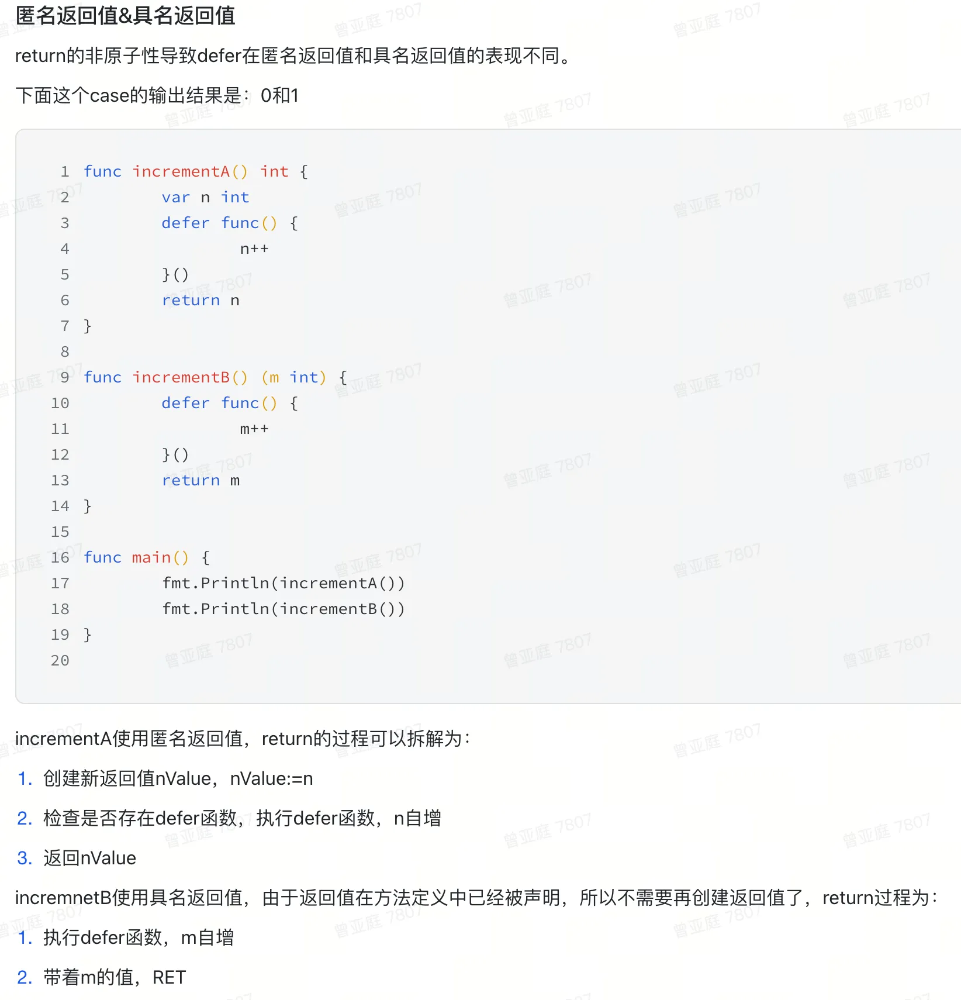
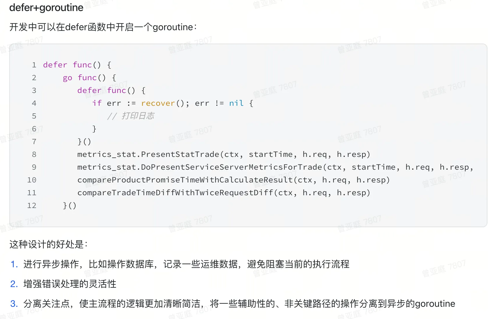

### 为什么用Go?

- 刚开始是因为了解到越来越多的公司使用go语言，就调研了一下go语言的优势，那会对于 Go 语言的了解并不够深入
    - 天然的高并发：采用了轻量级的协程（goroutine）和通信机制（channel），使得并发编程变得简单和高效
    - 语法简洁而富有表现力，代码可读性强，函数和包的设计鼓励模块化和解耦，使得代码更易于维护和扩展
    - 自动垃圾回收机制，使得内存管理变得简单且高效
    - 跨平台支持和部署便捷性
- 后续在使用go的过程中，让我真正爱上了这⻔语言，并对它的特性有了更深入的理解，同时，我也开始对一些被人们吐槽的问题有了更多的包容性，比如 错误处理if error，less is more，通过通信来共享内存等，通过理解这些特性，我才真正意识到这只小鼹鼠有多么的可爱~
- 语言只是工具，好坏在于如何使用，**Go语言不是万能的，但它的确能有效地解决某些问题**

### Go设计哲学

- Less is more
- 推荐《Go语言设计与实现》


### Go和Python区别？

- **执行速度快 vs 相对较慢**
- **语法简单 vs 语法优雅**
- **网络服务 vs 数据分析、机器学习**
- **内置并发 vs 需要第三方库**
- **静态类型 vs 动态类型**
- Go语言和Python都有各自的优势,具体选择还是要看企业需求和实际使用情况

### Go VS C++

go的结构体、组合、接口对应了C++的封装，继承，多态

- 结构体 == 封装：
    - 在 Go 语言中，结构体（struct）是一种用户自定义的数据类型，用于将不同类型的变量组合在一起。C++ 通过类（class）来实现封装。类将数据成员（类似于 Go 结构体中的字段）和成员函数组合在一起
    - Go 结构体通过字段名大小写来控制访问权限，C++ 通过 private、public 等访问修饰符来控制。Go相对来说规则更简洁，但在复杂的访问控制场景下可能不如 C++ 灵活
- 组合 == 继承：
    - Go 语言没有像 C++ 那样的传统继承机制，而是通过组合来实现代码复用。组合是指将一个结构体嵌入到另一个结构体中，使得外部结构体可以直接访问内部结构体的可访问成员
    - 组合的方式使得代码结构更加清晰，不像继承那样可能会出现复杂的层次结构和方法覆盖等问题，避免了继承的复杂性
- 接口 == 多态：
    -  Go 语言中，接口是一种抽象类型，它定义了一组方法签名，但没有具体的实现。。一个类型只要实现了接口定义的所有方法，就自动实现了这个接口
    - C++ 的多态依赖于类之间的继承层次结构和虚函数的重写机制


### Go为什么跨平台

https://zhuanlan.zhihu.com/p/621257358
https://cloud.tencent.com/developer/article/2311749

java跨平台：

- 可以在任意系统中编写Java程序，并生成.class字节码文件，但要想实现跨平台，则需要安装Windows、Linux、或Mac等系统自己版本的JVM虚拟机。然后把字节码文件放到不同系统下的JVM虚拟机中运行，这样就实现了所谓的跨平台
- **Java跨平台的根本原理，就是通过JVM虚拟机来实现的**！但你要知道，Java语言是跨平台的，JVM却不是跨平台的，不同的操作系统有不同版本的JVM！

go跨平台：

- Go提供了简单易用的跨平台编译特性，使得在一个平台上构建其他平台的二进制程序变得轻松
- 通过设置环境变量GOOS和GOARCH来指定目标操作系统和处理器架构。GOOS表示目标操作系统，如linux、windows、darwin（macOS）等；GOARCH表示目标处理器架构，如386、amd64、arm、arm64等
- 然后运行go build XXX.go即可生成相应的可执行程序
- **可以理解为“翻译”，指定国家语言，即可在一定程度上帮助程序员更专注的写代码而不是折腾各种软硬件环境**

### Go 编译流程

1. 词法分析:拆为token
2. 句法分析:生成语法树
3. 语义分析:逃逸分析，函数内联等。
4. 中间码生成:生成的是SSA码，和平台无关。
5. 代码优化
6. 机器码生成:先生成Plan9汇编代码，最后编译为机器码，输出的机器码为.a文件。这一步完成从平台无关到平台相关的改变
7. 链接: 把所有的.a文件变成一个可执行文件

### Go程序入口
1. 接受argc和argv参数
2. 初始化g0执行栈，g0是一个为了调度协程而产生的协程，一个母协程。
3. 进行运行时检测:
    - 检查各种类型的长度
    - 检查结构体字段的偏移量
    - 检查指针操作
    - 检查CAS操作
    - 检查atomic原子操作
    - 检查栈的大小是否是2的n次幂
4. 初始化调度器:全局栈空间内存分配，堆内存空间的初始化，初始化当前系统线程，算法初始化(hash，map)，垃圾回收器参数初始化等
5. 创建新协程，也就是主协程，执行runtime.main
6. 创建M，调度主协程，
7. 主协程执行主函数: 执行runtime包的init方法，启动GC，执行用户包以来的init方法，执行用户主函数main.main()

### Go Runtime
- Runtime作为程序的一部分打包生成二进制，Runtime和用户程序一起运行。这一点和Java不一样，Java的运行时需要安装JVM,看网页需要安装浏览器。下载一个Go程序后，不需要再安装GO的runtime。
- Runtime的能力:内存管理，垃圾回收，GMP协程调度，可以屏蔽系统差异，所以Go可以跨平台
- 用户和Runtime之间的交互可以直接调用Runtime的函数，比如一些关键字:
    - go ->newproc
    - new->newobject
    - make->makeslice,makechain,makemap...
    - <- : chansend1,chanrecy1

### Go内存管理

物理、虚拟内存  -> mheap堆 → HeapArena -> page→mspan -> mcentral -> mcache -> 总结内存模型 -> 堆内存分配 -> 栈内存分配

- Go 语言是如何进行内存管理的呢？首先，让我们来讨论它的内存模型。我们都知道计算机的物理内存条，但为了最大化利用物理内存并实现进程之间的内存隔离，操作系统将其划分为以⻚为单位的虚拟内存。因此，程序内部可以直接操作的是虚拟内存，通过内存管理单元（MMU）将其映射到物理内存。在 64 位操作系统下，虚拟内存的大小约为 256 TB，远大于物理内存；
- 对于进程内部，堆mheap是所有对象的内存起源，是 程序运行时中最大的临界共享资源，这意味着每次存取都要加锁，在性能层面是一件很可怕的事情，那么该如何管理和高效的使用这么一大块内存空间呢？
- Golang 借鉴了**Thread-Caching Malloc内存模型**，采用**分层思想**，使用**多级缓存**构建整个内存模型：
    - **heapArena** ：首先在**堆内存mheap**之上，将堆内存划分为 一个一个内存单元（HeapArena），每个单元大小为 64 MB，**heapArena** 是 mheap 向操作系统申请内存的单位
    - **page**：然后参考操作系统分页管理的思想，将每个 HeapArena划分为一个个大小为8KB的页 page，然后以page为单位组装成**不同级别**的mspan，mspan 是程序能够操作的最小内存单元
    - **mspan**： mspan大小为 page 的整数倍，且从 8B 到 80 KB 被划分为 67 种不同的规格，0 级用于处理更大的对象，上不封顶，分配对象时，会根据大小映射到不同规格的 mspan，从中获取空间.
    - **mcentral**：相同规格spanClass的 mspan 会被组织成双向链表，称为 mcentral，每个 mcentral 基于一把互斥锁管理，每个mcentral 下的 mspan 又分为两个链表，分别为有空间 mspan 链表 partial 和满空间 mspan 链表 full
    - **mcache**：**mcentral**是全局协程共享的，因此在访问时需要加锁，这可能导致锁饥饿的问题。为了解决这个问题，Go 借鉴了其 GPM 调度模型，在每个 M 上添加了一个本地缓存（mcache）；这样就不需要每次都从全局中心索引中获取 mspan 了。值得一提的是，由于在 GMP 模型中，当协程进行阻塞式系统调用时，会与 P 解绑，调用完成后可能会进入休眠队列。如果将 mcache 放置在 M上，可能会浪费内存。因此，**mcache 缓存的一组 mspan 实际上会放在 P 内部**。mcache 中包含每个Spanclass的两个 mspan，一个是 noscan 的，一个是 scan 的，总共有 136 个 mspan
- **多级缓存**：把堆内存划分为最小的page，然后组装成不同大小的mspan，用于分配给不同大小的对象，同时把锁的粒度也仅降低到Spanclass粒度
- **分层分配**：先从P本地的mcache中分配对应大小的mspan，不行再逐层向上申请，加锁访问该Spanclass的mcentral获取mspan，如果 mcentral  已满，将从 HeapArena 中换一组对应大小的mspan。如果所有的 HeapArena 都满了，将向操作系统申请一块新的虚拟内存单元 HeapArena

### Go垃圾回收机制

Go 语言在整个发展过程中，垃圾回收机制的演进为：标记清除法——>三色标记法+插入写屏障->三色标记法+混合写屏障 

- **标记-清除(STW)**：Go 最初的垃圾回收很简单，为了正确地清理垃圾，采用串行的方式进行标记-清理的工作，这个串行的过程叫做   STW （Stop The World）。就像它的名字一样，执行 GC 的整个过程，都会停止Goroutine 的工作。这非常影响程序的性能，所以后来 Go 一直在升级 GC 策略，都致力于在不影响程序安全性的情况下，减少 STW 的时间。
- **三色标记法**：既然串行这么慢，能否并发地进行 GC 呢？并发进行GC，其中的难点在于如何标记，于是 Go 将直接标记换成了三色标记法，所有对象初始化白色，然后遍历根对象，将其标记为灰色，遍历所有灰色对象，通过可达性分析跟踪其引用关系，引用的对象标记为灰色，自己标记为黑色；继续遍历灰色对象，直到遍历结束，最后只剩下黑、白对象，回收白色对象
- **对象丢失：**这一过程其实并不复杂，但注意此时用户程序正和 GC 并发地运行，如果此时突然有个**还未扫描的灰色对象的下游对象(白)指向了一个已分析扫描完成的黑色对象**。那么当此轮 GC 扫描完成的时候，那个突然改变指向插入黑色对象中的下游对象，就会被当做垃圾清理掉！
- **屏障机制：**出现这种问题的本质就是那些下游对象不听话，在 GC 期间乱跑，并且跑到了已经扫描分析完成的黑色对象上。但用户程序和 GC 是并发执行的，也不能完全怪它们。那么这时候就有两种思路了，第一种像以前一样，在扫描时进入STW 时间。但这肯定不是我们想要的，那么又要避免这种“插入”问题，就引入了另一种思路，在扫描时增加**写屏障机制(额外的判断处理逻辑)**来限制住乱跑的那些对象，主要有以下两种：
    - 可以看到错误原因是：
        
        1、一个白色对象被黑色对象引用了
        
        2、之前与此白色对象连接的灰色对象连接断开了
        
        同时满足这两条，才会出现错误
        
        所以破坏任意一条，就可以避免错误回收活跃对象，由此就有了强三色不变性和弱三色不变性
        
    - **插入写屏障**：插入对象时触发，强三色不变式
        - 只要有对象被**插入黑色对象**上，我们就将它的颜色**设置为灰色**，放入灰色队列中等待分析扫描。这样在此轮扫描结束后，最终也能保证不会误清理掉乱跑的对象
        - **栈上STW**：但是由于 Go 中对栈要求非常快速响应速度，以供函数调用频繁地入栈和出栈，在栈上使用写屏障会影响性能。所以**插入写屏障只能在堆上使用**。但我们也得防止栈里面出现这种“插入”问题，所以在扫描完成后会进入 STW 模式重新扫描栈上的对象，保证新引用的白色对象被添加不被清除，虽然也需要 STW，但由于协程栈通常很小，STW 的时间变短了
    - **删除写屏障**：删除对象时触发，弱三色不变式
        - 当有一个待扫描对象突然删除了它某一下游对象时，防止跑掉的下游对象被添加到某已扫描的黑色对象上，我们**将被删除的下游对象设置为灰色**，放入灰色队列中等待分析扫描，因此如果没有被引用的话，会保护一轮被删除的对象，延迟一轮被真正删除，所以**回收精读低**
        - 堆和栈上都使用
- **混合写屏障：结合插入和删除的优点，减少了插入写屏障的栈上STW**
    - **栈上插入**：GC开始就将**栈上的可达对象扫描并标记为黑色**，并且GC期间，**任何在栈上创建的新对象**，**均为黑色**，正常删除对象，栈上不触发屏障机制，也就是说，**栈上的节点都为黑色**，这样子之后就**不需要再进行STW额外扫描标记**了，解决了插入屏障的缺点(栈上创建是黑色，删除也还是黑色，引用先是灰色再变黑)
    - 堆上被删除的对象标记为灰色（可能被栈上对象引用）
    - 堆上被添加的对象标记为灰色


### GMP并发模型
GM 模型 -> 存在的问题 -> 引入 GMP -> 如何解决这些问题的

- GMP模型中的G代表Go 语言中的协程，M代表操作系统工作线程，P代表处理器
- **早期GM**：GMP也是一步步发展优化的结果，早期是没有P的，就是GM模型：通过一个全局队列存放所有的G，然后M 想要执行G、放回 G 都必须访问全局 G 队列，并且 M 有多个，即多线程访问同一资源需要加锁进行保证互斥 / 同步，所以全局 G 队列是有互斥锁进行保护的
- **存在问题**：
    - 全局**锁竞争**造成巨大的性能开销
    - **Goroutine 传递问题**：某个M刚创建的 G 放到了全局队列，而不是本地 M 执行，M 之间传递G导致不必要的开销和延迟
    - **数据局部性不好**：G 当前在 M运行后对 M 的内存进行了预热，但是后续 G 调度到同一个 M 的概率不高，所以数据局部性不好
- **GMP模型**：所以为了解决GM模型中全局队列带来的性能问题，引入了处理器   **P**  作为 G 和 M 之间的中介(中间层)，每个 M 对应一个 P，P 主要维护与其关联的M的**本地协程队列**
    - **减少锁竞争**：有了 P 之后，M 不再直接从全局队列中获取 G，而是从其关联的 P 的本地队列中获取一个可运行的协程执行调度循环，从而大大减少了访问全局队列时的锁竞争问题
    - **减少G传递**：当新建协程时，会优先考虑放入对应 P 的本地队列中执行，满了才放全局队列，所以也在一定程度上保证了数据局部性
    - **运行流程**：线程M想运行任务就得获取 P，从 P 的本地队列获取 G，P 队列为空时，M 先会尝试加锁从全局队列拿一批 G 放到 P 的本地队列，全局队列没有的话。M则会从其他 P 的本地队列偷一半放到自己 P 的本地队列(**work stealing 机制** )。M 运行 G，G 执行之后，M 会从 P 获取下一个 G，不断重复下去，当一个线程M因为G进行系统调用而阻塞时，该M会释放所绑定的P，把P交接给其他空闲的M执行(**hand off 机制**)，当 M 系统调用结束时候，这个 G 会尝试获取一个空闲的 P 执行，并放入到这个 P 的本地队列。如果获取不到 P，那么这个线程 M 变成休眠状态， 加入到空闲线程中，然后这个 G 会被放入全局队列中
        - M 与 P 的数量没有绝对关系，一个 M 阻塞，P 就会去M的休眠队列取一个或者创建一个 新的M，P一般等于CPU核心数，Go语言本身允许最多10000个线程M
    - 抢占式调度：基于协作和信号的两种抢占式调度，使协程能够并发执行，避免其他协程饥饿；当所有 M 的调度循环执行了 61 次后，会从全局队列中随机选择一个 G 放入某个 P 中，这是为了防止全局协程饥饿
    
    - P在程序启动时依据GOMAXPROCS初始化完成
        - **M0**：M0 是启动程序后（进程）的编号为 0 的主线程，这个 M 对应的实例会在全局变量 runtime.m0 中，不需要在 heap 上分配，**M0 负责执行进程初始化操作和启动第一个 G**， 在之后 M0 就和其他的 M 一样了
        - **G0**：G0 是每次启动一个 M 都会第一个创建的 gourtine，**G0 仅用于负责调度的 G**，G0 不指向任何可执行的函数，**每个 M 都会有一个自己的 G0**。在调度或系统调用时会使用 G0 的栈空间，全局变量的 G0 是 M0 的 G0
        
- 本质：通过Process处理器P将Goroutine协程G调度到machine内核线程M上面去，然后操作系统调度器将内核线程放到CPU上去执行
- 核心思想：
    - **复用线程：压榨！！**
        - **work stealing 机制**：自己的活干完了就帮别人干
        - **hand off 机制**：自己干不了也给别人干
        - **反正不让线程闲着，除非阻塞了**
    - **多CPU，多P并行工作**
    - **抢占式调度，防止协程饥饿**
    - **弱化全局队列，采用本地队列，减少锁竞争**
- 示例：
    
    ```go
    package main
    import "fmt"
    func main() {
    fmt.Println("Hello world")
    }
    ```
    
    1. runtinme创建最初的m0线程和用于m0调度的g0协程
    2. 调度器初始化工作：初始化 m0、栈、垃圾回收，以及创建和初始化由 GOMAXPROCS 个 P 构成的 P 列表
    3. 创建main协程 G ，加入m0绑定的P的本地队列
    4. m0启动，从绑定的P本地队列获取G
    5. M运行G
    6. G运行结束

### Go内存对齐？

- **为什么要内存对齐**：
    - CPU 访问内存时，并不是逐个字节访问，而是以**字长**（word size）为单位访问。比如 32 位的 CPU ，字长为 4 字节，那么 CPU 访问内存的单位也是 4 字节。这么设计的目的，是减少 CPU 访问内存的次数，提高内存读写的性能
    - 内存对齐提升性能的同时，也需要付出相应的代价。由于变量与变量之间增加了填充，并没有存储真实有效的数据，所以 **占用的内存会更大**，这也是典型的 `空间换时间` 策略
- **内存对齐规则**：
    - 对齐倍数：变量的地址(偏移量)需要是对齐值的整数倍，对齐值是变量类型长度和编译器默认字长的最小值
        - 结构体的成员变量，第一个成员变量的偏移量为 0。往后的每个成员变量的对齐值必须为**编译器默认对齐长度或当前成员变量类型的长度，取最小值作为当前类型的对齐值**。其偏移量必须为对齐值的整数倍
        - 结构体本身，对齐值必须为编译器默认对齐长度，或结构体的所有成员变量类型中的最大长度，取最大数的最小整数倍作为对齐值
            - **合理布局可以减少结构体内存占用**
            - 空结构体{}：
                - 没有任何字段的空 struct{} 和没有任何元素的 array 占据的内存空间大小为 0，不同的大小为 0 的变量可能指向同一块地址
                - 作为最后一个字段时需要额外开辟空间，**不要将 `struct{}` 类型的字段放在结构体的最后**，这样可以避免 `内存对齐` 带来的占用损耗

### Goroutine
- 协程是一种轻量级的线程。由go的进行时管理。
- 协程可以在进程中并发执行，高效利用多核处理器。
- Go 运行时会自动在协程之间进行调度，并发执行不同的任务，程序员无需手动管理协程的调度。


### 值传递和引用传递？

- **go没有引用传递，都是值传递，但是传递的值可以是引用类型**
- **值传递**：将实参的值传给形参，形参是实参的一份拷贝，实参和形参的内存地址不同，函数内对形参值内容的修改，是否会影响实参的值内容，取决于参数是否是引用类型
- **引用传递**：将实参的地址传给形参，函数内对于形参值内容的修改，将会影响实参的值内容

### New && Make ?

- new ：创建任何类型，返回类型的指针
- make：仅仅适用于创建slice,map,chan三个引用类型，创建时就初始化了，可指定大小

### defer 关键字

类似Java里的final，代表函数结束之前会触发的关键字。
1. 如果有多个defer函数，会按照调用顺序压入栈帧，也就是最后一个defer会被最先执行
2. defer关键字会比return后执行。return操作不是一个原子操作，底层分为两步来执行:
    ```
    a.第一步:返回值赋值
    // defer
    b.第二步:RET退出
    ```

    
    

### Panic 关键字

当业务代码panic的时候，意味着代码层面执行了panic(runtime.gopanic())

空指针，类型转换异常等都会在golang内置库里显式地执行panic。四种不可恢复的panic，会直接抛出fatal。
- 系统栈上发生 panic
- 内存分配时 panic
- 禁止抢占发生 panic
- g 锁在 m 上时发生 panic

panic能够改变程序的控制流，**调用panic后会立刻停止执行当前函数的剩余代码，并在当前 Goroutine 中递归执行调用方的defer**

**recover可以中止panic造成的程序崩溃，但是只能在defer中作用**

**panic函数可以被连续多次调用，通过link组成链表**

### recover 关键字

#### 不生效case
1. revover只能在defer中调用才会生效:
因为panic后主流程会被打断，即便后续控制流中调用了recover()也不会被执行了。
2. panic后才调用defer，recover不会生效:
3. recover只能捕获当前goroutine的panic。

#### recover流程
1. 编译器会负责做转换关键字的工作;
    - 将panic和recover分别转换成runtime.gopanic和runtime.gorecover;
    - 将defer转换成runtime.deferproc函数;
    - 在调用defer的函数末尾调用deferreturn函数;
2. 在运行过程中遇到runtime.gopanic方法时，会从 Goroutine 的链表递归执行调用方的defer
3. 如果执行defer时遇到gorecover就会将_panic的recovered字段标记成true。具体的恢复逻辑在gopanic中执行


### error 错误处理

#### 优雅handle error
Don't just check errors, handle them gracefully.

如果直接返回err不做任何处理，在顶层处理的时候看到err信息时会不清楚具体是哪个调用链路出了问题。比如仅看到```err="No such file or directory"```，go的error是没有堆栈信息的。
所以如果不打算处理某个error，最好用errors.Wrapf包装一下错误，带上堆栈信息一起返回。

#### Only handle error once
只处理一次错误

比较糟糕的情况是多次处理错误，error 被多次打印，导致日志上都是相同的error， 影响排查的效率。 更糟糕的情况是从 dao 层到 handler层一次都不处理，直接放在了response.BaseMessage.Message 中，连一行日志都没有,调用方说“接口调用出错了”，我们却连一行真正想要的日志都看不到。
因此对error 最好的方法是“处理且只处理一次”,那在什么时候处理这次 error 呢?
- API层是我们自己程序的最后一个入口，此时error 就不能再往上抛，该部分的 error 需要做处理。
- 在 goroutine 中的error，对于每个 goroutine 的最顶层，也有职责把 error 都处理完。


### json

用json做序列化和反序列化需要注意:
1. json.Marshal返回[]byte类型，以及一个error。
2. json.Unmarshal(jsonString,&movie)第二个形参一定要传递指针，才能达到直接修改movie变量的目的。

### 空接口和nil

https://studygolang.com/articles/10635

- 把一个具有类型的nil值赋值给interface{}，但是实际上interface里依然存了指向类型的指针，所以拿这个interface变量去和nil常量进行比较的话就会返回`false`
- **空接口的类型和值都是零值,才是nil**
- **具体类型的变量，判断是否是 nil ，只需要看其值是否为零值**

### Go 内存泄露

> Go虽然是自动GC类型的语言，但在编码过程中如果不注意，很容易造成内存泄漏的问题。比较常见的是发生在 slice、time.Ticker、goroutine 等的使用过程中

#### **slice 类型引起内存泄漏**

1. 传入的参数被切片返回，导致局部变量不能被释放

    Golang是自带GC的，如果资源一直被占用，是不会被自动释放的，比如下面的代码，如果传入的slice b是很大的，然后引用很小部分给全局量a，那么b未被引用的部分就不会被释放，造成了所谓的内存泄漏。

    ```go
    var a []int
    func test(b []int) {
        a = b[:3]
        return
    }

    ```

    想要理解这个内存泄漏，主要就是理解上面的a = b[:3]是一个引用，其实新、旧slice指向的都是同一片内存地址，那么只要全局量a在，b就不会被回收。

    如果想避免这个问题，可以使用`append`方法的实现，如果append的目标slice空间不够，会重新申请一个`array`来放需要`append`的内容，所以`&b[0]`和`&a[0]`的值是不一样的，而`&a[0]`和`&c[0]`地址是一致的：

    ```go
    time.Sleep(time.Second * 5)
    fmt.Println("main func")
    varb []int
    varc []int
    // 现在，如果再没有其它值引用着承载着a元素的内存块，// 则此内存块可以被回收了。functest(a []int) {
    c = a[:1]
    b = append(a[:0:0], a[:1]...)// 秀操作而已，也可以使用nilfmt.Println(&a[0], &c[0], &b[0])//0xc0000aa030 0xc0000aa030 0xc0000b2038

    ```

    也可以使用 copy()函数来实现引用类型的深拷贝。`copy(dst[], src[])`

2. 切片容量导致内存泄漏

    假如我们从网络中接受了很大的数据，该协议使用前5个字节标识消息类型。

    ```go
    func consumeMessages() {
        msg := receiveMessage() // a
        storeMessageType(getMessageType(msg)) //b
        // 其他的逻辑处理
    }
    // 然后msg作为一个参数
    func getMessageType(msg []byte) []byte { //c
        return msg[:5]
    }

    ```

    我们只想存储每个消息的前5字节代表的消息类型，但同时我们将每条消息的整个容量的数据也存储在了内存中。

    解决方式可以使用copy方法，来替代对msg进行切分：

    ```go
    func getMessageType(msg []byte) []byte {
        msgType := make([]byte, 5)
        copy(msgType, msg)
        return msgType
    }

    ```

3. **数组值传递**

    由于数组是Golang的基本数据类型，每个数组占用不同的内存空间，生命周期互不干扰，很难出现内存泄漏的情况，但是数组作为形参传输时，遵循的是值拷贝，如果函数被多个goroutine调用且数组过大时，则会导致内存使用激增。

    因此对于大数组放在形参场景下通常使用切片或者指针进行传递，避免短时间的内存使用激增。

#### **goroutine导致内存泄漏**

Go内存泄露，大部分都是goroutine泄露导致的。 虽然每个goroutine仅占用少量(栈)内存，但当大量goroutine被创建却不会释放时(即发生了goroutine泄露)，也会消耗大量内存，造成内存泄露。

另外，如果goroutine里还有在堆上申请空间的操作，则这部分堆内存也不能被垃圾回收器回收。

> Go 10次内存泄漏，8次goroutine泄漏，1次是真正内存泄漏，还有1次是cgo导致的内存泄漏  (“才高八斗”的既视感..)
> 

在Go中大概单个goroutine占用2.6k左右的内存空间。

Go 语言的内存泄漏通常因为错误地使用 goroutine 和 channel。例如以下几种情况：

1. 在 goroutine 里打开一个连接（如 gRPC）但是忘记 close。
2. 在 goroutine 里的全局变量对象没有释放。
3. 在 goroutine 里读 channel， 但是没有写入端，而被阻塞。
4. 在 goroutine 里写入无缓冲的 channel，但是由于 channel 的读端被其他协程关闭而阻塞。
5. 在 goroutine 里写入有缓冲的 channel，但是 channel 缓冲已满。
6. select操作在所有case上都阻塞，造成内存泄漏

其实本质上还是channel问题,  因为 `select..case`只能处理 `channel类型`,  即每个 `case` 必须是一个通信操作, 要么是发送要么是接收，`select` 将随机执行一个可运行 `case`， 如果没有 `case` 可运行，它将阻塞，直到有 `case` 可运行。 有个独立 `goroutine`去做某些操作的场景下，为了能在外部结束它，通常有两种方法：

- 同时传入一个用于控制`goroutine`退出的 `quit channel`，配合 `select`，当需要退出时`close` 这个 `quit channel`，该 `goroutine` 就可以退出
- 使用` context` 包的`WithCancel`，可参考`context.WithCancel()`的使用
1. I/O问题，I/O连接未设置超时时间，导致goroutine一直在等待，代码会一直阻塞。
2. 互斥锁未释放，goroutine无法获取到锁资源，导致goroutine阻塞

    ```go 
    //协程拿到锁未释放，其他协程获取锁会阻塞
    func mutexTest() {
        mutex := sync.Mutex{}
        for i := 0; i < 10; i++ {
            go func() {
                mutex.Lock()
                fmt.Printf("%d goroutine get mutex", i)
                //模拟实际开发中的操作耗时
                time.Sleep(100 * time.Millisecond)
            }()
        }
        time.Sleep(10 * time.Second)
    }

    ```

3. 死锁，当程序死锁时其他goroutine也会阻塞

    ```go
    func mutexTest() {
        m1, m2 := sync.Mutex{}, sync.RWMutex{}
        //g1得到锁1去获取锁2
        go func() {
            m1.Lock()
            fmt.Println("g1 get m1")
            time.Sleep(1 * time.Second)
            m2.Lock()
            fmt.Println("g1 get m2")
        }()
        //g2得到锁2去获取锁1
        go func() {
            m2.Lock()
            fmt.Println("g2 get m2")
            time.Sleep(1 * time.Second)
            m1.Lock()
            fmt.Println("g2 get m1")
        }()
        //其余协程获取锁都会失败
        go func() {
            m1.Lock()
            fmt.Println("g3 get m1")
        }()
        time.Sleep(10 * time.Second)
    }

    ```

4. waitgroup使用不当。

    waitgroup的Add、Done和wait数量不匹配会导致wait一直在等待。

    上面列的情况，在日常开发过程中不容易发现，因此会经常带来一些线上的问题。

5. **select-case** 误用导致的内存泄露

    ```go
    func TestLeakOfMemory(t *testing.T) {
    fmt.Println("NumGoroutine:", runtime.NumGoroutine())
    chanLeakOfMemory()
    time.Sleep(time.Second * 3) // 等待 goroutine 执行，防止过早输出结果
    fmt.Println("NumGoroutine:", runtime.NumGoroutine())
    }

    func chanLeakOfMemory() {
    errCh := make(chan error) // 1
    go func() { // (5)
        time.Sleep(2 * time.Second)
        errCh <- errors.New("chan error") // 2
        fmt.Println("finish sending")
    }()

    var err error
    select {
    case <-time.After(time.Second): // 3 大家也经常在这里使用 <-ctx.Done()
        fmt.Println("超时")
    case err = <-errCh: // 4
        if err != nil {
            fmt.Println(err)
        } else {
            fmt.Println(nil)
        }
    }
    }

    ```

    输出结果如下：

    ```go
    NumGoroutine: 2
    超时
    NumGoroutine: 3

    ```

    这是 `go channel` 导致内存泄漏的经典场景。 根据输出结果（开始有两个 `goroutine`，结束时有三个 `goroutine`），我们可以知道，直到测试函数结束前，仍有一个 `goroutine` 没有退出。

    原因是由于 1 处创建的 errCh 是不含缓存队列的 `channel`，如果 `channel` 只有发送方发送，那么发送方会阻塞；如果 `channel` 只有接收方，那么接收方会阻塞。

    可以看到由于没有发送方往 errCh 发送数据，所以 4 处代码一直阻塞。

    直到 3 处超时后，打印“超时”，函数退出，4 处代码都未接收成功。

    而 2 处的所在的 goroutine 在“超时”被打印后，才开始发送。

    由于外部的 goroutine 已经退出了，errCh 没有接收者，导致 2 处一直阻塞。

    因此 2 处代码所在的协程一直未退出，造成了内存泄漏。

    如果代码中有许多类似的代码，或在 for 循环中使用了上述形式的代码，随着时间的增长会造成多个未退出的 gorouting，最终导致程序 OOM。

    这种情况其实还比较简单。我们只需要为 channel 增加一个缓存队列。即把 (1) 处代码改为 `errCh := make(chan error, 1)` 即可。修改后输出如下所示，可知我们创建的 goroutine 已经退出了。

    ```go
    NumGoroutine: 2
    超时
    NumGoroutine: 2

    ```

    可能会有人想要使用 `defer close(errCh)` 关闭 channel。比如把 1 处代码改为如下形式(错误)：

    ```go
    errCh := make(chan error)
    defer close(errCh)

    ```

    由于 2 处代码没有接收者，所以一直阻塞。直到 `close(errCh)` 运行，2 处仍在阻塞。这导致关闭 channel 时，仍有 goroutine 在向 errCh 发送。然而在 golang 中，在向 channel 发送时不能关闭 channel，否则会 panic。因此这种方式是错误的。

    又或在 5 处 goroutine 的第一句加上 `defer close(errCh)`。由于 2 处阻塞， `defer close(errCh)` 会一直得不到执行。因此也是错误的。 即便对调 2 处和 4 处的发送者和接收者，也会因为 channel 关闭，导致输出无意义的零值。

6. **goruntine 中 map 并发**

    `map` 是引用类型，函数值传值是调用，参数副本依然指向`m`，因为值传递的是引用，对于共享变量，资源并发读写会产生竞争。 下面的场景在工作中经常遇到（测的时候不容易发现）。

    ```go
    funcTestConcurrencyMap(t *testing.T) {
        m := make(map[int]int)
        go func() {
            for{
                m[3] = 3
            }
        }()

        go func() {
            for{
                m[2] = 2
            }
        }()
    //select {}time.Sleep(10 * time.Second)
    }

    ```

7. time.Ticker **误用造成内存泄漏**

    > 注意：Ticker 和 Timer 是不同的。Timer 只会定时一次，而 Ticker 如果不 Stop，就会一直发送定时。


    ```go
    funcTestTickerNormal(t *testing.T) {
    ticker := time.NewTicker(time.Second)
        defer ticker.Stop() // stop一定不能漏了
        go func() {
        for{
                fmt.Println(<-ticker.C)
            }
        }()

        time.Sleep(time.Second* 3)
        fmt.Println("finish")
    }

    ```

    time.After()使用注意事项

    看下面的例子：

    ```go
    funcTestTimeAfter(t *testing.T) {
        defer func() {
            fmt.Println(runtime.NumGoroutine())
        }()

        go func() {
            ticker := time.NewTicker(time.Second* 1)
            for{
            select{
            case<-ticker.C:
                        fmt.Println("hello world")
            case<-time.After(time.Second* 3):
                        fmt.Println("exit")
            return}
            }
        }()

        time.Sleep(time.Second* 5)
        fmt.Println("main func")
    }

    // 输出结果如下
    === RUN   TestTimeAfter
    hello world
    hello world
    hello world
    hello world
    hello world
    main func
    3
    --- PASS: TestTimeAfter (5.00s)
    PASS

    ```

    从输出结果看，程序根本没有打印`exit`, 也证明了goroutine不是由`time.After()` 退出，而是函数执行结果退出。

    看下关于`time.After()` 实现原理：After底层是用NewTimer实现， `NewTimer(d).C` 每次都是 return 了一个新的对象。

    ```go
    funcAfter(d Duration) <-chanTime {
        return NewTimer(d).C
    }

    funcNewTimer(d Duration) *Timer {
    c := make(chanTime, 1)
    t := &Timer{
        C: c,
        r: runtimeTimer{
            when: when(d),
            f:    sendTime,
            arg:  c,
        },
    }
    startTimer(&t.r)
    return t
    }

    ```

    可以进行如下的修改

    ```go
    funcTestTimeAfter(t *testing.T) {
        deferfunc() {
            fmt.Println(runtime.NumGoroutine())
        }()

        idleDuration := time.After(time.Second* 3)
        ticker := time.NewTicker(time.Second* 1)
        deferticker.Stop()

        for{
        select{
        case<-ticker.C:
                fmt.Println("hello world")
        case<-idleDuration:
                fmt.Println("exit")
        return}
        }

        time.Sleep(time.Second* 5)
        fmt.Println("main func")
    }

    ```

    下面的这个例子，是经常遇到的一定要注意： 定时器定义位置
    ```go
    func main() {
        chi := make(chan int)
        go func() {
            for {
                // 定时器都是新创建的，那么就会造成永久性的泄露。
                timer := time.After(10 * time.Second)
                select {
                case <-ch:
                    fmt.Println("get it")
                case <-timer:
                    fmt.Println("end")
                }
            }
        }()

        for i:= 1; i< 1000000; i++ {
            chi <- i
            time.sleep(time.Millisecond)
        }
    }

    ```