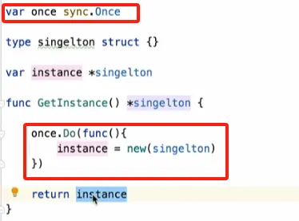

# Go并发编程

### 重要概念

- 使用一个`go`关键字让程序异步执行
- **`sync.WaitGroup{}`并发控制：**
    - 当新运行一个goroutine时，我们需要调用`wg.Add(1)`
    - 当一个goroutine运行完成的时候(defer)，我们需要调用`wg.Done()`
    - `wg.Wait()`让程序阻塞在此处，直到所有的goroutine运行完毕
- **`for`循环中的goroutine！**
    - 如果goroutine中使用了`for`迭代的变量，所有goroutine都会获得**最后一次**循环的值
    - **需要将迭代的变量赋值给函数参数**
- **goroutine数量控制**
    - 利用带缓冲channel实现
- **context.Context**
    - 并发执行的goroutine只要有一个出错，其他goroutine就可以停止，没有必要继续执行下去了。如何把取消的事件传导到其他goroutine呢？`context.Context`就是用来传递类似上下文信息的结构

### 并发安全

- 当多个goroutine对同一个内存区域进行读写时，就会产生并发安全的问题，它会导致程序运行的结果不符合预期
- 比如多个goroutin并发的对于`results`变量进行写入，如果使用`results = append(results, result)`的方式并发赋值，因为会涉及到slice的扩容等操作，所以并不是并发安全的，需要利用`sync.Mutex{}`进行加锁
- 更推荐使用 `results[i] = result`这种方式赋值，每一个goroutine都写在了独立的位置，且没有任何读取的操作时`results[i] = result`是并发安全的
- **`sync.Once{}`单次赋值：**
    - 对于全局变量的赋值比较常规做法就是利用`sync.Mutex{}`进行加锁
    - `sync.Once{}`功能如其名，将我们要执行的逻辑放到它的`Do()`方法中，无论多少并发都只会执行一次
    - **单例模式实现**

        

### 并发示例

#### 多线程批量查询：


```go

package main

import (
    "context"
    "errors"
    "fmt"
    "sync"
)

// search函数用于单个词的搜索
func search(ctx context.Context, word string) (string, error) {
    select {
    case <-ctx.Done():
        return "", ctx.Err()
    default:
        if word == "Go" || word == "Java" {
            return "", errors.New("Go or Java")
        }
        return fmt.Sprintf("result: %s", word), nil // 模拟结果
    }
}

// coSearch函数用于多个词的并发搜索
func coSearch(ctx context.Context, words []string) ([]string, error) {
    ctx, cancel := context.WithCancelCause(ctx)
    defer cancel(nil)

    var (
        wg   = sync.WaitGroup{}
        once = sync.Once{}

        results = make([]string, len(words))
        tokens  = make(chan struct{}, 2)

        err error
    )

    for i, word := range words {
        tokens <- struct{}{}
        wg.Add(1)

        go func(word string, i int) {
            defer func() {
                wg.Done()
                <-tokens
            }()

            result, e := search(ctx, word)
            if e!= nil {
                once.Do(func() {
                    err = e
                    cancel(e)
                })
                return
            }

            results[i] = result
        }(word, i)
    }

    wg.Wait()

    return results, err
}
```

#### 多线程打印1-100：

```go
package main

import (
    "fmt"
    "time"
)

func main() {
    // 定义线程数，这里控制了协程的数量
    n := 4
    // 设定目标数，用于控制循环等逻辑
    target := 8
    // 创建一个长度为n的通道数组，每个元素都是通道，缓冲区为0
    chs := make([]chan struct{}, n)
    for i, _ := range chs {
        chs[i] = make(chan struct{}, 0)
    }

    num := 1
    // 启动n个协程
    for i := 0; i < n; i++ {
        go func(i int) {
            // 此循环控制每个协程的执行次数以及逻辑
            // 由于刚开始所有协程同时以num=1进入循环，需要控制最后一轮不进入循环
            for num <= target-n+1 {
                // 每个协程在这里等待获取执行权，从对应的通道接收信号
                <-chs[i]
                // 获得执行权后打印当前协程编号以及对应的数字
                fmt.Printf("goroutine %d: %d\n", i, num)
                if (i+1)%n == 0 {
                    fmt.Println()
                }
                // 数字自增，准备传递给下一个协程
                num++
                // 将执行权传递给下一个协程，通过向对应通道发送信号
                chs[(i+1)%n] <- struct{}{}
            }
        }(i)
    }

    // 首先给第1个协程（序号为0）执行权，让整个流程开始
    chs[0] <- struct{}{}
    // 等待协程执行一段时间，确保协程有足够时间完成操作
    time.Sleep(time.Second * 1)
    // 收回最后1个协程的执行权，避免最后1个协程因为向无缓冲通道发送信号但无人接收而一直阻塞
    <-chs[target%n]
}
```

#### 双协程交替打印0-1

```go
package main

import (
    "fmt"
    "time"
)


func main() {
    
    chan0 := make(chan int)
    chan1 := make(chan int)


    go func() {
        for {
            // 阻塞等待从chan0通道接收信号
            <-chan0
            fmt.Println("0")
            // 向chan1通道发送信号，通知另一个协程可以执行了
            chan1 <- 1
        }
    }()

    go func() {
        for {
            // 阻塞等待从chan1通道接收信号
            <-chan1
            fmt.Println("1")
            // 向chan0通道发送信号，使得第一个协程可以再次执行
            chan0 <- 1
        }
    }()

    // 向chan0通道发送初始信号，启动整个交替执行的流程
    chan0 <- 1

    // 让主协程睡眠一段时间，给其他协程足够的时间去执行交替打印操作
    time.Sleep(1 * time.Second)
}

```

```go
package main

import (
    "fmt"
    "time"
)

func main() {
    // 创建一个用于协程间通信的整数通道notify
    notify := make(chan int)


    go func() {
        for {
            // 阻塞等待从notify通道接收信号
            <-notify
            fmt.Println("0")
            // 向notify通道发送信号，通知另一个协程可以执行了
            notify <- 1
        }
    }()


    go func() {
        for {
            // 阻塞等待从notify通道接收信号
            <-notify
            fmt.Println("1")
            // 向notify通道发送信号，以便第一个协程后续可以再次执行
            notify <- 1
        }
    }()

    // 向notify通道发送初始信号，开启两个协程交替执行的流程
    notify <- 1

    // 让主协程睡眠一段时间，保证协程有充足时间进行交替打印操作
    time.Sleep(1 * time.Second)
}
```