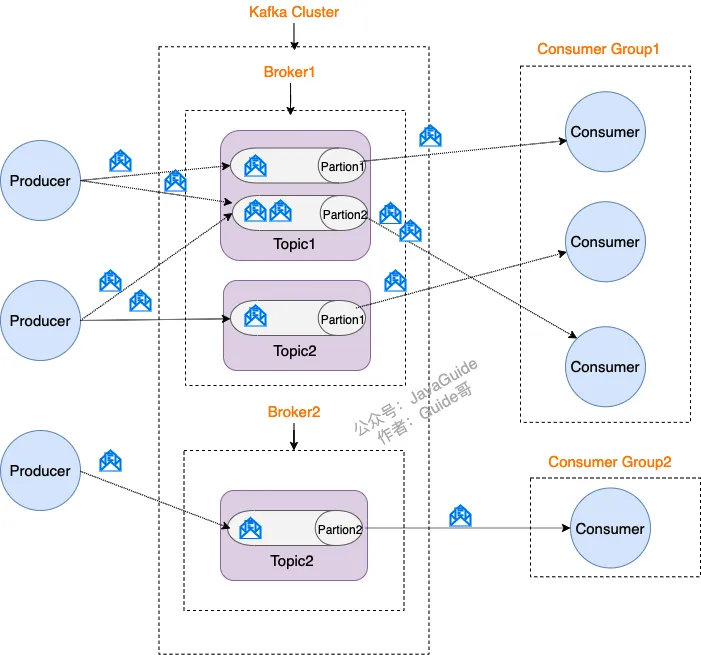
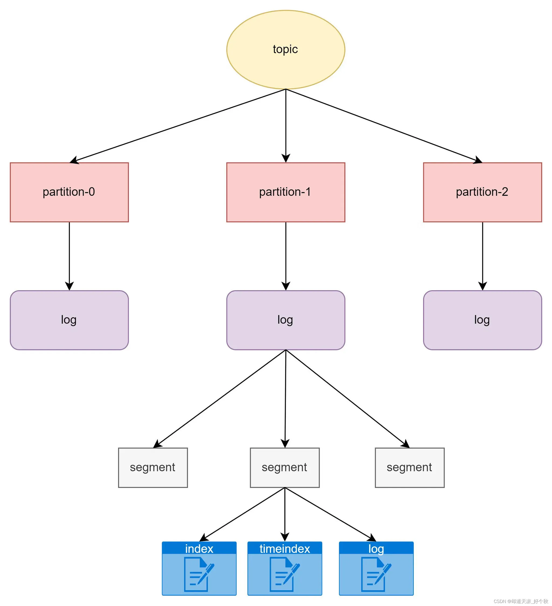
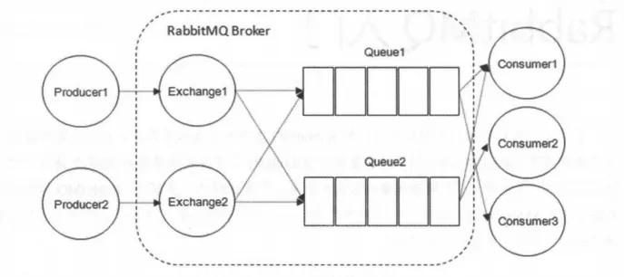

# 消息队列

## Kafka

- 分布式流式处理平台：**消息队列、可容错的持久化存储、流处理**

### **Kafka为什么快？**

- **磁盘顺序读写**、并且利用了操作系统本身的 Page Cache
- **零拷贝技术**：也就是直接将数据从内核空间的读缓冲区直接拷贝到内核空间的 socket 缓冲区(sendfile)
- **分区分段+索引：**不仅提升了数据读取的效率，同时也提高了数据操作的并行度

### **kafka架构**：

- Broker(示例)、topic(主题)、partition(队列)、producer(生产者)、consumer(消费者)
- **分区(Partition)**：**负载均衡、高性能、可扩展**
    - 一个 Topic 可以有多个 不同的Partition、同一 Topic 下的 Partition 可以分布在不同的 Broker 上，这样便能提供比较好的并发能力（负载均衡）
    - Partition本质是一个追加写的日志文件(offset,hw,LEO)
    - **多副本机制(Replica)**：**高可用、容错复制一致性**
    - 每一个分区（Partition）中存在多个副本，并且副本之间关系为Leader和followers
    - **生产者和消费者只与 Leader 副本交互(主写主读)**，其他副本只是 leader 副本的拷贝，它们的存在只是为了保证消息存储的安全性，
        - 虽然副本没有读写分离，分担Leader的压力，但是kafka从另外一个角度，通过使得每一个Broker都有一个Leader副本，那么每一个Broker上的读写负载都是一样的，从而实现了一定程度的负载均衡
        - 此外，使用读写分离必然要考虑不同节点间的数据同步，也就**会有数据不一致的问题**存在，数据同步底层更是涉及了磁盘数据传输，时延开销大，对要求实时响应的应用来说是难以接受的
    
    
    

- **生产者发送消息：**
    - **发后即忘**：它只管往 Kafka 里面发送消息，但是不关心消息是否正确到达，所以可能出现消息丢失
    - **同步**：发送一条消息需要等上个消息发送成功后才可以继续发送
    - **异步**：发送消息不需要等待，根据回调函数结果作相应处理
    - 消息落盘：
        - 轮询：key为空，**依次**将消息发送该topic下的所有分区
        - key 指定分区： key 不为空，并且使用默认分区器，Kafka 会将 key 进行 hash，然后**根据hash值映射到指定的分区上**
        - 自定义或者指定partition发送
- **消费者消费消息**
    - 自动提交 VS 手动提交 offset
- **发布-订阅模式**

### **持久化和过期策略**

- **segment**
    - Kafka用于存储消息的基本单元；
    - segment指partition文件夹下产生的文件；
    - segment文件命名与offset有关，为log start offset；
    - 每个分段都有一个起始偏移量和一个结束偏移量，用于定位消息的位置；
    - 一个segment对应一个日志文件（[offset].log）、时间索引文件（[offset].timeindex）和索引文件（[offset.index]），日志文件是用来记录消息，索引文件用来保存消息的索引；
    - segment的大小可以通过server.properties配置文件中log.segment.bytes来配置，默认1G；
- **持久化：**
    - **磁盘存储**：Kafka 将消息写入磁盘，通常是以日志文件的形式。每个主题（Topic）被划分为若干个分区（Partition），每个分区对应一个或多个日志文件。当生产者发送消息时，消息会被追加到对应分区的日志文件中，并保存在磁盘上
    - **写入效率**：Kafka 使用顺序写入磁盘的方式，这比随机写入要高效得多。操作系统的页面缓存（page cache）通常也会缓存这些数据，从而提高读取速度
    - **副本机制**：Kafka 支持配置副本（replication），即每个分区可以有多个副本分布在不同的节点上，以此保证数据的高可用性。如果一个节点发生故障，其他副本可以继续提供数据服务
- **过期策略：**
    - **基于时间的过期策略**：可以设置消息的最大保留时间（如7天）。在此时间之后的消息将会被删除。
        - 配置参数：`log.retention.hours`（默认是168小时，即7天）
    - **基于大小的过期策略**：可以设置每个分区的日志文件最大总大小。当日志文件的总大小超过此值时，较旧的日志文件会被删除。
        - 配置参数：`log.retention.bytes`
    - **日志段（Segment）删除**：Kafka 的日志文件是分段存储的，每个段有一定的大小或时间限制。当一个日志段达到了规定的大小或时间，并且超过了过期策略的限制，该段会被标记为可删除。
        - 配置参数：`log.segment.bytes` 和 `log.segment.ms`
    - **清除机制（Log Compaction）**：对于某些主题（如配置了 `log.cleanup.policy=compact`），Kafka 提供了一种日志压缩机制，保留每个键的最新版本，删除旧的版本。这对于存储持久性状态非常有用

### **顺序消费、消息丢失、重复消费、消费失败、消费积压**

- **顺序消费：一个队列或者一个key一个队列**
    - Kafka 只能保证 Partition(分区) 内的消息有序
    - 方法
        1. 1 个 Topic 只对应一个 Partition
        2. （推荐）发送消息的时候指定 key/Partition，同一个 key 的消息可以保证只发送到同一个 partition
            1. 但是其中一个消费失败了，就影响后续的消费了
                1. **失败重试机制**：消费者在处理消息时，先判断该订单号在重试表有没有数据，如果有则直接把当前消息保存到重试表。如果没有，则进行业务处理，如果出现异常，把该消息保存到重试表
- **消息丢失：从消息的流程考虑三个组件**
    - **生产者丢失**：**异步，回调**
        - **异步**使用 `send` 方法发送消息，采用为其添加**回调函数**的形式，如果消息发送失败的话，我们检查失败的原因之后重新发送即可！
    - **消费者丢失：手动提交**
        - 问题：我们知道消息在被追加到 Partition(分区)的时候都会分配一个特定的偏移量（offset），当消费者拉取到了分区的某个消息之后，会**自动提交**了 offset，自动提交的话会有一个问题，试想一下，当消费者刚拿到这个消息准备进行真正消费的时候，突然挂掉了，消息实际上并没有被消费，但是 offset 却被自动提交了
        - 解决：**关闭自动提交 offset，每次在真正消费完消息之后再自己手动提交 offset，这样会带来新的重复消费问题**
    - **Kafka丢失**：**先同步，再响应**
        - 问题：当 acks 配置为 1 时，生产者发送消息，只要 leader 副本成功写入消息，就代表成功。这种方案的问题在于，当返回成功后，如果 leader 副本和 follower 副本还没有来得及同步，leader 就崩溃了，那么在选举后新的 leader 就没有这条消息，也就丢失了
        - 解决：**设置 acks = all（-1），只有所有副本全部收到消息时，生产者才会接收到来自服务器的响应，该模式的延迟会很高**
- **重复消费：幂等校验**
    - 问题：**手动提交 offset会带来消息被重新消费**的问题，比如**你刚刚消费完消息之后，还没提交 offset，结果自己挂掉了，那么这个消息理论上就会被消费两次**
    - 解决：
        - 消费消息服务做**幂等校验**，比如 Redis 的 set、MySQL 的主键等天然的幂等功能。这种方法最有效
            - **如插入数据时判断不存在时插入，存在即更新，利用数据库主键，天然支持幂等性**
- **消费失败**：**重试+死信队列**
    - 重试机制：在默认配置下，当消费异常会进行重试，重试多次后会跳过当前消息，继续进行后续消息的消费，不会一直卡在当前消息
    - Kafka 消费者在默认配置下会进行最多 10 次 的重试，每次重试的时间间隔为 0，即立即进行重试。如果在 10 次重试后仍然无法成功消费消息，则不再进行重试，消息将被视为消费失败
    - 当达到最大重试次数后，如果仍然无法成功处理消息，消息会被发送到对应的**死信队列**中
- **消息积压：**
    - **先解决积压**：
        - 快速解决积压就是通过水平扩容partition和消费者数量，但是kafka不允许一个partition被多个消费者消费(为了保证顺序)，而且我们应该是需要解决已经发生积压的partition
        - 所以考虑优化消费者消费速度，采用多线程的方式处理，对于严格保证消息顺序的场景，可以把线程池改为多个队列，每个队列用单线程处理
    - **再进一步分析造成积压的原因**：**生产者，消费者，消息队列**
        - 比如生产者短时间内发送大量数据！**限流生产者**
        - 比如某一个消息消费失败，导致消息队列卡住，那么采取失败**重试+死信队列**！
        - 比如路由规则不合理，导致某一个partition含有大量数据，修改更加均衡的路由规则

## rabbitMQ

- RabbitMQ 模型更像是一种交换机模型
- **架构**：
    - **Exchange(交换器)：**在 RabbitMQ 中，消息并不是直接被投递到Queue(消息队列)中的，中间还必须经过Exchange(交换器)这一层，Exchange(交换器)会把我们的消息**路由**到对应的Queue(消息队列)中
        - **路由策略(交换机类型)**：
            - **direct(默认)：**把消息路由到那些 Bindingkey 与 RoutingKey 完全匹配的 Queue 中**(严格匹配)**
            - **fanout：**发送到绑定的所有队列中，不需要做任何判断操作(**不匹配**)
            - **topic：** Bindingkey 与 RoutingKey **模糊匹配**
            - **headers：**headers 类型的交换器不依赖于路由键的匹配规则来路由消息，而是根据发送的消息内容中的 **headers 属性**进行匹配
    - **Binding(绑定)：**RabbitMQ 中通过 Binding(绑定) 将 Exchange(交换器) 与 Queue(消息队列) 关联起来，可以将交换器理解成一个由绑定构成的路由表
        - 生产者将消息发送给交换器时，需要一个 RoutingKey,当 BindingKey 和 RoutingKey 相匹配时，消息会被路由到对应的队列中
    - **Queue(消息队列)：**
        - 消息的容器，消息一直在队列里面，等待消费者连接到这个队列将其取走
        - **RabbitMQ**中消息只能存储在**队列**中，这一点和**Kafka**这种消息中间件相反。Kafka 将消息存储在**topic（主题）**这个逻辑层面，而相对应的队列逻辑只是 topic 实际存储文件中的位移标识
        - **多个消费者可以订阅同一个队列：**这时队列中的消息会被平均分摊（Round-Robin，即轮询）给多个消费者进行处理，而不是每个消费者都收到所有的消息并处理，这样避免消息被重复消费
    - **消息传输：**
        - **Channel(信道)**：信道是建立在 **TCP 链接上的虚拟链接**，且每条 TCP 链接上的信道数量没有限制。就是说 RabbitMQ 在一条 TCP 链接上建立成百上千个信道来达到多个线程处理，这个 TCP 被多个线程共享，每个信道在 RabbitMQ 都有唯一的 ID，保证了信道私有性，每个信道对应一个线程使用
- **rabbitMQ高可用：**
    - **普通集群模式：节点间共享queue的元数据信息**
    - **镜像集群模式：**
        - 每个 RabbitMQ 节点都有这个 queue 的一个完整镜像，包含 queue 的全部数据，当一个节点宕机，其它机器（节点）还可以继续服务
        - 性能开销大，数据同步
- **死信队列**：
    - **导致的死信的几种原因**：
        - 消息被拒（`Basic.Reject /Basic.Nack`) 且 `requeue = false`。
        - 消息 TTL 过期。
        - 队列满了，无法再添加
    - **死信dead message（消息被拒、TTL过期，队列满无法添加）---->死信交换器DLX：Dead-Letter-Exchange---->死信队列**
- **延迟队列**：
    - 延迟队列指的是存储对应的延迟消息，**消息被发送以后，并不想让消费者立刻拿到消息**，而是等待特定时间后，消费者才能拿到这个消息进行消费，存放需要在指定时间被处理的消息的队列
    - RabbitMQ 本身是没有延迟队列的，要实现延迟消息，一般有两种方式
        - **TTL+DLX模拟实现**：TTL 则刚好能让消息在延迟多久之后成为死信，另一方面，成为死信的消息都会被投递到死信队列里，这样只需要消费者一直消费死信队列里的消息就完事了，因为里面的消息都是希望被立即处理的消息
        - 通过**RabbitmQ插件**实现延迟队列：本质是**在交换机处延迟**（生产者—→交换机（延迟，TTL到了再放入队列）-——>队列——>消费者）
- **惰性队列：**
    - 惰性队列会尽可能的将消息存入磁盘中，而在消费者消费到相应的消息时才会被加载到内存中，它的一个重要的设计目标是能够支持更长的队列，即支持更多的消息存储
    - 当消费者由于各种各样的原因(比如消费者下线、宕机亦或者是由于维护而关闭等)而致使**长时间内不能消费消息造成堆积时**，惰性队列就很有必要了，我们可以将消息存储在磁盘中，避免占用大量内存
- **优先级队列：**
    - 通过x-max-priority参数来实现，优先级高的队列会先被消费
    - 注意：**队列需要设置为优先级队列的同时消息也必须设置消息的优先级才能生效**，而且消费者需要等待消息全部发送到队列中才去消费因为这样才有机会对消息进行排序
- **顺序消费、消息丢失、重复消费、消费失败、消息积压**
    - **顺序消费：**
        - **拆分多个 queue(消息队列)**，每个 queue(消息队列) 一个 consumer(消费者)，就是多一些 queue (消息队列)而已，确实是麻烦点，同一个key
        - **或者就一个 queue (消息队列)，**但是对应一个 consumer(消费者)，然后这个 consumer(消费者)内部用**内存队列**做排队，然后分发给底层不同的 worker 来处理(线程池，一个队列一个线程)
    - **消息丢失：三个角度**
        - **生产者丢失：**
            - **发布确认机制**：单个确认发布、批量确认发布、异步确认发布。
                - 其中前两者是**同步确认**的方式，也就是发布一个/一批消息之后只有被确认发布，后续的消息才能继续发布，
                - 后者是**异步确认**的方式，我们只管发布消息即可，消息是否被确认可以通过**回调函数**来接收到
        - **RabbitMQ丢失**：
            - 如果 RabbitMQ 因为自身内部错误导致消息丢失，就会发送一条 nack 消息，生产者应用程序同样可以在回调方法中处理该 nack 消息
            - **持久化**、集群、普通模式、镜像模式
        - **消费者丢失**：在接收消息并且处理完该消息之后，才告知 RabbitMQ 可以把该消息删除了
            - **自动应答（默认）**：自动应答即消息发送后立即被认为已经传送成功，也就是RabbitMQ默认采用的消息应答方式。这种模式需要在高**吞吐量和数据传输安全性方面做权衡**，因为该模式下如果消息在被接收之前，消费者的 connection 或者 channel 关闭，**消息就丢失了**
            - **手动应答**：**采用手动应答后的消息自动重新入队可以避免自动应答中消息丢失的情况**。如果消费者由于某些原因失去连接(其通道已关闭，连接已关闭或 TCP 连接丢失)，导致消息未发送 ACK 确认，RabbitMQ 将了解到消息未完全处理，并将对其重新排队。如果此时其他消费者可以处理，它将很快将其重新分发给另一个消费者。这样，即使某个消费者偶尔死亡，也可以确保不会丢失任何消息
    - **重复消费：幂等校验**
        - **幂等性**：所谓幂等性就是指用户对于同一操作发起的一次请求或者多次请求的结果是一致的，不会因为多次点击而产生了副作用。
        - 消息队列 MQ 中出现的幂等性问题就是消息重复消费。比如消费者在消费 MQ 中的消息时，MQ 已把消息发送给消费者，消费者在给 MQ 返回 ack 时网络中断，故 MQ 未收到确认信息，该条消息会重新发给其他的消费者，或者在网络重连后再次发送给该消费者，但实际上该消费者已成功消费了该条消息，造成消费者的重复消费
        - **幂等性的解决一般使用全局ID**，就是每次完成一次操作应该生成一个唯一标识，比如时间戳、UUID、消息队列中消息的id号等等。这样每次消费消息时都先通过该唯一标识先判断该消息是否已消费过，如果消费过则不再消费，则避免了消息重复消费问题
        - 此外推荐利用**Redis 原子性：利用 redis 执行 setnx 命令**，天然具有幂等性，从而实现不重复消费
    - **消息积压：**
        - 消息积压通常是由于消息生产速度超过了消费速度所导致，消息积压问题的处理取决于消息积压的类型，例如，消息积压是突发性消息积压问题？还是缓慢持续增长的消息积压问题
        - 当然，对于系统发生消息积压的情况，需要**先解决积压，再分析原因**，毕竟保证系统的可用性是首先要解决的问 题。**快速解决积压的方法就是通过水平扩容增加Consumer的实例数量**
        - **突发性消息积压问题**：只有两种原因，要么是发送变快了，要么是消费变慢了
            - **水平扩展消费者**：消费者数量增多，则可以并行提升消息消费的速度，从而避免消息积压的问题
                - rabbitmq工作模式一个队列多个消费者，但是kafka只能是一个队列一个消费者
            - **优化消费者处理速度**：
                - 对于可以并行处理的任务，使用**多线程或异步处理**来提高吞吐量
            - **限流生产者：**在生产者端实施限流策略，确保消息产生的速度不会超过系统的处理能力
        - **消费失败导致**的一条消息反复消费，堵车了：
            - **重试+死信队列**：在消费者处理消息出现失败或超时的情况下，加入消息重试机制或将异常消息放入死信队列，避免异常消息一直占用队列资源
        - 监控和告警