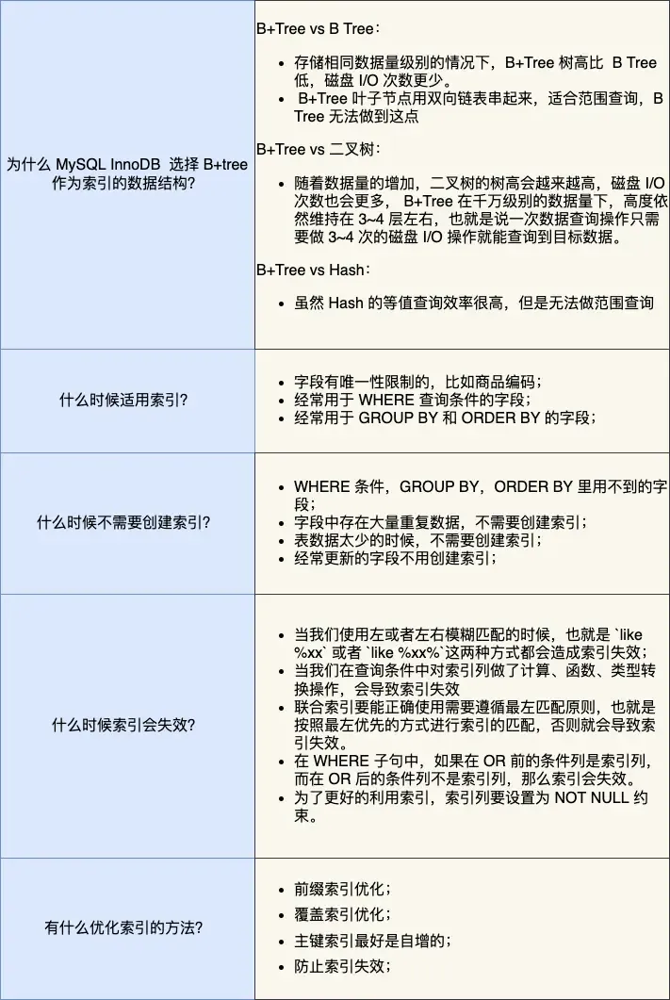
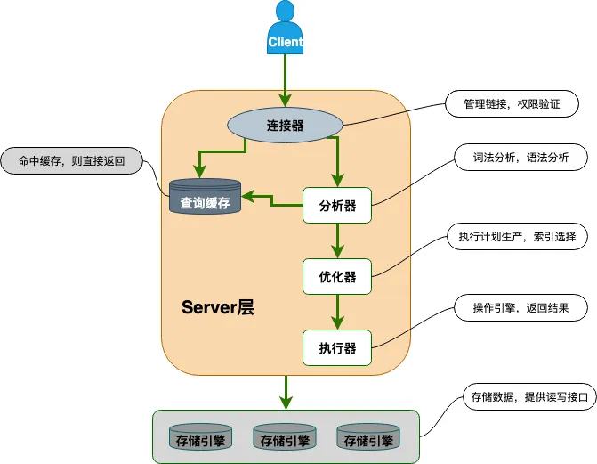
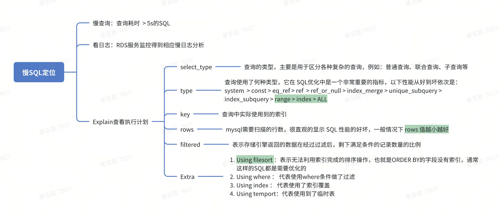
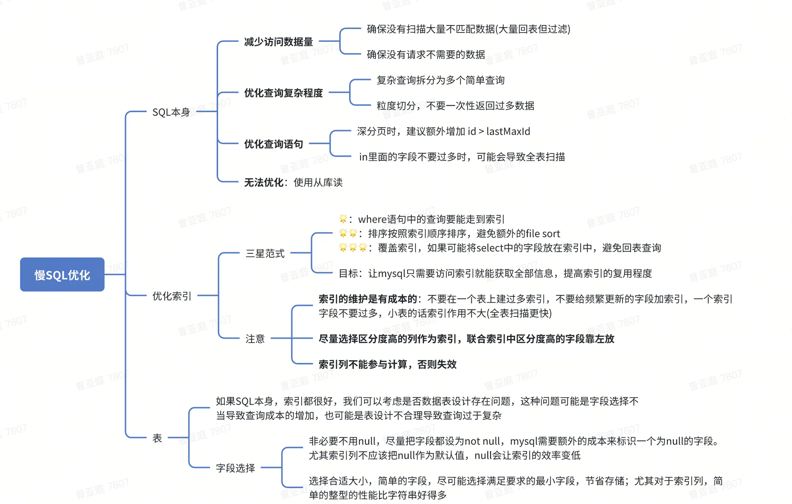
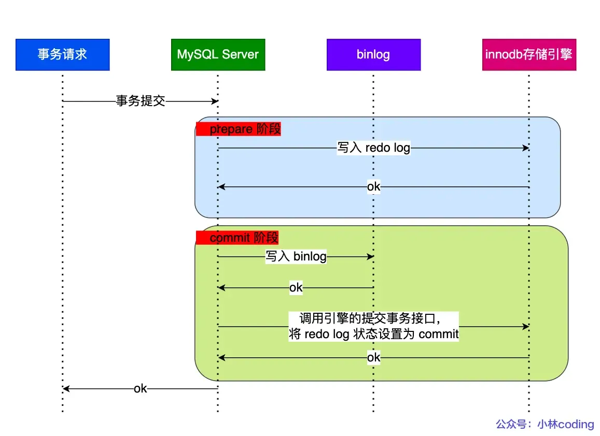
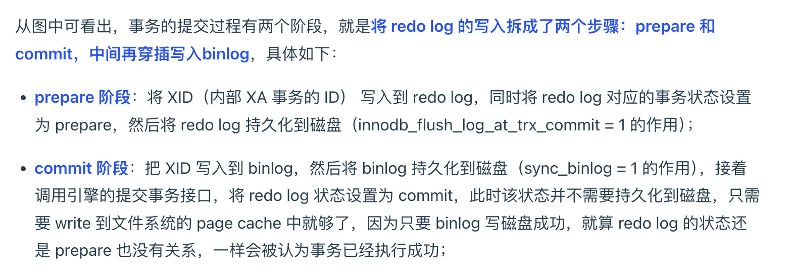

# Mysql

**索引、事务、日志**

### mysql 参数配置

https://juejin.cn/post/7207718128939221049

### 常用SQL语法？

Group by : 分组

Order by :排序

Distinct: 去重

Count:计数

Desc：倒序

### 一次SQL语句执行流程？

**SQL** 全称是(Structured Query Language:结构化查询语言) 

MySQL 的架构共分为两层：**Server 层和存储引擎层( 默认是InnoDB)**

**Server 层：负责建立连接、分析和执行 SQL**

1. **连接器**：建立连接，管理连接、校验用户身份；
    1. 连接mysql：`mysql -h$ip -u$user -p` ，MySQL 是基于 TCP 协议进行传输，所以需要建立TCP连接
    2. 校验客户端的用户名和密码
    3. 获取该用户的权限，用于后续权限逻辑的判断
2. 查询缓存：
    1. 查询语句如果命中查询缓存则直接返回，否则继续往下执行。MySQL 8.0 已删除该模块；
3. **解析SQL**：
    1. **词法分析**：识别关键字，如select from等
    2. **语法分析**：根据词法分析的结果，语法解析器会根据语法规则，判断输入的这个 SQL 语句是否满足 MySQL 语法，满足则构建出 SQL 语法树，方便后续模块读取表名、字段、语句类型
4. **执行SQL**：
    1. 预处理器：检查表或字段是否存在；将 `select *` 中的 `*` 符号扩展为表上的所有列
    2. **优化器**：基于查询成本的考虑， 选择查询成本最小的执行计划；
        1. explain 关键字：`type` 列表示的是扫描方式，index代表走索引，all代表全表扫描
    3. **执行器**：根据执行计划执行 SQL 查询语句，从存储引擎读取记录，返回给客户端
    4. **涉及索引相关知识！！**

**存储引擎层：负责数据的存储和提取**

如索引数据结构：InnoDB 支持索引类型是 B+树

### MySQL 一行记录是怎么存储的？

- 数据库表中的记录都是按行（row）进行存放的，每行记录根据不同的行格式，有不同的存储结构
- 记录是按照行来存储的，但是数据库的读取并不以「行」为单位，否则一次读取（也就是一次 I/O 操作）只能处理一行数据，效率会非常低
- **InnoDB 的数据是按「页」为单位来读写的，默认每个页的大小为 16KB**
- **表中的行记录存储在「数据页」里面，数据页中的记录按照「主键」顺序组成单向链表，单向链表的特点就是插入、删除非常方便，但是检索效率不高，**因此，数据页中有一个**页目录**，起到记录的索引作用
- 行格式（row_format），就是一条记录的存储结构
    - Compact 行格式：
        - 记录的额外信息：变长字段长度列表、NULL 值列表、记录头信息
        - 记录的真实数据：隐藏字段(row_id隐式自增 id 、trx_id事务id、roll_pointer上一个版本的指针)，trx_id 和 roll_pointer用于实现MVCC

# 慢查询sql

- 原因：
    - **没加索引**
    - **加了，但是索引失效**
        - 索引列 存在隐式的类型转换、使用函数、运算、
        - 查询条件包含or
        - like通配符以%开头
        - 查询条件不满足联合索引最左匹配原则
    - **limit深分页问题**
        - limit 100000,10：会扫描offset + n行，然后丢弃掉前offset行，返回后n行数据，**多余的offset意味着大量多余的回表次数**
        - 减少回表次数：
            - 标签记录法：将limit 100000,10 改为 id > 100000 limit 10，也就是通过一个自增字段id记录一下目前已经查找到100000了，然后基于id索引即可
            - 延迟关联法：覆盖索引，减少回表
    - **单表数据量太大**
        - **加索引还是很慢：千万级别数据下，**B+树很高，需要经历的磁盘io变多，此时就要考虑**分库分表**了

### 分库分表

[https://javaguide.cn/high-performance/read-and-write-separation-and-library-subtable.html#分库分表后-数据怎么迁移呢](https://javaguide.cn/high-performance/read-and-write-separation-and-library-subtable.html#%E5%88%86%E5%BA%93%E5%88%86%E8%A1%A8%E5%90%8E-%E6%95%B0%E6%8D%AE%E6%80%8E%E4%B9%88%E8%BF%81%E7%A7%BB%E5%91%A2)

# 索引

索引是数据的目录

### 为什么使用B+树？

哈希不能范围查找，二叉查找树自增主键退化为链表，平衡二叉树大量数据下需要大量磁盘io，B树/B+树是多叉查找树，更加矮胖，减少磁盘io，而B+树进一步优化

我们知道，索引的作用是做数据的快速检索，而快速检索的实现的本质是数据结构。通过不同数据结构的选择，实现各种数据快速检索，避免暴力的顺序遍历方法

- **哈希表的尝试**：采用哈希映射，将值(key)通过哈希函数变换为固定长度的 key 地址，通过这个地址查找具体数据，同时为了避免哈希冲突，采用链地址法，可以达到O(1)的时间复杂度，但是 Mysql 并没有采取哈希作为其底层算法，这是为什么呢？因为它**没办法做数据高效范围查找**，所以不适合
- **二叉查找树**：二叉查找树是一种天然支持数据快速查找的数据结构，但是有个致命缺点，就是极端情况下会退化为线性链表，时间复杂O(lgn)退化为 O(N)，而在数据库中，数据的自增是一个很常见的形式，比如一个表的主键是 id，而主键一般默认都是自增的，
- **平衡二叉树、红黑树**：二叉查找树存在不平衡问题，那就通过旋转等操作让它自动保持平衡，也就不会退化成链表，同时保证了不错的查找性能，同样也可以实现范围查找，数据插入等，但这时还要考虑另外一个问题：**MySQL 的数据是存储在磁盘中的，所以这时候查询的瓶颈就在于磁盘 IO次数了，**而平衡二叉树和红黑树一个节点只能存放一个数据，一次磁盘 IO 只能取出来一个节点上的数据加载到内存里，查找的磁盘io次数和树的高度相关，当节点数量大量增长时，这课树的高度就会变得非常大，那么就需要更多的磁盘io次数了，这是非常耗时的，也就是说**高效的二叉平衡树在面对百万数据时，树结构过于庞大，查询复杂度很高，依然需要大量磁盘io**
- **B树**：所以为了减少磁盘 IO 的次数，考虑到磁盘 IO 的特点，就是从磁盘读取 1B 数据和 1KB 数据所消耗的时间是基本一样的，根据这个思路进一步优化，**每个节点中存放多个数据**，多叉树结构扁平化，减小树高度，提升查找效率，也减少了磁盘io数
- **B+树**：在B树基础上进一步优化，仅叶子节点存放数据，叶子节点之间采用双向有序链表相连，方便区间范围查找；非叶节点存放索引，在数据量相同的情况下，相比存储数据记录的 B 树，B+树的非叶子节点可以存放更多的索引，所以**B+ 树可以比 B 树更「矮胖」，查询底层节点的磁盘 I/O次数会更少**

### **为什么使用自增主键？**

因为B+树存放数据的叶子节点底层是通过有序链表存储的，如果是自增的，**插入一条新记录，都是追加操作，不需要重新移动数据，**如果不是自增就会涉及插入排序，影响其他数据页，可能需要分页等数据移动操作，开销大

因为是链表，尽管插入，删除效率高，但是查找效率慢，所以需要优化查询效率，采用索引的方式，以空间换时间，页内建立目录项，页间也建立目录项（索引），以此构造B+树

### 什么时候适用索引？

- 字段有**唯一性**限制的，比如商品编码；
- 经常用于 `WHERE` 查询条件的字段，这样能够提高整个表的查询速度，如果查询条件不是一个字段，可以建立联合索引。
- 经常用于 `GROUP BY` 和 `ORDER BY` 的字段，这样在查询的时候就不需要再去做一次排序了，因为我们都已经知道了建立索引之后在 B+Tree 中的记录都是排序好的。

### 什么时候不需要创建索引？

- **区分度不高的场景；**
- **表数据太少的时候，不需要创建索引；**
- **频繁更新的字段不适合创建索引；**比如不要对电商项目的用户余额建立索引，因为索引字段频繁修改，由于要维护 B+Tree的有序性，那么就需要频繁的重建索引，这个过程是会影响数据库性能的

### 索引下推是什么？

- 索引下推是 MySQL 5.6 针对扫描二级索引的一项优化改进。总的来说是通过把索引过滤条件下推到存储引擎，来减少 MySQL 存储引擎访问基表的次数以及 MySQL Server层访问存储引擎的次数
- **索引下推是为了减少回表而发明的，**通过减少回表的次数来提高数据库的查询效率(注意是减少不是避免！)，只是多做了条件过滤，减少了不必要的回表，但是满足条件后获取额外数据依然需要回表
    - `select * from table where name like 'zh%' and age=10`
    - **二级索引是（name，age）的联合索引**
    - 二级索引最左匹配原则找到符合zh开头的第一个记录然后回表返回完整记录给server层，再由server层通过age=10条件过滤这条记录。之后返回第二个，以此类推
    - **索引下推流程**：二级索引最左匹配符合zh开头的记录，判断本条记录的age是否等于10，如果等于再去回表，不等于就不用回表，继续找二级索引zh开头的第二条记录，继续操作，直到找到一个符合age=10的记录
    - **本来Server层干的事情现在下推到存储引擎了**

### 主键索引 & 二级索引

- 主键索引：也就是**聚簇索引**，叶子节点存放真正的数据，其它对普通字段建立的索引都属于二级索引，多个普通字段组合在一起创建的索引就叫做联合索引
- 二级索引：叶子节点不存放数据副本（否则更新操作需要更新所有索引树下的数据副本），而是存放索引字段+主键（同样大小的页就可以存放更多的项，减少数据存储空间，更少的页也会加快查询效率），如果索引/主键中已经包含需要的数据，无需回表
- **回表**：所谓的回表其实就是，当我们使用非聚簇索引查询数据时，需要的数据可能包含其他列，但走的索引树叶子节点只能查到当前列值以及主键ID，所以需要根据主键ID再去查一遍数据，得到SQL 所需的列，也就是**当前索引无法检索出完整的内容，需要通过主键二次查询**
- **索引下推：索引下推是为了减少回表而发明的，**通过减少回表的次数来提高数据库的查询效率(注意是减少不是避免！)，只是多做了条件过滤，减少了不必要的回表，但是满足条件后获取额外数据依然需要回表
    - `select * from table where name like 'zh%' and age=10`
    - **二级索引是（name，age）的联合索引**
    - 二级索引最左匹配原则找到符合zh开头的第一个记录然后回表返回完整记录给server层，再由server层通过age=10条件过滤这条记录。之后返回第二个，以此类推
    - **索引下推流程**：二级索引最左匹配符合zh开头的记录，判断本条记录的age是否等于10，如果等于再去回表，不等于就不用回表，继续找二级索引zh开头的第二条记录，继续操作，直到找到一个符合age=10的记录
    - **本来Server层干的事情现在下推到存储引擎了**
- **覆盖索引**：想要**避免**回表，可以使用[覆盖索引](https://www.zhihu.com/search?q=%E8%A6%86%E7%9B%96%E7%B4%A2%E5%BC%95&search_source=Entity&hybrid_search_source=Entity&hybrid_search_extra=%7B%22sourceType%22%3A%22answer%22%2C%22sourceId%22%3A2548375803%7D)，所谓的覆盖索引，实际上就是你想要查出的列刚好在叶子节点上(索引和主键)都存在，就不需要回表操作了，也就是建立联合索引，让它存在叶子节点中
- **联合索引**注意**最左前缀匹配原则**：
    - 先匹配最左边的，索引只能用于查找key是否存在（相等），遇到[范围查询](https://www.zhihu.com/search?q=%E8%8C%83%E5%9B%B4%E6%9F%A5%E8%AF%A2&search_source=Entity&hybrid_search_source=Entity&hybrid_search_extra=%7B%22sourceType%22%3A%22answer%22%2C%22sourceId%22%3A2548375803%7D) (>、<、between、like左匹配)等就不能进一步匹配了，后续退化为[线性查找](https://www.zhihu.com/search?q=%E7%BA%BF%E6%80%A7%E6%9F%A5%E6%89%BE&search_source=Entity&hybrid_search_source=Entity&hybrid_search_extra=%7B%22sourceType%22%3A%22answer%22%2C%22sourceId%22%3A2548375803%7D)
    - 查询优化器会根据实际估算按索引查找（回表磁盘读取文件成本）和全表扫描（order by额外内存排序成本...）的成本，然后选择其中更快的方法，但是不会都真正执行一遍

### 索引失效包括哪些？

本质：

- 索引是根据**原始值**建立的，所以如果对字段进行操作（计算、函数、类型转换）都会导致索引失效，走全表扫描
    1. **对索引字段使用函数**：因为索引保存的是索引字段的原始值，而不是经过函数计算后的值，自然就没办法走索引了
    2. **对索引进行表达式计算：**同样因为索引保存的是索引字段的原始值，而不是 id + 1 表达式计算后的值，所以无法走索引
    3. **对索引隐式类型转换：**MySQL 在遇到字符串和数字比较的时候，会自动把字符串转为数字，然后再进行比较，如果字段类型是字符串，但是输入了整型，会在字符串字段上作用一个隐式类型转化函数，即情况1使用函数，所以索引失效
- 联合索引不符合遵循最左匹配原则：
    - **like 关键字左**或者左右模糊匹配：也就是 `like %xx` 或者 `like %xx%` 这两种方式都会造成索引失效，因为**索引 B+ 树是按照「索引值」有序排列存储的，只能根据前缀进行比较**

# 事务

### **什么是事务？**

- 事务Transaction：封装的一系列sql操作，执行时要么全部成功，要么全部失败，事务中的操作执行是真正修改数据库的，如果中途失败，则回滚undo，保证一致
- begin并没有开始事务，第一条select才开始
    - MYSQL事务分为【隐式事务和显示事务】
    - 隐式事务比如insert、update、delete语句，事务的开启、提交或回滚由mysql内部自动控制
    - 显式事务是指在应用程序中使用BEGIN、COMMIT明确指定事务的开始和结束
- **ACID特性**：
    - **原子性**（Atomicity）：
        - 一个事务中的所有操作，**要么全部成功，要么全部失败**，不会结束在中间某个环节，而且事务在执行过程中发生错误，会被回滚到事务开始前的状态
        - 通过 **undo log**（**回滚日志**） 来保证的
    - **一致性**（Consistency）：通过持久性+原子性+隔离性来保证数据一致
    - **隔离性**（Isolation）：
        - **并发事务之间互不干扰**，数据库允许多个并发事务同时对其数据进行读写和修改的能力，隔离性可以防止多个事务并发执行时由于交叉执行而导致数据的不一致
        - 通过 **MVCC**（**多版本并发控制**） 结合锁机制来保证
    - **持久性**（Durability）：
        - **事务处理后，变更永久生效**，即便系统故障也不会丢失
        - 通过 **redo log** （**重做日志**）来保证的

### 隔离级别？

- 并发事务带来的问题：
    - **脏读**：读到其他事务执行中数据
    - **不可重复读**：一个事务内两次读取数据不一致（更新、删除）
    - **幻读**：一个事务内两次读取记录不一致（插入）
        - 哎刚才明明是两条记录啊，怎么现在3条了？？？
- 隔离性：通过不同隔离级别来解决上述问题
    - **读未提交**：会脏读，不采用，通过直接读取最新数据实现
    - **读已提交(**read commit(rc)：有不可重复读和幻读问题，通过MVCC实现，读取最新版本数据
    - **可重复读(**repeatable read(rr)：有幻读问题，**InnoDB默认使用**，通过MVCC实现，始终读取事务开始时版本数据(快照读)
    - **串行化**：通过加读写锁实现，完全解决问题，但效率最低，性能最差

### MVCC：隔离性保证

- MVCC：多版本并发控制（**read view + undo 版本链**）
    - **read view四个字段**：事务相关
        - **creator_trx_id** ：指的是**创建该 Read View 的事务的事务 id**
        - **m_ids** ：创建 Read View 时，当前数据库中「活跃且未提交事务」的**事务 id 列表**
        - **min_trx_id**：m_ids 的最小值
        - max_trx_id：**创建 Read View 时当前数据库中应该给下一个事务的 id 值，也就是全局事务中最大的事务 id 值 + 1；**
    - **数据的2个隐藏字段**：数据相关
        - trx_id：该数据版本的事务id
        - roll_point：指向上一个版本的数据记录
    - **undo 版本链**：**类似写时复制（copy-on-write）策略的方式，在生成新版本数据的同时，也会通过 undo log 保留修改前的数据副本，**并和旧数据通过指针相连，形成新旧版本链，**为外界在读取行记录时提供了一个能够自由选取指定版本的能力**
    - **通过「版本链」来控制并发事务访问同一个记录时的行为就叫 MVCC**
- **多版本**：与**写时复制copy on write**思想一致，读写分离，提高并发效率（但不是真正的复制，read view结构存储当前事务相关字段，和数据条目隐藏字段包括事务id，回滚指针（指向上一个版本，即undo log版本链指针）进行比对查找
- **事务read view和数据版本链比对查找的流程**：一个事务去访问记录的时候，除了自己的更新记录总是可见之外，还有这几种情况：
    - 如果记录的 trx_id 值小于 Read View 中的 `min_trx_id` 值，表示这个版本的记录是在创建 Read View **前**已经提交的事务生成的，所以该版本的记录对当前事务**可见**。
    - 如果记录的 trx_id 值大于等于 Read View 中的 `max_trx_id` 值，表示这个版本的记录是在创建 Read View **后**才启动的事务生成的，所以该版本的记录对当前事务**不可见**。
    - 如果记录的 trx_id 值在 Read View 的 `min_trx_id` 和 `max_trx_id` 之间，需要判断 trx_id 是否在 m_ids 列表中：
        - 如果记录的 trx_id **在** `m_ids` 列表中，表示生成该版本记录的活跃事务依然活跃着（还没提交事务），所以该版本的记录对当前事务**不可见**。
        - 如果记录的 trx_id **不在** `m_ids`列表中，表示生成该版本记录的活跃事务已经被提交，所以该版本的记录对当前事务**可见**。
- **读已提交的实现：是在每次读取数据时，都会生成一个新的 Read View**
- **可重复读的实现**：**启动事务时生成一个 Read View，然后整个事务期间都在用这个 Read View**
- **可重复读级别中的幻读问题**：
    - **快照读**：事务执行过程中看到的数据，一直跟这个事务启动时看到的数据是一致的（即使插入也看不见，所以解决了幻读）
    - **当前读**：只有普通查询是快照读，其他操作时都是使用的最新版本的数据，存在幻读问题，进一步**通过 next-key lock（记录锁+间隙锁）方式解决了幻读，**如果有其他事务在 next-key lock 锁范围内插入了一条记录，那么这个插入语句就会被阻塞，无法成功插入，所以就很好了避免幻读问题
- **可重复读(快照读)级别依然存在的问题**：
    - 操作旧数据时发现有新的数据
    - 解决：
        1. **乐观锁+CAS**：不上锁，只是根据版本号version判断在此期间数据是否更新，结合CAS机制，compare and swap（比较与交换），不断自旋循环重试
        2. 悲观锁：依靠数据库的**锁**机制实现，以保证操作最大程度的独占性

# 日志

前情提要：

- 我们知道，对于 mysql innodb 这样以磁盘作为存储介质的数据库来说，**全量数据内容是存储在磁盘上的.** 但是在事务执行过程中，**针对涉及到的数据记录，会基于局部性原理，以数据所在的页 page（默认 16KB）为单位将对应内容从磁盘加载到内存中**. 如果此时事务执行的是一笔更新操作并且事务被成功提交，那么**内存中的数据会被更新，且直到该数据被溢写更新回到磁盘之前，该 page 在内存和磁盘中的结果是不一致的**，我们称这样的页 page 为**脏页 dirty page**

### 预写日志机制

- Write-Ahead Logging，WAL技术，指的是 MySQL 的写操作并不是立刻更新到磁盘上，而是**先记录在日志上，然后在合适的时间再更新到磁盘上**
- MySQL真正使用WAL的原因是：磁盘的写操作是**随机IO**，比较耗性能，所以如果把每一次的更新操作都先写入log中，那么就成了**顺序写**操作，实际更新操作由后台线程再根据log异步写入
- **核心**：将**随机**写转变为了**顺序**写，降低了客户端的延迟，提升了吞吐量

### **undo log：原子性保证**

- **undo log 以数据行记录为粒度**，其存放在数据库的**特殊共享表空间 undo segment** 内，可以将其理解为一类特殊的数据
    - undo log都有一个 r**oll_pointer 回滚指针**和一个 **trx_id 事务id**
        - 通过 trx_id 可以知道该记录是被哪个事务修改的；
        - 通过 roll_pointer 指针可以将这些 undo log 串成一个链表，这个链表就被称为**版本链**
- **undo log** 采用一种类似**写时复制**的策略，记录一个行记录上一版本的旧数据，并通过指针串联成链，**用以支持事务回滚操作以及MVCC的版本选取策略**
- 原子性：全部成功，全部失败
    - **全部提交：** 当事务**提交时，其事务 id 会获得“正名”** ，这样一瞬间，其产生的所有行记录对应的数据版本都会被外界所认可，**体现了原子性中“全部动作一起成功”** 的语义
    - **全部回滚**：**当事务回滚时，其事务 id 会失去“正名”** ，其产生的所有行记录对应数据版本都被外界否定，与此同时，可以**很方便地借助 undo log 将涉及修改的行记录内容回溯成上一个版本的状态，体现了原子性中“全部动作一起失败”** 的语义
- **undo log** **存放于 innodb 共享表空间 undo segment 中**，**本身也需要依赖于 redo log 实现数据持久化**

### **redo log： 持久性保证**

- 问题：在事务提交时，innodb 应该采取怎样的持久化机制，来保证这部分变更的数据能够被持久稳定地存储下来
- 作用：持久化记录的写操作，防止在写操作更新到磁盘前发生断电丢失这些写操作，直到该操作对应的脏页真正落盘，这样即使系统奔溃，脏页刷盘失败，也可以通过redo log 的内容，将数据恢复到当前最新的状态
- 目的：**redo log 是为了防止数据库宕机而起到的一项保险措施，恢复时通过存量 ibd 文件以及 redo log file 就能还原出最真实精确的数据状态.**
- 所以在数据库正常运行场景中，其实是不需要使用到 redo log 的，因为此时哪怕磁盘 ibd 文件内容与内存中的 dirty page 存在差异也不会影响数据的一致性，正常读内存，当dirty page 因内存淘汰策略即将被踢出内存时，也会确保持久化到 ibd 文件中，保证内容的一致性。
- **redo log 同样以 page 为粒度，存储的内容是一个 page 在更新后物理层面上的数据状态**
- **redo log** 是一种类似于**预写日志**的内容，**以磁盘顺序写的方式生成该 page 对应的 redo log file，当脏页落盘后，清除redo log file内容，**用于实现**对数据持久性及写操作性能的保证**
- redo log由以下两部分组成：
    - **redo log buffer：内存**中的重做日志缓存区
        - 每当有事务执行并执行写操作时，会**以数据所从属的 page 为单位，生成对应的 redo log，并将其投递到 redo log buffer** 中
    - **redo log file：磁盘**中的重做日志文件
        - 在事务提交时，会把内存中的 redo log **持久化到磁盘上的 redo log file** 中(fsync)

### **binlog：主从复制，数据备份**

- **binlog 是 mysql 数据库层面**产生的，不依附于任何存储引擎，属于全局共用的二进制日志；**redo log 是 innodb 存储引擎专属定制**的，供引擎内部使用
- **binlog 的记录内容是逻辑层面的增量执行 SQL 语句**，主要用途可能用于数据库之间的主从复制，通过重放增量 SQL 的方式复刻出完整的数据内容；**redo log 以 page 为粒度存储物理意义上的页数据**，其目的是为了兼顾事务的持久性以及写操作的高性能
- binlog 文件是记录了所有数据库表结构变更和表数据修改的日志，**不会记录查询类的操作**，比如 SELECT 和 SHOW 操作
- **为什么有了 binlog， 还要有 redo log？**
    - 其实通过 binlog 是不是也能闭环实现数据的持久化，那还需要redo log么？
    - redo log 的采用还是有必要的，这个问题的核心就在于数据恢复流程的效率问题. 在 innodb 中，每次启动数据库时，都会统一基于 redo log 执行数据恢复流程，而不会刻意区分此前数据库是异常宕机还是正常终止. 同样是**通过持久化日志还原数据，基于 binlog 这种逻辑增量记录的方式，其效率是远远不如基于 redo log 这种物理日志的**.
    - **只依靠 binlog 是没有 crash-safe 能力：**这个问题跟 MySQL 的时间线有关系，最开始 MySQL 里并没有 InnoDB 引擎，MySQL 自带的引擎是 MyISAM，但是 MyISAM 没有 crash-safe 的能力，binlog 日志只能用于归档。而 InnoDB 是另一个公司以插件形式引入 MySQL 的，既然**只依靠 binlog 是没有 crash-safe 能力**的，所以 InnoDB 使用 redo log 来实现 crash-safe 能力
    - **crash-safe能力：能够保证MySQL在任何时间段突然奔溃，重启后之前提交的记录都不会丢失**
        - https://blog.csdn.net/qq_31960623/article/details/116209282
- **如果不小心整个数据库的数据被删除了，能使用 redo log 文件恢复数据吗？**
    - 不可以使用 redo log 文件恢复，只能使用 binlog 文件恢复。 因为 redo log 文件是循环写，是会边写边擦除日志的，只记录未被刷入磁盘的数据的物理日志，已经刷入磁盘的数据都会从 redo log 文件里擦除。 binlog 文件保存的是全量的日志，也就是保存了所有数据变更的情况，理论上只要记录在 binlog 上的数据，都可以恢复，所以如果不小心整个数据库的数据被删除了，得用 binlog 文件恢复数据
- **binlog 和 redolog 两阶段提交**

# 锁

https://zhuanlan.zhihu.com/p/31875702