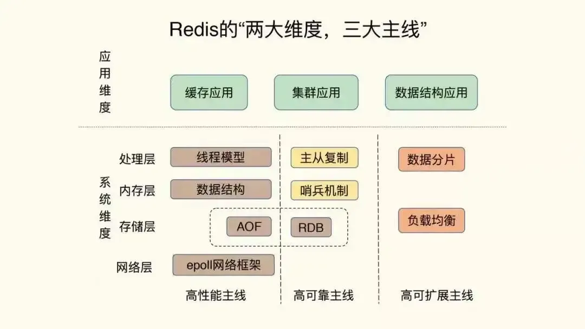
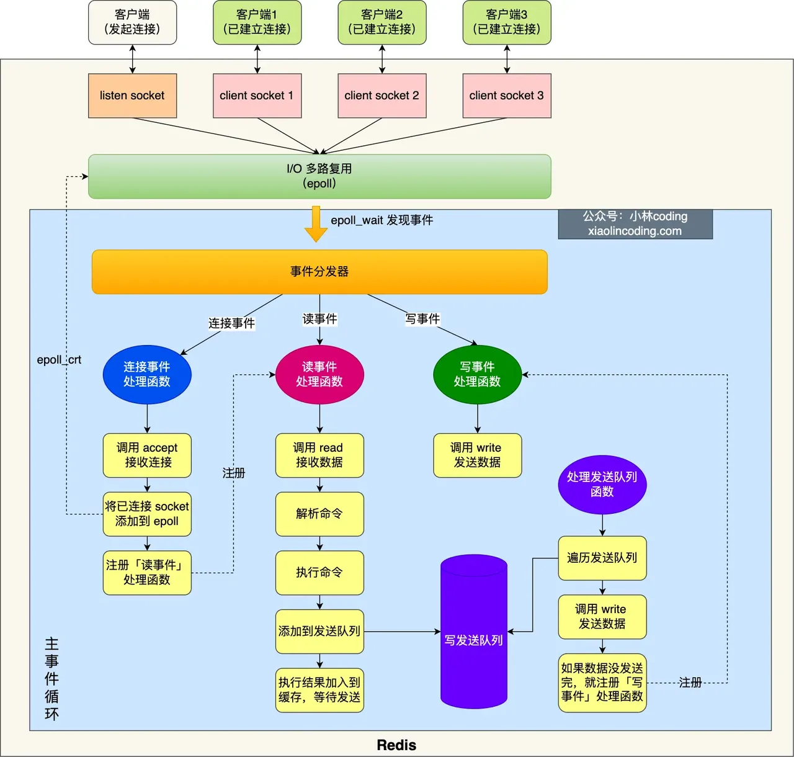

# Redis




### redis 集群高可用？

**主从模式**：复制，一致性，但是不能容错

**哨兵模式**：解决单点故障，即可容错，但是数据集中存储在主节点，负载仍然过大

**cluster集群**: 为了应对海量数据的并发请求，将数据分片，节点平等，但每个数据分片都有一主多从，并行处理请求

- https://blog.csdn.net/yangqjiayou/article/details/137627180

**集群**

1. 单机模式
    1. 单点故障：服务不可用、数据丢失
    2. 无法读写分离
2. 主从
    1. 读写分离
    2. 数据备份
    3. 无法自动容错和恢复
    4. 主从切换可能丢失数据
3. 哨兵
    1. 监控和自动故障处理能力
    2. 主从切换时，开启保护机制，禁止写操作，访问瞬断
    3. 无法在线扩容，有单机瓶颈
4. Redis Cluster
    1. 分片机制，灵活扩缩容
    2. 节点过多会有 gossip 风暴

### redis 参数配置

`redis.conf`

```
#最大内存占用
maxmemory 256mb

# 内存淘汰策略
maxmemory-policy allkeys-lru
# 超时时间
timeout 60

# 以守护进程（daemon）模式运行，默认为 no
#daemonize yes

# 设置 Redis 的工作目录
#dir /var/lib/redis

# 日志文件路径
#logfile /var/log/redis/redis-server.log

# 设置数据库数量，默认为 16
databases 16

# 最大客户端连接数
maxclients 1000

# 设置密码
requirepass test
# 设置是否开启 AOF（Append Only File）持久化方式，默认为 no
appendonly yes

# AOF 文件名
appendfilename "appendonly.aof"

# AOF 自动重写配置
auto-aof-rewrite-percentage 100
auto-aof-rewrite-min-size 64mb

# 开启 RDB 持久化
save 900 1
save 300 10
save 60 10000

# 内存压缩算法
rdbcompression yes

# 数据库文件格式
rdbchecksum yes

# 启用多线程
io-threads 4

# 设置日志级别
loglevel notice
```
### redis  大 key、热 key

1. 什么是大 key、热 key
- **大 key**：含有较大数据或含有大量成员、列表数的 Key 称之为大 Key
    - 一个 STRING 类型的 Key，它的值为 5MB（数据过大）
    - 一个 LIST 类型的 Key，它的列表数量为 20000 个（列表数量过多）
    - 一个 HASH 格式的 Key，它的成员数量虽然只有 1000 个但这些成员的 value 总大小为 100MB（成员体积过大）
- **大 Key 带来的常见问题**
    - Client 发现 Redis **变慢**；
    - Redis 内存不断变大引发 OOM，或达到 maxmemory 设置值引发写阻塞或重要 Key 被**逐出**；
    - Redis Cluster 中的某个 node 内存远超其余 node，但因 Redis Cluster 的数据迁移最小粒度为 Key 而无法将 node 上的**内存均衡**化；
    - 大 Key 上的读请求使 Redis 占用服务器全部**带宽**，自身变慢的同时影响到该服务器上的其它服务；
    - 删除一个大 Key 造成主库较长时间的**阻塞**并引发同步中断或主从切换；
- **大 key 的处理方法**
    1. 对大 Key 进行拆分
        1. 如将一个含有数万成员的 HASH Key 拆分为多个 HASH Key，并确保每个 Key 的成员数量在合理范围，在 Redis Cluster 结构中，大 Key 的拆分对 node 间的内存平衡能够起到显著作用。
    2. 对大 Key 进行清理
        1. 将不适合 Redis 能力的数据存放至其它存储，并在 Redis 中删除此类数据。需要注意的是，我们已在上文提到一个过大的 Key 可能引发 Redis 集群同步的中断，Redis 自 4.0 起提供了 UNLINK 命令，该命令能够以非阻塞的方式缓慢逐步的清理传入的 Key，通过 UNLINK，你可以安全的删除大 Key 甚至特大 Key。
    3. 时刻监控 Redis 的内存水位
        1. 突然出现的大 Key 问题会让我们措手不及，因此，在大 Key 产生问题前发现它并进行处理是保持服务稳定的重要手段。我们可以通过监控系统并设置合理的 Redis 内存报警阈值来提醒我们此时可能有大 Key 正在产生，如：Redis 内存使用率超过 70%，Redis 内存 1 小时内增长率超过 20%等。通过此类监控手段我们可以在问题发生前解决问题，如：LIST 的消费程序故障造成对应 Key 的列表数量持续增长，将告警转变为预警从而避免故障的发生。
    4. 对失效数据进行定期清理
        1. 例如我们会在 HASH 结构中以增量的形式不断写入大量数据而忽略了这些数据的时效性，这些大量堆积的失效数据会造成大 Key 的产生，可以通过定时任务的方式对失效数据进行清理。在此类场景中，建议使用 HSCAN 并配合 HDEL 对失效数据进行清理，这种方式能够在不阻塞的前提下清理无效数据。
- **热 key**：在某个 Key 接收到的访问次数、显著高于其它 Key 时，我们可以将其称之为热 Key
    - 某 Redis 实例的每秒总访问量为 10000，而其中一个 Key 的每秒访问量达到了 7000（访问次数显著高于其它 Key）
    - 对一个拥有上千个成员且总大小为 1MB 的 HASH Key 每秒发送大量的 HGETALL（带宽占用显著高于其它 Key）
    - 对一个拥有数万个成员的 ZSET Key 每秒发送大量的 ZRANGE（CPU 时间占用显著高于其它 Key）
- **热 Key 带来的常见问题**
    - 热 Key 占用大量的 Redis **CPU 时间**使其性能变差并影响其它请求；
    - Redis Cluster 中各 node 流量不均衡造成 Redis Cluster 的分布式优势无法被 Client 利用，一个**分片负载**很高而其它分片十分空闲从而产生读/写热点问题；
    - 热 Key 的请求压力数量超出 Redis 的承受能力造成**缓存击穿**，此时大量请求将直接指向后端存储，将其打挂并影响到其它业务；
- **热 key 的处理方法**
    1. 在 Redis Cluster 结构中对热 Key 进行复制
        1. 在 Redis Cluster 中，热 Key 由于迁移粒度问题造成请求无法打散使单一 node 的压力无法下降。此时可以将对应热 Key 进行复制并迁移至其他 node，例如为热 Key foo 复制出 3 个内容完全一样的 Key 并名为 foo2，foo3，foo4，然后将这三个 Key 迁移到其他 node 来解决单一 node 的热 Key 压力。
        2. 该方案的缺点在于代码需要联动修改，同时，Key 一变多带来了数据一致性挑战：由更新一个 Key 演变为需要同时更新多个 Key，在很多时候，该方案仅建议用来临时解决当前的棘手问题。
    2. 使用读写分离架构
        1. 如果热 Key 的产生来自于读请求，那么读写分离是一个很好的解决方案。在使用读写分离架构时可以通过不断的增加从节点来降低每个 Redis 实例中的读请求压力。
        2. 然而，读写分离架构在业务代码复杂度增加的同时，同样带来了 Redis 集群架构复杂度的增加：我们不仅要为多个从节点提供转发层（如 Proxy，LVS 等）来实现负载均衡，还要考虑从节点数量显著增加后带来的故障率增加的问题，Redis 集群架构变更的同时为监控、运维、故障处理带来了更大的挑战。
    3. 利用二级缓存
        1. 可以使用本地缓存缓解 redis 访问压力，但是可能会出现数据不一致的情况

- **大 key 和热 key 产生原因**
1. 将 Redis 用在并不适合其能力的场景，造成 Key 的 value 过大，如使用 String 类型的 Key 存放大体积二进制文件型数据（大 Key）；
2. 业务上线前规划设计考虑不足没有对 Key 中的成员进行合理的拆分，造成个别 Key 中的成员数量过多（大 Key）；
3. 没有对无效数据进行定期清理，造成如 HASH 类型 Key 中的成员持续不断的增加（大 Key）；
4. 预期外的访问量陡增，如突然出现的爆款商品、访问量暴涨的热点新闻、直播间某大主播搞活动带来的大量刷屏点赞、游戏中某区域发生多个工会间的战斗涉及大量玩家等（热 Key）；
5. 使用 LIST 类型 Key 的业务消费侧代码故障，造成对应 Key 的成员只增不减（大 Key）

- **如何找到大 key 和热 key**
1. 使用 Redis 内置功能发现大 Key 及热 Key
    1. Redis 自 4.0 起提供了 **MEMORY USAGE** 命令来帮助分析 Key 的内存占用，相对 debug object 它的执行代价更低，但由于其时间复杂度为 O(N)因此在分析大 Key 时仍有阻塞风险。
    2. 通过**获取长度或元素个数**的命令来分析 key 的相关信息。可以方便且安全的对 Key 进行分析而不会影响线上服务，但由于它们返回的结果非 Key 的真实内存占用数据，因此不够精确，仅可作为参考。
2. 通过 Redis 官方客户端 redis-cli 的 bigkeys 参数发现大 Key、hotkeys 参数发现热 Key
    1. Redis 提供了 **bigkeys** 参数能够使 redis-cli 以遍历的方式分析整个 Redis 实例中的所有 Key 并汇总以报告的方式返回结果。该方案的优势在于方便及安全，而缺点也非常明显：分析结果不可定制化。bigkeys 仅能分别输出 Redis 六种数据结构中的最大 Key，如果你想只分析 STRING 类型或是找出全部成员数量超过 10 的 HASH Key，那么 bigkeys 在此类需求场景下将无能为力。
    2. Redis 自 4.0 起提供了 **hotkeys** 参数来方便用户进行实例级的热 Key 分析功，该参数能够返回所有 Key 的被访问次数，它的缺点同样为不可定制化输出报告，大量的信息会使你在分析结果时复杂度较大，另外，使用该方案的前提条件是将 redis-server 的 maxmemory-policy 参数设置为 LFU。
3. **通过业务层定位热 Key**
    1. 指向 Redis 的每一次访问都来自业务层，因此我们可以通过在业务层增加相应的代码对 Redis 的访问进行记录并异步汇总分析。该方案的优势为能够准确并及时的分析出热 Key 的存在，缺点为业务代码复杂度的增加，同时可能会降低一些性能。
4. 使用开源工具发现大 Key
    1. redis-rdb-tools：离线分析，不影响线上、实时性差


### Redis 五大基本类型和应用场景

redis中存储数据是以key-value的形式去存储的，**其中key为String字符串类型，value的数据类型有string、hash、list、set、zset等这五种常用的**

1. String
    
    String 类型的值最大能存储 512MB。**string**: 简单动态字符串SDS， ****在C 的原生字符串上进一步封装，使得其不仅可以保存文本数据，还可以保存二进制数据，获取字符串长度的时间复杂度是 O(1)**，**典型的应用setnx分布式锁
    
    **应用场景**
    
    1. 缓存功能：利用 redis 作为缓存，配合其它数据库作为存储层，可以大大加快系统的读写速度、以及降低后端数据库的压力。
    2. 计数器：可以快速实现计数和查询的功能。而且最终的数据结果可以按照特定的时间落地到数据库或者其它存储介质当中进行永久保存。
    3. 共享 session
2. List
    
    List 支持存储 2^32-1 个元素。
    
    从列表的两端进行插入（pubsh）和弹出（pop）元素，支持读取指定范围的元素集，  或者读取指定下标的元素等操作。
    
    redis 列表是链表型的数据结构。
    
    **应用场景**
    
    1. 消息队列
    2. 分页：注意 lrange 的时间复杂度是 O(S+N)，S 是距离，N 是获取的个数
3. Set
    
    元素不重复，可以方便地进行交并差操作。
    
    **应用场景**
    
    1. 去重
    2. 共同好友
4.  ZSet
    
    元素不重复，可以设置 score，用于排序。
    
    **应用场景**
    
    1. 排行榜
    2. 优先队列
5. Hash
    
    key-value 结构。
    
    **应用场景**
    
    1. 存储结构化数据

### redis单线程模型？

`事件处理部分是单线程，总体程序不是，会有后台线程，处理文件、AOF 刷盘、异步释放内存。`

**Redis 单线程：**单线程指的是「接收客户端请求->解析请求 ->进行数据读写等操作->发送数据给客户端」这个业务过程是由一个线程（主线程）来完成的

- 但是，Redis 程序并不是单线程的，Redis 在启动的时候，是会启动后台线程（BIO）的，比如处理「关闭文件、AOF 重写、释放内存」这些其他耗时任务

**早期为什么使用单线程：**

- 因为CPU 并不是制约 Redis 性能表现的瓶颈所在，所以没必要多线程，而且多线程会带来并发读写的一系列问题，增加了系统复杂度、同时可能存在线程切换、加锁解锁、甚至死锁造成的性能损耗
- 内存读写和网络IO才是redis的瓶颈：对于网络io，它采用io多路复用技术使得使用单线程就可以应对大量的网络io请求，而对于内存读写，redis则设计了不同的时空动态均衡的高效数据存储结构如SDS，跳表等，优化内存读写速度

**redis6.0以后是多线程：因为随着网络硬件的性能提升，Redis 的性能瓶颈有时会出现在网络 I/O 的处理上，所以**使用多个io子线程提升io读写解析数据的效率，但是在执行命令操作内存数据的时候还是用单线程

### redis 缓存穿透、击穿、雪崩？

- 穿透：redis和数据库都没有这个数据，导致每次请求都去请求数据库
    - 解决：
    • 非法请求限制，缓存空值+短的过期时间，布隆过滤器（不存在直接返回）
- 击穿：热key失效，大量并发请求都向数据库请求该key
    - 解决：永不失效，或者加分布式锁
- 雪崩：大量不同的key同一时间失效，访问这些key的请求都去访问数据库
    - 解决：随机过期时间

- 缓存穿透

对于缓存和数据库中都没有的数据，用户不断发起请求。缓存不命中时查询数据库，导致数据库流量过高。攻击者可以利用这个漏洞攻击。

**解决方案**

1. 接口层增加校验，如用户鉴权校验，id 做基础校验，id<=0 的直接拦截；
2. 从缓存取不到的数据，在数据库中也没有取到，这时也可以将 key-value 对写为 key-null，缓存有效时间可以设置短点，如 30 秒（设置太长会导致正常情况也没法使用）。这样可以防止攻击用户反复用同一个 id 暴力攻击。
3. 布隆过滤器。类似于一个 hash set，用于快速判某个元素是否存在于集合中，其典型的应用场景就是快速判断一个 key 是否存在于某容器，不存在就直接返回。布隆过滤器的关键就在于 hash 算法和容器大小。

- 缓存击穿

缓存击穿是指缓存中没有但数据库中有的数据（一般是缓存时间到期），这时由于并发用户特别多，同时读缓存没读到数据，又同时去数据库去取数据，引起数据库压力瞬间增大，造成过大压力。

**解决方案**

1. 设置热点数据永远不过期。
2. 加互斥锁：比如 singleflight 组件。当缓存中没有数据时，只允许一个线程去数据库查询并更新缓存，其他线程等待该线程完成后再从缓存中获取数据。这样可以减少对数据库的并发访问，但是也会降低系统的吞吐量和响应速度
- 分布式锁：当多个 Redis 节点存在时，可以使用分布式锁来保证只有一个节点去数据库查询并更新缓存，其他节点等待该节点完成后再从缓存中获取数据。这样可以避免多个 Redis 节点同时访问数据库，但是也会增加系统的复杂度和延迟

- 缓存雪崩

缓存雪崩是指缓存中数据大批量到过期时间，而查询数据量巨大，引起数据库压力过大甚至 down 机。和缓存击穿不同的是，缓存击穿指并发查同一条数据，缓存雪崩是不同数据都过期了，很多数据都查不到从而查数据库。

**解决方案**

1. **设置不同的过期时间**。可以给缓存设置不同或者随机的过期时间，避免大量的缓存同时失效，造成数据库压力突增
2. **缓存预热**：对于即将来临的大量请求，可以将数据提前缓存在 Redis 中，并设置不同的过期时间
3. **使用多级缓存**：可以构建多级缓存架构，比如 Nginx 缓存+Redis 缓存+本地缓存等，当某一级缓存出现问题时，可以从其他级别的缓存中获取数据，增加系统的容错能力
4. **使用限流熔断**：可以利用一些限流和熔断组件，对请求进行限流和降级处理，当请求超过系统能承受的阀值时，直接拒绝或者返回默认值，保护数据库不被打垮
5. **使用集群和负载均衡**：可以将 Redis 部署成集群模式，并使用负载均衡组件，比如 LVS、HAProxy 等，对请求进行分发和转发，提高 Redis 的可用性和并发能力

### redis和数据库的一致性保证？

- **延迟双删**：先删redis，再更新数据库，最后隔一段时间再删除redis(删除更新期间redis的旧数据)
- **旁路缓存cache Aside**：先更新数据库，再删除redis，保证更新后的数据正确读取
- CPU缓存一致性：
    - **写直达*Write Through：*把数据同时写入内存和 Cache 中，**但是每次写操作都要两次写，影响性能
    - **写回*Write Back***：对于已经缓存在 Cache 的数据的写入，只需要更新其数据就可以，不用写入到内存，只有在需要把缓存里面的脏数据交换出去的时候，才把数据同步到内存里**，**减少了数据写回内存的频率，这样便可以提高系统的性能
    - **多核缓存一致性**：
        - CPU 都是多核的，由于 L1/L2 Cache 是多个核心各自独有的，那么会带来多核心的**缓存一致性**
        - **基于总线嗅探机制的 MESI 协议：**
            - **状态机模型**：四个状态标记数据：独占，共享，已修改，已失效
            - **写传播**：当某个 CPU 核心发生写入操作时，需要把该事件广播通知给其他核心
            - **事务的串行化**：在保证各个不同的核心上运行的结果一致

### redis为什么快？

- 内存读写速度快
- 单线程+io多路复用响应快
- 时空动态均衡的高效数据结构处理快

Redis 几万 QPS

1. Redis 基于内存，内存的访问速度是磁盘的上千倍；
2. Redis 基于 Reactor 模式设计开发了一套高效的事件处理模型，主要是单线程事件循环和 IO 多路复用（Redis 线程模式后面会详细介绍到）；
3. 主事件流程是单线程，免去了加锁等耗时操作
4. Redis 内置了多种优化过后的数据结构实现，性能非常高

### Redis 有哪些痛点 ?

在使用的过程中, 主要遇到以下一些痛点问题:

- 内存成本高
    - 业务不同阶段对 QPS 要求不同 比如游戏业务, 刚上线的新游戏特别火爆, 为了支持上千万同时在线, 需要不断的进行扩容增加机器。运营一段时间后, 游戏玩家可能变少, 访问频率(QPS)没那么高, 依然占用大量机器, 维护成本很高。
    - 需要为 Fork 预留内存 Redis 保存全量数据时, 需要 Fork 一个进程。Linux 的 fork 系统调用基于 Copy On Write 机制, 如果在此期间 Redis 有大量的写操作, 父子进程就需要各自维护一份内存。因此部署 Redis 的机器往往需要预留一半的内存。
- 缓存一致性的问题 对于 Redis + MySQL 的架构需要业务方花费大量的精力来维护缓存和数据库的一致性。
- 数据可靠性 Redis 本质上是一个内存数据库, 用户虽然可以使用 AOF 的 Always 来落盘保证数据可靠性, 但是会带来性能的大幅下降, 因此生产环境很少有使用。另外 不支持 回档, Master 故障后, 异步复制会造成数据的丢失。
- 异步复制 Redis 主备使用异步复制, 这个是异步复制固有的问题。主备使用异步复制, 响应延迟低, 性能高, 但是 Master 故障后, 会造成数据丢失。

### redis实现分布式锁？

- **锁**？
    - 在并发场景中，为了保证临界资源的数据一致性，我们会经常使用到“锁”这个工具对临界资源进行保护，让混乱的并发访问行为退化为秩序的串行访问行为
- **分布式锁**？
    - 在**本地环境**中，由于多线程之间能够共享进程的数据，因此可以比较简单地实现进程内的互斥锁；
    - 然而在**分布式场景**中，有时我们需要跨域多个物理节点执行加锁操作，因此我们就需要依赖到类似于 redis、mysql 这样的状态存储组件，在此基础之上实现所谓的“分布式锁”技术
- **SETNX操作**：采用set only if not exist —— SETNX 操作来实现插入一条kv对，如果发现已经存在，则说明别人加锁了，那么持续轮询，直到他把这个kv对删除，然后我插入成功，那么我就成功加锁了
- **死锁**？
    - 问题：客户端获取锁后**宕机**，没有及时解锁，别人也无法获取锁
    - **过期时间**：基于经验设置过期时间 expire time 机制保证就算宕机依然在时间到期后会释放锁
    - 新问题：如果过期时间内客户端没有处理完，**锁就被提取释放了**
    - **看门狗**：看门狗思路源自于一款基于 java 编写的 redis 分布式锁工具 redisson 当中，本质是实现etcd的租约续约机制，也就是在锁的持有方执行业务逻辑处理的过程中时，需要**异步启动一个看门狗守护协程**，持续为分布式锁的过期阈值进行延期操作
- **一锁多持**：
    - redis**集群**：为避免单点故障引起数据丢失问题，redis 会基于主从复制的方式实现数据备份增加服务的容错性
    - **弱一致**：redis 在进行数据的主从同步时，采用的是**异步**执行机制（**先响应请求，再执行数据同步**），侧重提高可用性，因此是弱一致的
    - **问题**：redis master加锁后还没同步这个锁信息就宕机了，新master继续分配给别客户端 锁
    - **红锁**：基于多数派原则来解决，过半投票策略（半数以上的人达成共识即可，不苛刻地强求所有人同意），也就是**先不响应客户端请求，取得半数加锁成功后才响应客户端请求（raft）**

### **Redis的渐进式rehash扩容机制**

- Redis 会使用装载因子（load factor）来判断是否需要做 rehash。装载因子的计算方式是，哈希表中所有 entry 的个数除以哈希表的哈希桶个数（数组长度），当满足以下条件中的其中一个时就会进行扩容
    - 装载因子 ≥ 5时进行rehash，额外地在进行 RDB 生成和 AOF 重写时，哈希表的 rehash 是被禁止的，这是为了避免对 RDB 和 AOF 重写造成影响
- **渐进式rehash：**
    - 扩展或收缩哈希表需要将 ht[0] （旧全局哈希表） 的所有键值对移动到 ht[1]（新全局哈希表） 当中。这个动作是**分多次，渐进式**地完成的。原因在于当键值对过多时，一次性移动所有键值对会导致Redis在一段时间内无法对外提供服务
    - 步骤如下：
        1. 为 ht[1] 分配内存空间，此时字典同时存在两个哈希表。
        2. 将 dict::rehashidx 置为 0，rehash 工作正式开始。
        3. 在 rehash 进行期间，每次对字典执行增删改查操作时，程序在执行客户端指定操作之外，还会将 ht[0] 在 rehashidx 索引上的所有键值对rehash 到 ht[1]，然后将 rehashidx 的值加一。也就是从ht[0] 的第一个索引位置开始，将这个索引位置上的所有 entries 拷贝到ht[1] 中，接着依次处理下一个哈希桶
        4. 随着字典操作的不断执行，ht[0] 的所有键值对最终会全部移动到 ht[1]，此时程序会将 rehashidx 设为 -1，释放ht[0]的空间，表示 rehash 操作已完成
        
    - **注意**：
        - 在渐进式 rehash 操作过程中，因为同时存在两个哈希表，所以对key的删除，查找，更新操作会在两个哈希表上进行。redis会先尝试在 ht[0] 中寻找目标键值对，如果没有找到则会在 ht[1] 再次寻找
        - 但是新增操作就不一样了，新增key只会在新的哈希表 ht[1] 上进行，为的是确保 ht[0] 中的已经被清空的单向链表不会新增元素
        - 在 rehash 被触发后，即使没有收到新请求，Redis 也会定时执行一次 rehash 操作，而且，每次执行时长不会超过 1ms，以免对其他任务造成影响

### redis 持久化

- **`RDB快照`**
    1. 工作原理
        
        Redis 可以通过创建快照来获得存储在内存里面的数据在某个时间点上的副本。RDB 持久化产生的文件是一个经过压缩的二进制文件，这个文件可以被保存到硬盘中，可以通过这个文件还原数据库的状态，它可以手动执行，也可以在 redis.conf 配置文件中配置，定时执行。
        
    2. 触发机制
    - 手动触发
        
        
        | **命令** | **save** | **bgsave** |
        | --- | --- | --- |
        | **IO 类型** | 同步 | 异步 |
        | **阻塞** | 是 | 是（阻塞发生在 fock()，通常非常快） |
        | **复杂度** | O(n) | O(n) |
        | **优点** | 不会消耗额外的内存 | 不阻塞客户端命令 |
        | **缺点** | 阻塞客户端命令 | 需要 fock 子进程，消耗内存 |
        - bgsave：bgsave 是异步进行，进行持久化的时候，redis 还可以将继续响应客户端请求
        - save：save 命令是同步的命令，会占用主进程，会造成阻塞，阻塞所有客户端的请求
    - 自动触发
        - 自动触发配置，m 秒内修改 n 次 key，触发 rdb
        - 全量复制时：主节点发送 rdb 文件给从节点完成复制操作，主节点会触发 bgsave 命令
        - 执行 flushall 命令
        - 退出 redis、且没开启 aof
        
        ```
        
                1.# 时间策略
        # save m n
        save 900 1
        save 300 10
        save 60 10000
        
        # 文件名称d
        bfilename dump.rdb
        
        # 文件保存路径dir
        /home/work/app/redis/data/
        
        # 如果持久化出错，主进程是否停止写入
        stop-writes-on-bgsave-error yes
        
        # 是否压缩
        rdbcompression yes
        
        # 导入时是否检查
        rdbchecksum yes
        
        ```
        
    1. 优缺点
    
    **优点：**
    
    1. RDB 的内容为二进制的数据，占用内存更小，更紧凑，更适合做为备份文件；
    2. RDB 对灾难恢复非常有用，它是一个紧凑的文件，可以更快的传输到远程服务器进行 Redis 服务恢复；
    3. RDB 可以更大程度的提高 Redis 的运行速度，因为每次持久化时 Redis 主进程都会 fork() 一个子进程，进行数据持久化到磁盘，Redis 主进程并不会执行磁盘 I/O 等操作；
    4. 与 AOF 格式的文件相比，RDB 文件可以更快的重启。
    
    **缺点：**
    
    1. 因为 RDB 只能保存某个时间间隔的数据，如果中途 Redis 服务被意外终止了，则会丢失一段时间内的 Redis 数据。
    2. RDB 需要经常 fork() 才能使用子进程将其持久化在磁盘上。如果数据集很大，fork() 可能很耗时，并且如果数据集很大且 CPU 性能不佳，则可能导致 Redis 停止为客户端服务几毫秒甚至一秒钟。
- **`AOF日志`**
    1. AOF 持久化功能的实现有 5 个部分：
        1. **命令追加（append）**：所有的写命令会追加到 AOF 缓冲区中。
        2. **文件写入（write）**：将 AOF 缓冲区的数据写入到 AOF 文件中。这一步需要调用`write`函数（系统调用），`write`将数据写入到了系统内核缓冲区之后直接返回了（延迟写）。注意！！！此时并没有同步到磁盘。
        3. **文件同步（fsync）**：AOF 缓冲区根据对应的持久化方式（ `fsync` 策略）向硬盘做同步操作。这一步需要调用 `fsync` 函数（系统调用）， `fsync` 针对单个文件操作，对其进行强制硬盘同步，`fsync` 将阻塞直到写入磁盘完成后返回，保证了数据持久化。
            
            fsync 策略有 3 种：
            
            1. appendfsync always：每次写操作都 fsync，性能差
            2. appendfsync everysec：每秒执行一次 fsync，可能会丢失这一秒的数据
            3. appendfsync no：不主动执行 fsync，返回速度最快。操作系统自己同步数据，Linux 下一般为 30 秒一次
        4. **文件重写（rewrite）**：随着 AOF 文件越来越大，需要定期对 AOF 文件进行重写，达到压缩的目的。
        5. **重启加载（load）**：当 Redis 重启时，可以加载 AOF 文件进行数据恢复。
    2. **重写机制**
    **why**：随着 Redis 的运行，AOF 的日志会越来越长，如果实例宕机重启，那么重放整个 AOF 将会变得十分耗时，而在日志记录中，又有很多无意义的记录，比如将一个数据 incr 一千次，那么就不需要去记录这 1000 次修改，只需要记录最后的值即可。所以就需要进行 AOF 重写。
    **how**：Redis 提供了`bgrewriteaof`指令用于对 AOF 日志进行重写。AOF 文件重写并不需要对现有的 AOF 文件进行任何读取、分析或者写入操作，而是通过读取服务器当前的数据库状态来实现的。首先从数据库中读取键现在的值，然后用一条命令去记录键值对，代替之前记录这个键值对的多条命令，这就是 AOF 重写功能的实现原理。
    **重写缓冲区**：AOF 文件重写期间，Redis 还会维护一个 AOF 重写缓冲区，该缓冲区会在子进程创建新 AOF 文件期间，记录服务器执行的所有写命令。当子进程完成创建新 AOF 文件的工作之后，服务器会将重写缓冲区中的所有内容追加到新 AOF 文件的末尾，使得新的 AOF 文件保存的数据库状态与现有的数据库状态一致。最后，服务器用新的 AOF 文件替换旧的 AOF 文件，以此来完成 AOF 文件重写操作
    3. 优缺点
    
    **优点：**
    
    1. 数据安全，aof 持久化可以配置 appendfsync 属性，有 always，每进行一次 命令操作就记录到 aof 文件中一次。
    2. 通过 append 模式写文件，即使中途服务器宕机，可以通过 redis-check-aof 工具解决数据一致性问题。
    3. AOF 机制的 rewrite 模式。AOF 文件没被 rewrite 之前（文件过大时会对命令 进行合并重写），可以删除其中的某些命令（比如误操作的 flushall）)
    
    **缺点：**
    
    1. AOF 文件比 RDB 文件大，且恢复速度慢。
    2. 数据集大的时候，比 rdb 启动效率低

- **`AOF 和 RDB 的选择`**
    
    在 Redis 中，AOF 和 RDB 两种持久化方式各有优缺点，一般来说，有以下几个方面需要参考：
    
    - **数据安全性：如果要求数据不丢失，推荐 AOF**
        - **AOF** 可以采取**每秒同步一次**数据或**每次写操作都同步**用来保证数据安全性
            - 如果使用**每秒同步一次**策略，则最多丢失一秒的数据
            - 如果使用**每次写操作都同步**策略，安全性达到了极致，但这会**影响性能**
        - **RDB** 是一个全量的二进制文件，恢复时只需要加载到内存即可，但是可能会丢失最近几分钟的数据（取决于 RDB 持久化策略）
    - **数据恢复速度：如果要求快速恢复数据，推荐 RDB**
        - **AOF** 需要重新执行所有的写命令，恢复时间会更长
        - **RDB** 是一个全量的二进制文件，恢复时只需要加载到内存即可
    - **数据备份和迁移：如果要求方便地进行数据备份和迁移，推荐 RDB**
        - **AOF** 文件可能会很大，传输速度慢
        - **RDB** 文件是一个紧凑的二进制文件，占用空间小，传输速度快
    - **数据可读性：如果要求能够方便地查看和修改数据，推荐 AOF**
        - **AOF** 是一个可读的文本文件，记录了所有的写命令，可以用于灾难恢复或者数据分析
        - **RDB** 是一个二进制文件，不易查看和修改

|  | **数据安全性** | **数据恢复速度** | **数据备份和迁移** | **数据可读性** |
| --- | --- | --- | --- | --- |
| **AOF** | 高 | 低 | 低 | 高 |
| **RDB** | 低 | 高 | 高 | 低 |
- **`混合持久化`**
    
    **原理：**
    
    - RDB 快照做全量持久化
    - AOF 做增量持久化
    
    配置
    
    ```
    # 开启混合持久化配置
    aof-use-rdb-preamble yes
    
    ```
    
    先使用 RDB 进行快照存储，然后使用 AOF 持久化记录所有的写操作，当重写策略满足或者手动触发重写的时候，将最新的数据存储为 RDB 记录。崩溃重启时，先加载 RDB 部分，再加载 AOF 部分，既保证了数据完整性，又提高了恢复数据的性能。
    
    **问题**：
    
    - AOF 重写和 RDB 持久化可能会同时发生**冲突**，导致内存、CPU 和磁盘的消耗增加。为了解决这个问题，Redis 采用了一些策略来协调两者之间的关系。
    - AOF 文件可能会变得**很大**，导致磁盘空间不足或者恢复时间过长。为了解决这个问题，Redis 提供了 AOF 重写机制来压缩 AOF 文件。
    - AOF 文件可能会被**损坏或者丢失**，导致数据无法恢复。为了解决这个问题，Redis 提供了 AOF 校验机制来检测 AOF 文件是否完整
    
    **冲突：**
    
    在 Redis 中，AOF 重写和 RDB 持久化可能会同时发生，这会导致一些冲突和问题。例如：
    
    - AOF 重写和 RDB 持久化都需要 fork 子进程，如果两个子进程同时存在，会增加内存的消耗和系统的负载。
    - AOF 重写和 RDB 持久化都需要写入磁盘，如果两个文件同时写入，会增加磁盘的压力和 IO 的开销。
    - AOF 重写和 RDB 持久化都需要在完成后通知主进程，如果两个信号同时到达，可能会造成信号丢失或者处理错误。
    
    为了解决这些冲突和问题，Redis 采用了以下策略：
    
    - 如果 AOF 重写和 RDB 持久化同时被触发，那么只有一个子进程会被创建，优先执行 RDB 持久化，然后再执行 AOF 重写。这样可以避免同时存在两个子进程的情况。
    - 如果 AOF 重写正在进行，而此时又收到了 RDB 持久化的请求，那么 RDB 持久化会被延迟到 AOF 重写完成后再执行。这样可以避免同时写入两个文件的情况。
    - 如果 AOF 重写和 RDB 持久化都完成了，那么主进程会先处理 RDB 持久化的信号，然后再处理 AOF 重写的信号。这样可以避免信号丢失或者处理错误的情况。
    
    总之，Redis 通过优先级、延迟和顺序等方式来协调 AOF 重写和 RDB 持久化的冲突和问题，保证了数据的完整性和一致性，下图为简要说明。
    
    | **场景** | **策略** |
    | --- | --- |
    | AOF 重写与 RDB 持久化同时被触发 | 优先 RDB |
    | AOF 重写正在进行 | 优先 AOF |
    | AOF 重写和 RDB 持久化都完成 | 优先 RDB |

## 过期删除——内存回收策略

**惰性删除**：只会在取出 key 的时候才对数据进行过期检查。这样对 CPU 最友好，但是可能会造成太多过期 key 没有被删除。

**定期删除**：每隔一段时间抽取一批 key 执行删除过期 key 操作。并且，Redis 底层会通过限制删除操作执行的时长和频率来减少删除操作对 CPU 时间的影响。

通过惰性删除和定期删除两种方式相结合的方法，redis 就能在较小影响服务性能和可用性的情况下清理过期 key，释放内存空间。

## 逐出——内存淘汰策略

| 淘汰策略 | 作用 |
| --- | --- |
| MAXMEMORY_VOLATILE_LRU | 从设置了过期时间的键中，删除最长时间未使用的键 |
| MAXMEMORY_VOLATILE_LFU | 从设置了过期时间的键中，删除使用频率最低的键 |
| MAXMEMORY_VOLATILE_RANDOM | 从设置了过期时间的键中，随机删除键 |
| MAXMEMORY_VOLATILE_TTL | 从设置了过期时间的键中，删除即将过期的键 |
| MAXMEMORY_ALLKEYS_LRU： | 从所有键中，删除最长时间未使用的键 |
| MAXMEMORY_ALLKEYS_LFU | 从所有键中，删除使用频率最低的键 |
| MAXMEMORY_ALLKEYS_RANDOM | 从所有键中，随机删除键 |
| MAXMEMORY_NO_EVICTION | 不删除键，在写操作时直接报错（默认策略） |

### redis 内存碎片及整理

分配了 32 字节的连续内存空间，而存储数据实际只需要使用 24 字节内存空间，那这多余出来的 8 字节内存空间如果后续没办法再被分配存储其他数据的话，就可以被称为内存碎片。

**原因**

1. Redis 存储存储数据的时候向操作系统申请的内存空间可能会大于数据实际需要的存储空间。
2. 频繁修改 Redis 中的数据也会产生内存碎片。当 Redis 中的某个数据删除时，Redis 通常不会轻易释放内存给操作系统。

**查看内存碎片**

`info memory` 命令。

通常情况下，我们认为 `mem_fragmentation_ratio > 1.5` 的话才需要清理内存碎片。 `mem_fragmentation_ratio > 1.5` 意味着你使用 Redis 存储实际大小 2G 的数据需要使用大于 3G 的内存。

**内存清理**

1. purge 命令在不停机的情况下清理内存
2. degrag 机制自动整理内存
3. 重启