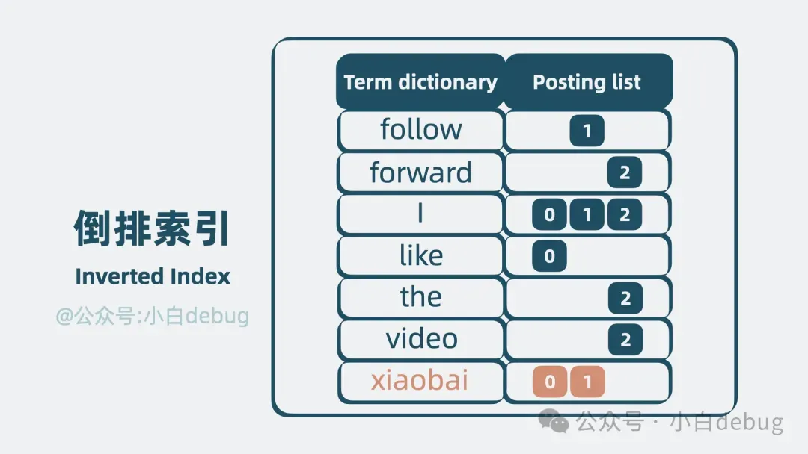
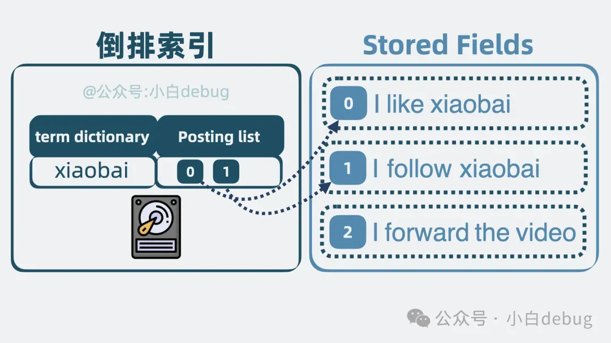
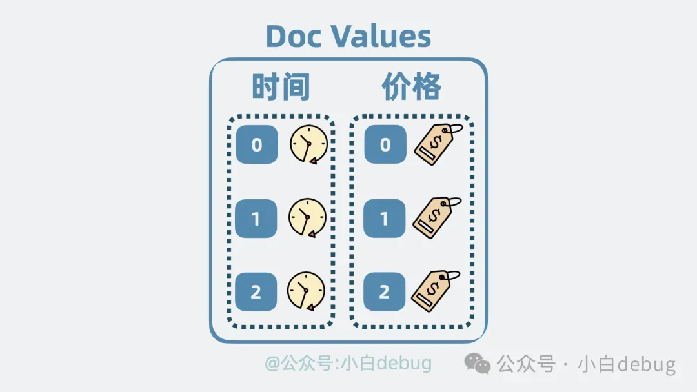
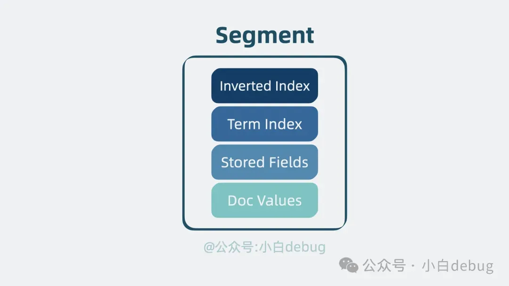

# ES

# **elasticSearch 是什么？**

- **搜索场景**：搜索包含某些**关键词**的数据内容，在海量数据中，通过关键词检索出需要的内容
- **elastic Search**, 也就是 es，是一个开源的搜索引擎
- **搜索引擎三大过程**：爬取内容、进行分词、建立倒排索引
- **实现功能**：只要将数据写入 es，应用就可以通过一些关键词搜索到数据。效果就像某度搜索一样

# **工作原理是怎么样的？**

- Lucene是一个建立倒排索引的开源库，缺点是必须要懂一点搜索引擎原理的人才能用的好
- 所以Elasticsearch 在 Lucene 的基础上进行**封装**，将其对搜索引擎的操作都封装成了**restful的api**，通过http请求就能对其进行操作
- 同时，它还考虑了**海量数据**，实现了Master-slave 架构和数据的分片和备份，是一个可以存储海量数据的分布式搜索引擎
- Elasticsearch 中的**索引、类型和文档**的概念比较重要，类似于 MySQL 中的数据库、表和行
- Elasticsearch 一个典型应用就是 ELK 日志分析系统

# Lucene原理

- 倒排索引：inverted index，是根据文章内容中的关键字建立索引
- **Term Dictionary**：**关键词**，按字典序排序，二分查找
    - 数据量很大，放**内存**并不现实，必须放在**磁盘**中
    - 查询磁盘慢，怎么办？
        - **Term Index：前缀树，目录索引，存放磁盘位置信息**
        - 这个目录树结构，体积小，适合放内存中，加速搜索
        - Term Index通过少量的检索，就可以定位到词项内容
- **Posting List：文档 id、词频**和**词项在文本里的偏移量等信息**
    - 搜索得到的是**文档 id**，我们还需要拿着这个 id 找到**文档内容本身**
    - **Stored Fields** ：存放文档的原始信息，行式存储
    - **Doc Values：**进一步对搜索得到的文档进行排序和聚合
        - 比如按时间排序或商品价格排序
        - 用**空间换时间**的思路，再构造一个**列式存储**结构，将散落在各个文档的某个字段，**集中**存放，当我们想对某个字段排序的时候，就只需要将这些集中存放的字段一次性读取出来，就能做到针对性地进行排序

- **Segment(kafka也是segment)**
    - 一个具备**完整搜索功能的最小单元，**包含四个关键结构：**倒排索引**用于搜索，**Term Index** 用于加速搜索，**Stored Fields** 用于存放文档的原始信息，以及 **Doc Values** 用于排序和聚合
    - 可以用多个文档生成一份 segment**，但segment 一旦生成，则不能再被修改，否则需要修改其中四个数据结构，影响读写性能**
    - 如果还有新的文档要写入，那就生成新的 segment。这样**老的 segment 只需要负责读，写则生成新的 segment**。同时保证了读和写的性能
    - 但 segment 变多了，我们怎么知道要搜索的数据在哪个 segment 里呢？问题不大，**并发同时读**多个 segment 就好了
    - 但是segment 文件越写越多，文件句柄会被耗尽，这时候需要不定期合并多个小 segment，变成一个大 segment，来控制文件数量
    
    
    
- **lucene**
    - 多个 segment，就共同构成了一个**单机文本检索库，也就是**开源基础搜索库 **lucene**
    - 但lucene 属实过于简陋，像什么高性能，高扩展性，高可用，它是一个都不沾，需要进一步优化

# Elasticsearch对**lucene的优化**

- **高性能**
    - **问题**：多个调用方**同时读写**同一个 lucene 必然导致争抢计算资源。抢不到资源的一方就得等待，浪费时间
    - **解决：**
        - **数据分类**：首先是对写入 lucene 的数据进行分类，比如体育新闻和八卦新闻数据算两类，每一类是一个 **Index Name**
        - **多个lucene**：将不同类数据写入到不同的 lucene 中，读取数据时，根据需要搜索不同的 Index Name 。这就大大降低了单个 lucene 的压力
        - **单个 Index Name 内数据依然可能过多：进一步分片shard，每个 shard 分片本质上就是一个独立的 lucene 库**。这样就可以将读写操作分摊到多个 分片 中去，大大降低了争抢，提升了系统性能
- **可扩展**
    - **问题**：随着 分片 变多，如果 分片 都在同一台机器上的话，就会导致**单机 cpu 和内存过高**，影响整体系统性能
    - **解决**：分布式架构**横向扩展**，将 分片 **分散**部署在多台机器上，这每一台机器，就是一个 **Node**
- **高可用**
    - **问题：**如果其中一个 Node 挂了，那 Node 里所有分片 都无法对外提供服务了，无法保证服务的高可用
    - **解决：复制，**给 分片 **多加几个副本**。将 分片 分为 **Primary shard** 和 **Replica shard**，也就是主分片和副本分片 。主分片会将数据同步给副本分片，副本分片**既可以**同时提供读操作，**还能**在主分片挂了的时候，升级成新的主分片让系统保持正常运行，**提高性能**的同时，还保证了系统的**高可用**

- **本质**：**elastic search**为了应对海量数据时依旧维持较好的系统性能，将**单机系统 lucene** 变成一个**分布式系统(raft)**，对外提供 `http` 接口，实现对数据的增删改查
- es 和 kafka架构很像：
    - es 中用于分类消息的 `Index Name`，其实就是 kafka 的 `topic`
    - es 中用于对 Index Name 数据分片的 `Shard`，其实就是 kafka 中拆分 topic 数据的 `Partition`
    - es 中用于分散部署多个 shard 的 `Node`, 其实就相当于 kafka 中的 `broker`
- es写入：
    - 当**客户端应用**发起数据**写入**请求，请求会先发到集群中**协调节点**。
    - 协调节点根据 hash 路由，判断数据该写入到哪个**数据节点**里的哪个**分片**(Shard)，找到**主分片**并写入。分片底层是 **lucene**，所以最终是将数据写入到 lucene 库里的 **segment** 内，将数据固化为**倒排索引**和 **Stored Fields** 以及 **Doc Values** 等多种结构。
    - 主分片 写入成功后会将数据同步给 **副本分片**。
    - 副本分片 写入完成后，**主分片**会响应协调节点一个 ACK，意思是写入完成。
    - 最后，**协调节点**响应**客户端应用**写入完成。
- es搜索：
    - **查询**文档id：
        - 当**客户端应用**发起**搜索**请求，请求会先发到集群中的**协调节点**。
        - 协调节点根据 **index name** 的信息，可以了解到 index name 被分为了几个 **分片**，以及这些分片 分散哪个**数据节点**上，将请求转发到这些数据节点的 分片 上面。
        - 搜索请求到达分片后，分片 底层的 lucene 库会**并发**搜索多个 **segment**，利用每个 segment 内部的**倒排索引**获取到对应**文档 id**，并结合 **doc values** 获得**排序信息**。分片将结果聚合返回给**协调节点**。
        - **协调节点**对多个分片中拿到的数据进行**一次排序聚合**，**舍弃**大部分不需要的数据
    - **获取**文档数据：
        - **协调节点**再次拿着**文档 id** 请求**数据节点**里的 **分片**，分片 底层的 lucene 库会从 segment 内的 **Stored Fields** 中取出**完整文档内容**，并返回给协调节点。
        - **协调节点**最终将数据结果返回给**客户端**。完成整个搜索过程