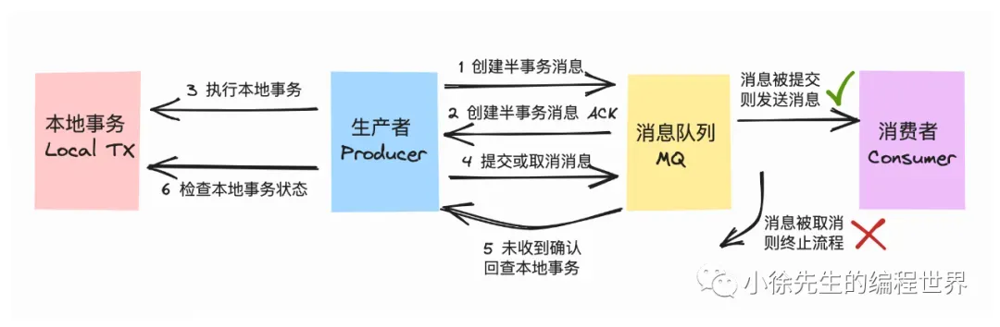
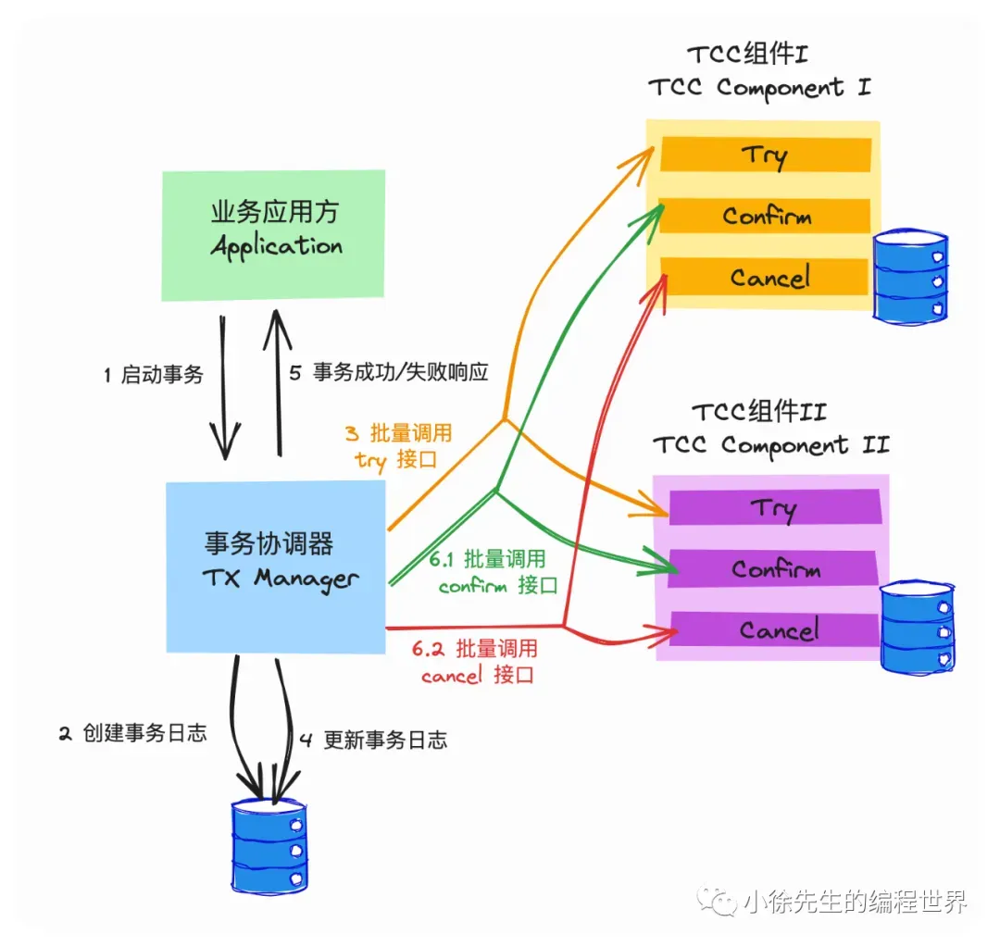
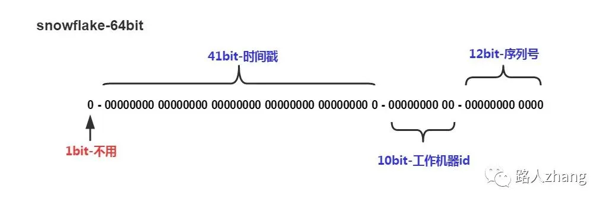
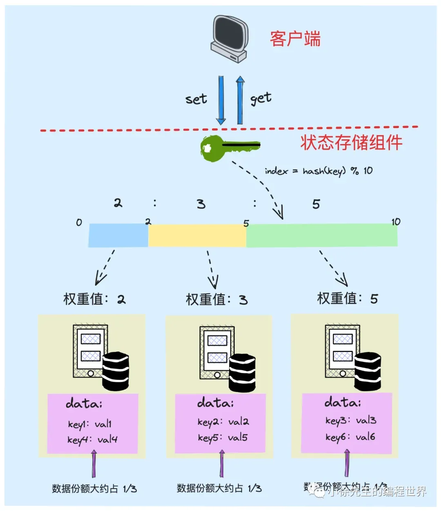
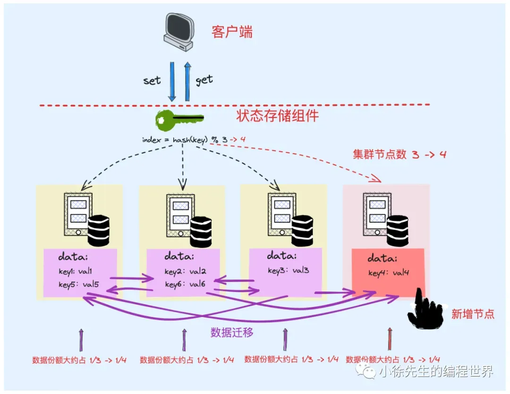

# 分布式

## 分布式理论

### CAP理论：

- C一致性：具体而言，每次读操作，要么读到最新（即时一致性），要么读失败（顺序一致性，不能读到旧的数据），对用户而言就像操作单机一样（要么我给您返回一个错误，要么我给你返回绝对一致的最新数据）**强调的是数据正确（分为弱一致性，强一致性(串行)，最终一致性(在一段时间后，数据会最终达到一致状态)）**
- A可用性：系统总能够在有限的时间内返回结果（我一定会给您返回数据，不会给你返回错误，但不保证数据最新，强调的是不出错）**针对节点出现故障，系统可用**
- P分区容错性：在网络环境不可靠的背景下，整个系统仍然是正常运作的，不至于出现系统崩溃或者秩序混乱的局面. **针对网络出现问题，系统可用，**在分布式系统中，系统间的网络不能100%保证健康，一定会有故障的时候，但必须对外保证服务，所以对于分布式系统而言, P 是必须得到保证的，否则这就违背了“分布式”的语义。在这种系统出现网络分区的情况下系统的服务就需要在一致性 和 可用性之间进行取舍了！
- **保证P，为什么无法同时满足AC**？保证P即保证系统在出现网络分区之后仍然能够提供可用性，那么一致性必然无法满足。因为可用性的要求是系统仍然能够提供服务，但是这个时候分布式系统在两个地域之间无法通信，那么America的请求无法同步到China的服务节点上，整个系统的一致性显然不能满足。同理 为了保证一致性，那么可用性也必然不能满足，因为一致性的要求是请求A写入America之后从China中读，一定要能够读到这个请求（强一致性）或者 经过一段时间之后也能够读到（弱一致性）。但是两地域已经出现了网络分区，那么请求会阻塞从而降低可用性。
- redis **选择AP原则**，**牺牲掉数据一致性，满足可用性和容错性**

## 分布式事务

https://mp.weixin.qq.com/s/Z-ZY9VYUzNER8iwk80XSxA

- **事务**，是一组操作的顺序集合，需要具备**ACID**特性
    - **本地事务**：当事务仅仅局限于一个数据库内，那么ACID是能够水到渠成地得到实现的
    - **分布式事务**：但是倘若事务涉及修改的对象是**跨数据库**甚至**跨服务跨存储组件**时，那么就是分布式事务了
- **一致性**：
    - 分布式事务中的“数据状态一致性”，指的是数据的最终一致性，而非数据的即时一致性，因为即时一致性通常是不切实际的
    - 没有分布式事务能够保证数据状态具备百分之百的一致性，根本原因就在于网络环境和第三方系统的不稳定性
- **基于消息队列MQ实现分布式事务**：
    - **at least once** ：MQ采用的是先消费后反馈的形式，使得投递到 MQ 中的消息能至少被下游消费者 consumer 消费到一次，从而保证消息不会在消费环节丢失
    - **exactly once**：但是存在消息重复消费问题，所以下游的 consumer 还需要基于消息的唯一键执行幂等去重操作，在 at least once 的基础上过滤掉重复消息，最终达到 exactly once 的语义
    - 实现事务流程：
        - 分布式事务：事务流程中包含需要在服务 A 中执行的动作 I 以及需要在服务 B 中执行的动作 II
        - MQ串联：
            - 服务A作为生产者，服务B作为消费者
            - 服务 A 首先在执行动作 I，执行成功后往 MQ 中投递消息，驱动服务 B 执行动作 II
            - 服务 B 消费到消息后，完成动作 II 的执行
        - **存在问题**：
            - **问题1：服务A执行动作I和投递消息本质也需要保证原子性**：在这个流程中，服务 A 需要执行的操作有两步：（1）执行动作 I；（2）投递消息. 这两个步骤本质上也无法保证原子性，即可能出现服务 A 执行动作 I 成功，而投递消息失败的问题
                - 这两个步骤在流程中一定会存在一个执行的先后顺序，不管先执行哪一个，都会出现后面那个执行失败而前一个无法回滚
                - **事务消息Transaction Message(RocketMQ  TX Msg)**：
                    
                    
                    
                    - 倘若本地事务执行失败，则 producer 会向 RocketMQ 发出删除半事务消息的回滚指令，因此保证消息不会被发出
                    - 倘若本地事务执行成功， 则 producer 会向 RocketMQ 发出事务成功的确认指令，因此消息能够被正常发出
                    - 倘若 producer 端在发出第二轮的确认或回滚指令前发生意外状况，导致第二轮结果指令确实. 则 RocketMQ 会基于自身的轮询机制主动询问本地事务的执行状况，最终帮助半事务消息推进进度.
                    - 事务消息方案本质上是狭义的分布式事务. 基于消息队列组件中半事务消息以及轮询检查机制，**保证了本地事务和消息生产两个动作的原子性，但不具备事务的逆向回滚能力(也就是问题2)**
            - **问题2：服务B的动作II执行失败，而动作I无法回滚**：服务 B 消费到消息执行动作 II 可能发生失败，即便依赖于 MQ 重试也无法保证动作一定能执行成功，此时缺乏令服务 A 回滚动作 I 的机制. 因此很可能出现动作 I 执行成功，而动作 II 执行失败的不一致问题
                - 认识：并非所有动作都能通过简单的重试机制加以解决，在正常的事务流程中，后置操作失败时，我们应该连带前置操作一起执行回滚，然而这部分能力在 TX Msg 的主流程中并没有予以体现
                    - 要实现这种事务的逆向回滚能力，就必然需要构筑打通一条由下游逆流而上回调上游的通道
                - **TCC 方案**：
                    - **Try-Confirm-Cancel：两阶段提交**
                        - **第一个阶段是 Try**，指的是先对资源进行锁定，资源处于中间态但不处于最终态
                        - **第二个阶段分为 Confirm 和 Cancel**，指的是在 Try 操作的基础上，真正提交这次修改操作还是回滚这次变更操作
                        - TCC 分布式事务架构：
                            - **事务协调器 TX Manager**：
                                - Application 交互的唯一入口、
                                - Component 的注册和管理、
                                - 串联 Try——Confirm/Cancel 的两阶段流程、
                                - 持续运行轮询检查任务，推进每个处于中间态的分布式事务流转到终态
                            - **服务组件TCC Component**：
                                - 提供 Try、Confirm、Cancel 三个接口、
                                - 针对数据记录，新增出一个对应于 Try 操作的中间状态枚举值、
                                - 针对于同一笔事务的重复请求，需要执行幂等性校验
                                - 需要支持**空回滚**操作. 即针对于一笔新的 Transaction ID，在没收到 Try 的前提下，若提前收到了 Cancel 操作，也需要将这个信息记录下来，但不需要对真实的状态数据发生变更
                                    - **悬挂问题**：从执行逻辑上，Try 应该先于 Cancel 到达和处理，然而在事实上，由于**网络环境的不稳定性**，请求到达的先后次序可能颠倒. 在这个场景中，Component A 需要保证的是，针对于同一笔事务，只要接受过对应的 Cancel 请求，之后到来的 Try 请求需要被忽略. 这就是 TCC Component 需要支持空回滚操作的原因所在
                        
                        
                        
                        - Try 操作的容错率是比较高的，原因在于有人帮它兜底. Try 只是一个试探性的操作，不论成功或失败，后续可以通过第二轮的 Confirm 或 Cancel 操作对最终结果进行修正
                        - Confirm/Cancel 操作是没有容错的，倘若在第二阶段出现问题，可能会导致 Component 中的状态数据被长时间”冻结“或者数据状态不一致的问题
                            - 解决方案是：在第二阶段中，通过**TX Manager 轮询重试 + TCC Component 幂等去重**这两套动作形成的组合拳，保证 Confirm/ Cancel 操作至少会被 TCC Component 执行一次

## 分布式ID

https://blog.csdn.net/qq_40950903/article/details/108589837

- ID：**数据的唯一标识**
- 需求：单机 MySQL数据量越来越大，需要进行分库分表，在分库之后， 数据遍布在不同服务器上的数据库，数据库的自增主键已经没办法满足生成的主键唯一了。**我们如何为不同的数据节点生成全局唯一主键呢**
- **分布式ID**
    - 全局唯一、生成快、方便易用、有序递增
- **生成方案：**
    - **UUID**：
        - **核心：结合机器的网卡、当地时间、一个随记数来生成UUID**
        - **无序、插入导致B+树索引分裂**
        - **字符串存储，查询效率低**
        - **形式为8-4-4-4-12的32个字符，长度长，存储冗余**
        - 优点：本地生成，生成简单，性能好，没有高可用风险
        - 缺点：长度过长，存储冗余，且无序不可读，查询效率低
    - **雪花算法Snowflake**：**时间戳+机器ID+自增序列号**
        - **核心：把64-bit分别划分成多段，分开来标示机器、时间、某一并发序列等，从而使每台机器及同一机器生成的ID都是互不相同**
        - **按时间趋势递增(而非严格递增)，与时间强相关，不同机器需要进行时钟同步**
        - **不依赖第三方系统(redis)，以服务形式部署，性能高**
        - Snowflake 由 64 bit 的二进制数字组成，这 64bit 的二进制被分成了几部分：
            - **1位符号位：**符号位（标识正负），始终为 0，代表生成的 ID 为正数
            - **41位时间戳（毫秒级）**:一共 41 位，用来表示时间戳，单位是毫秒
            - **10位数据ID**:一般来说，前 5 位表示机房 ID，后 5 位表示机器 ID
            - **12位自增序列号**: 序列号为自增值，代表单台机器每毫秒能够产生的最大 ID 数(2^12 = 4096),也就是说单台机器每毫秒最多可以生成 4096 个 唯一 ID
            - 优点：高性能，低延迟，按时间有序，一般不会造成ID碰撞
            - 缺点：需要独立的开发和部署，依赖于机器的时钟
    
            
    
    - **数据库号段模式，批量生成ID**：
        - **核心：使用单台数据库批量的获取自增ID，再分给不同的机器去消费**
        - 一次按需批量生成多个ID，每次生成都需要访问数据库，将数据库修改为最大的ID值，并在内存中记录当前值及最大值。
        - 优点：避免了每次生成ID都要访问数据库并带来压力，提高性能
        - 缺点：属于本地生成策略，存在单点故障(可以使用数据库集群解决，不过增加了复杂度)，服务重启造成ID不连续
            - 数据库集群：双主模式集群
                - 将数据库进行水平拆分，每个数据库设置不同的初始值和相同的自增步长
    - **Redis生成ID：**
        - **核心：Redis的所有命令操作都是单线程的，本身提供像 incr 和 increby 这样的自增原子命令，所以能保证生成的 ID 肯定是唯一有序的**
        - 优点：不依赖于数据库，灵活方便，且性能优于数据库；数字ID天然排序，对分页或者需要排序的结果很有帮助。
        - 缺点：如果系统中没有Redis，还需要引入新的组件，增加系统复杂度；
            - 单体故障：使用 Redis 集群应对。假如一个集群中有5台 Redis。可以初始化每台 Redis 的值分别是1, 2, 3, 4, 5，然后步长都是 5，步长和初始值要事先确定，集群方式也可以进行负载均衡
            - 照理说，Redis单机号称10w+的能力，一般是没有问题的。但考虑到单节点的性能瓶颈，我们可以利用前面[MySQL数据库](https://cloud.tencent.com/product/cdb?from_column=20065&from=20065)乐视的优化方案。可以使用 Redis 集群来获取更高的吞吐量（①数据库水平拆分，设置不同的初始值和相同的步长；②批量缓存自增ID）

## 分布式锁

https://mp.weixin.qq.com/s/KYiZvFRX0CddJVCwyfkLfQ

https://mp.weixin.qq.com/s/3zuATaua6avMuGPjYEDUdQ

- **锁**？
    - 在并发场景中，为了保证临界资源的数据一致性，我们会经常使用到“锁”这个工具对临界资源进行保护，让混乱的并发访问行为退化为秩序的串行访问行为
- **分布式锁**？
    - 在**本地环境**中，由于多线程之间能够共享进程的数据，因此可以比较简单地实现进程内的互斥锁；
    - 然而在**分布式场景**中，有时我们需要跨域多个物理节点执行加锁操作，因此我们就需要依赖到类似于 redis、mysql 这样的状态存储组件，在此基础之上实现所谓的“分布式锁”技术
- **主动轮询型(redis实现)：**
    - **SETNX操作**：采用set only if not exist —— SETNX 操作来实现插入一条kv对，如果发现已经存在，则说明别人加锁了，那么持续轮询，直到他把这个kv对删除，然后我插入成功，那么我就成功加锁了
    - **实现流程：**
        - 针对于同一把分布式锁，使用同一条数据进行标识（以 redis 为例，则为 key 相同的 kv 对）
        - 假如在存储介质成功插入了该条数据（之前数据不存在），则被认定为加锁成功
        - 把从存储介质中删除该条数据这一行为认定为释放锁操作
        - 倘若在插入该条数据时，发现数据已经存在（锁已被他人持有），则持续轮询，直到数据被他人删除（他人释放锁），并由自身完成数据插入动作为止（取锁成功）
        - 由于是并发场景，需要保证 （1）检查数据是否已被插入（2）数据不存在则插入数据 这两个步骤之间是原子化不可拆分的（在 redis 中是 set only if not exist —— SETNX 操作）
    - **死锁**？
        - 问题：客户端获取锁后**宕机**，没有及时解锁，别人也无法获取锁
        - **expire过期时间**：基于经验设置过期时间 expire time 机制保证就算宕机依然在时间到期后会释放锁
        - **过期时间不精准问题**：如果过期时间内客户端没有处理完，**锁就被提取释放了**
        - **看门狗**：看门狗思路源自于一款基于 java 编写的 redis 分布式锁工具 redisson 当中，本质是实现etcd的租约续约机制，也就是在锁的持有方执行业务逻辑处理的过程中时，需要**异步启动一个看门狗守护协程**，持续为分布式锁的过期阈值进行延期操作
    - **一锁多持**：
        - redis**集群**：为避免单点故障引起数据丢失问题，redis 会基于主从复制的方式实现数据备份增加服务的容错性
        - **数据弱一致**：redis 在进行数据的主从同步时，采用的是**异步**执行机制（**先响应请求，再执行数据同步**），侧重提高可用性，因此是弱一致的
        - **问题**：redis master加锁后还没同步这个锁信息就宕机了，新master继续分配给别客户端 锁
        - **红锁**：基于多数派原则来解决，过半投票策略（半数以上的人达成共识即可，不苛刻地强求所有人同意）
            
            红锁的实现中：
            
            - 我们假定集群中有 2N+1个 redis 节点（通常将节点总数设置为奇数，有利于多数派原则的执行效率）
            - 这些 redis 节点彼此间是相互独立的，不存在从属关系
            - 每次客户端尝试进行加锁操作时，会同时对2N+1个节点发起加锁请求
            - 每次客户端向一个节点发起加锁请求时，会设定一个很小的请求处理超时阈值
            - 客户端依次对2N+1个节点发起加锁请求，只有在小于请求处理超时阈值的时间内完成了加锁操作，才视为一笔加锁成功的请求
            - 过完2N+1个节点后，统计加锁成功的请求数量
            - 倘若加锁请求成功数量大于等于N+1（多数派），则视为红锁加锁成功
            - 倘若加锁请求成功数量小于N+1，视为红锁加锁失败，此时会遍历2N+1个节点进行解锁操作，有利于资源回收，提供后续使用方的取锁效率
- **监听回调型(etcd实现)：**
    - 流程类似：
        - 针对于同一把分布式锁，使用一条相同的数据进行标识（唯一、明确的 key）
        - 倘若在存储介质内成功插入该条数据（要求 key 对应的数据不存在），则这一行为被认定为加锁成功
        - 把从存储介质中删除该条数据这行为理解为解锁操作
    - 不同点：
        - 在取锁失败时，**watch 回调型分布式锁不会持续轮询，而是会 watch 监听锁的删除事件**，即在插入数据时，若发现该条记录已经存在，说明锁已被他人持有，此时选择监听这条数据记录的删除事件，当对应事件发生时说明锁被释放了，此时才继续尝试取锁
    - **etcd实现**：
        - etcd 中提供了watch 监听器的功能，即针对于指定范围的数据，通过与 etcd 服务端节点创建 grpc 长连接的方式持续监听变更事件
        - **死锁问题：**
            - etcd中提供了租约续约机制：
                - 用户可以先申请一份租约，设定好租约的截止时间
                - 异步启动一个续约协程，负责在业务逻辑处理完成前，按照一定的时间节奏持续进行续约操作
                - 在执行取锁动作，将对应于锁的 kv 数据和租约进行关联绑定，使得锁数据和租约拥有相同的过期时间属性
        - **惊群效应**：
            - 问题：倘若一把分布式锁的竞争比较激烈，那么**锁的释放事件可能同时被多个的取锁方所监听**，一旦锁真的被释放了，所有的取锁方都会一拥而上尝试取锁，然而我们知道，一个轮次中真正能够取锁成功的只会有一名角色，因此这个过程中会存在大量无意义的性能损耗，且释放锁时刻瞬间激增的请求流量也可能会对系统稳定性产生负面效应
            - 解决：
                - 为规避惊群效应，etcd 中提供了前缀 prefix 机制以及版本 revision 机制，和 zookeeper 的临时顺序节点功能有些类似：
                    - **前缀 prefix** ：对于同一把分布式锁，会以锁前缀 prefix 拼接上自身身份标识（租约 id），生成完整的 lock key(只有前缀相同)
                    - **版本号**：每个取锁方插入锁记录数据时，会获得自身 lock key 处在锁前缀 prefix 范围下唯一且递增的版本号 revision
                    - **加锁成功标志**：插入加锁记录数据不意味着加锁成功，而是需要在插入数据后查询一次锁前缀 prefix 下的记录列表，判定自身 lock key 对应的 revision 是不是其中最小的，如果是的话，才表示加锁成功
                    - **监听回调**：如果锁被他人占用，取锁方会 watch 监听 revision 小于自己但最接近自己的那个 lock key 的删除事件
                        - 这样所有的取锁方就会在 revision 机制的协调下，根据取锁序号（revision）的先后顺序排成一条队列，每当锁被释放，只会惊动到下一顺位的取锁方，惊群问题得以避免

## 一致性哈希

https://mp.weixin.qq.com/s/NZNVCZF8jiiPTAQ8Ievyrg

- 前置知识：
    - **状态服务**
        - **无状态服务**：无需负责存储状态数据、仅需要聚焦业务执行逻辑的服务
            - 灵活横向扩展：因为请求被分发到哪个节点并不重要，执行逻辑都是相同的
        - **有状态服务**：需要通过内存或磁盘实现状态数据存储的服务，如数据库，消息队列等
            - 针对于这类服务，由于其**存储了状态数据**，因此在对集群进行**横向分治**（为防止单点故障而对数据进行冗余备份）时，需要考虑数据的一致性问题；在对集群进行**纵向分治**（为提高集群整体性能上限，不同节点各自分担部分数据存储工作，共同构成全集）时，需要明确数据与所从属节点之间的映射关系
            - **而一旦集群发生扩缩容，节点数量发生变更，对应的映射关系就需要发生变化，对应的状态数据就要发生迁移，这会是一个很复杂且笨重的流程**
    - **纵向分治**：
        - 通过**哈希散列**的方式实现数据的纵向分治，基于哈希函数的离散性，保证每个节点分配的数据量均可能趋于平均
        - 即**节点 index = 数据 hash 值 % 节点个数**：所以这个映射关系能生效的前提是，**集群节点的数量需要维持不变**.
    - **带权分治**：
        - 在实际场景中，**不同节点的性能可能存在差距**. 我们希望做到能者多劳，让性能好的节点多完成一些任务，性能差的节点少承担一些工作
        - **水平轴权值分区**：设置一条水平轴，每个节点根据其权重值大小在轴上占据对应的比例分区. 接下来每当有数据到来，我们都会根据数据的 key 取得 hash 值并对水平轴的总长度取模，找到其在水平轴上的刻度位置，再根据该刻度所从属的分区，推断出这笔数据应该从属于哪一个节点
            
            
            
    - **数据迁移：**
        - 集群节点数量变化，原有映射关系破坏，为了维护原有映射关系，需要执行数据迁移操作，这是很重的操作，**涉及影响的范围是全量的旧节点**
        
        
        
- **一致性哈希：**
    - **哈希环：**
        - 打破固有的数据与节点之间的点对点映射关系
        - 环结构：首尾连接、起点为0、终点为 2^32，与 0 重合
        - **节点**入环：
            - 对**节点** index 取 hash 值，然后使用该 hash 值对 2^32 取模
        - **数据**出、入环：
            - 对数据的 key 取hash值，同样对 2^32 取模
            - 沿着**数据**在哈希环上的位置顺时针往下（包括位置本身），找到第一个**节点**，作为数据所归属的节点
        - **节点变化，数据迁移**：
            - **因为这种环状结构加 ceiling（向上开放寻址） 的方式，使得数据所从属的节点 index 不再与集群的节点总数强相关，而仅仅取决于数据与节点在哈希环上的拓扑结构**，最终因节点变更而引起数据迁移时，也仅仅需要对**局部位置进行变更即可**，而不需要将影响面放大到全局.
- **节点位置不均匀问题**：
    - 我们知道节点位置是根据节点 index 取哈希，并进一步对哈希环长度（2^32） 取模后得到的
    - **而哈希的“离散”和“均匀”是建立在数据样本足够大的情况下，倘若集群节点数量很少，那么就很可能出现节点位置分布不均匀的情况**
    - 而各个节点分配到的数据量，其实取决于其和上一个节点之间相对距离的长短，从而导致数据分配不均匀
    - **虚拟节点策略：**
        - 思想：哈希散列本身是具有离散性的，**节点数据分配不均的问题通常只会发生在集群节点数量较少的情况下**. 那么，倘若我们采用某种手段，**将节点数量放大**，那么更大的数据样本就自然而然地能够弥合或者缩小这部分误差所产生的影响，进一步突显出哈希函数的离散性质
        - 做法：
            - **真实节点**：集群中的各个节点，是物理意义上存在的服务器节点
            - **虚拟节点**：真实节点进入哈希环时使用的一系列代理节点，是逻辑意义上的代理节点，
            - **路由表**：建立好每个虚拟节点与真实节点的映射关系
            - **数据出、入环：**使用虚拟节点进行数据的抢占和关联，找到一笔数据所从属的虚拟节点时，通过路由表，找到其所映射的真实节点，然后返回真实节点的 index
- **总结**：
    - 一致性哈希算法是一种适用于有状态服务的负载均衡策略
    - 由一个首尾衔接的哈希环组成
    - 节点和数据都需要通过取哈希并对环长度取模后确定位置
    - 一致性哈希最大的优势是，在集群节点数量发生变更时，只需要承担局部小范围的数据迁移成本
    - 进一步采用虚拟节点路由的方式，提高负载均衡程度，并能很好地支持带权分治的诉求