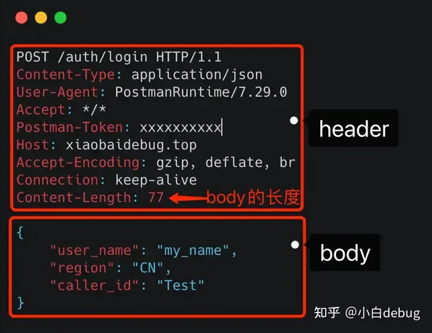
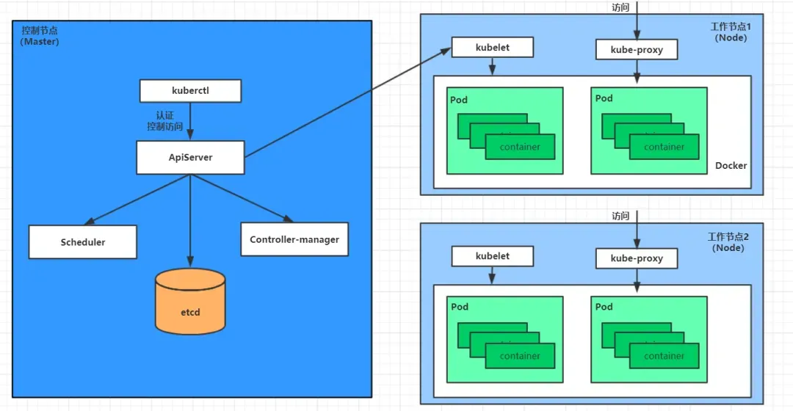
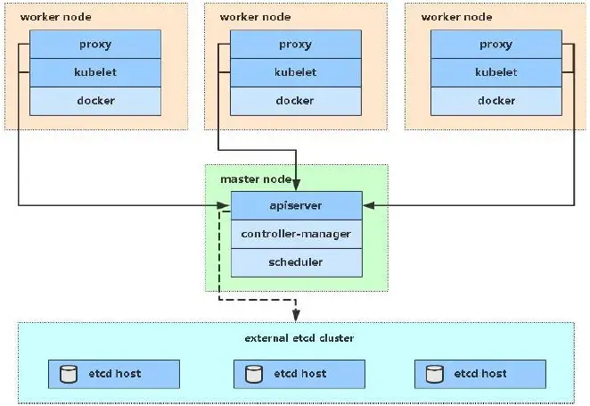
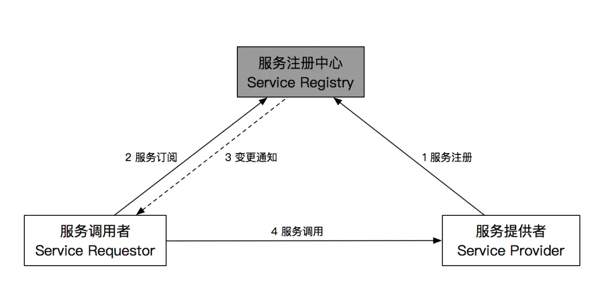
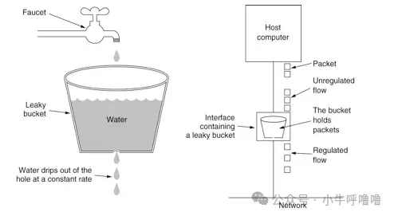
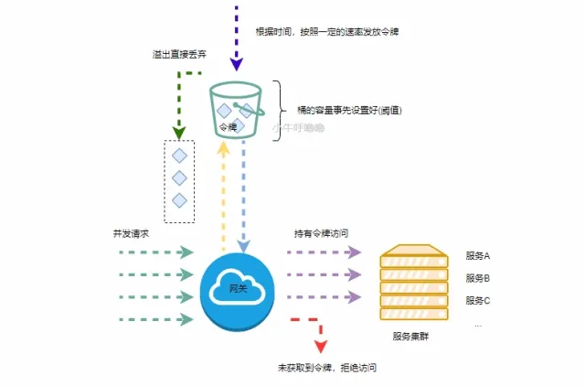
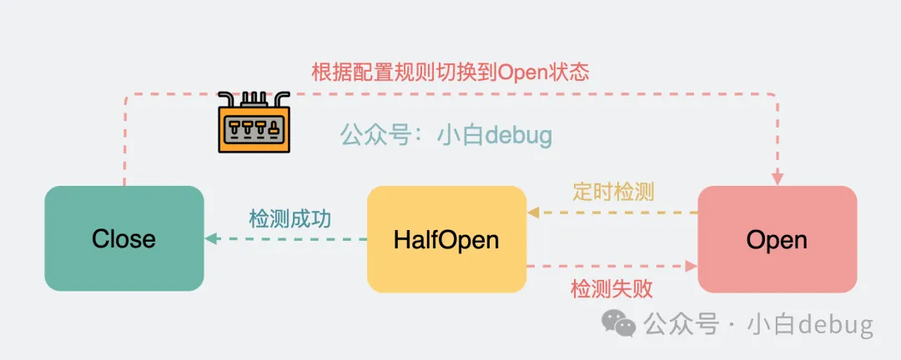

# 微服务

### **为什么会出现RPC的概念?**

- **传统单体架构**：代码臃肿，难以维护
- **微服务架构**：按功能拆分为多个服务
- **服务间通信**：即进程之间如何通信
- **进程通信**：管道通信、消息队列、共享内存、网络socket….
- **分布式部署**：采用网络socket通信，(其他是本机通信
- **socket通信**：选用可靠的通信协议TCP，而不用UDP
- **纯裸TCP：粘包问题，自定义消息格式，**用于区分消息边界(消息体长度)
- **服务通信流程**：TCP连接->序列化->数据编码->发送->数据解码->反序列化->业务处理->回包
    - **序列化**：TCP传输是基于字节流传输的，所以需要把数据的结构体**对象转换为字节流**，这个过程就称为序列化；反之，也能将字节流再转换为结构体对象，这个过程叫反序列化
    - **数据编解码：**纯裸TCP存在**粘包**问题，所以需要**自定义消息格式**(接口协议规范)，明确字节数据的**边界**，来完成数据包的制造和拆分；即**发送端在发送数据时需要按照这个格式编码，而服务端接受到数据时需要按这个格式解码(消息头+消息体)**
        - 可以基于 **HTTP** 协议来实现，当然也可能基于其他任何一个胡编乱造的协议，只要双方约定好协议格式，能编码解码就行。所以说可以认为 **HTTP 其实是 RPC 中编、解码的一种方式**
        - 事实上，在**内部服务的相互调用**中，通常都会自定义协议来实现 RPC， 而不是用 HTTP，毕竟 **HTTP 还是略显笨重**；
        - 反之，在**提供到对外的接口**的时候，通常是以 HTTP 协议为基准的， 因为 **HTTP** 是大家公认的一份标准
        
        
        
- **RPC ：要是上述过程能直接像调用本地函数一样调用远程的方法就好了**
    - 所以RPC就是一种思想，HTTP是一种 RPC 的实现方式
    - RPC调用远程方法的这个过程，实际上它把这些都封装好了，让你感觉就像在调用本地方法一样
- **RPC与服务治理**
    - 网络socket通信，需要IP+端口port，单机部署很明确
    - 但分布式架构下，就需要**服务中心**(etcd/redis)，管理大量服务的IP：port列表，主要两大功能：**请求转发、请求过滤！**
    - **服务发现**：向服务中心发送请求，找到服务对应的IP端口的过程
        - http通过**DNS服务**去解析得到它背后的IP地址，默认80端口
    - **服务注册**：每个服务启动的时候，需要将他的**IP:PORT**以及**服务名称**注册到服务中心
    - **负载均衡：**将请求分散给各个机器上，维持各个机器的请求的均衡态势，防止某个机器请求过载
    - **容灾处理**：剔除掉故障的机器，防止下次再访问到这个有故障的地址

### 序列化

- **序列化协议**：将**数据对象**和**字节流(文本/二进制)**进行互相转化，用于数据传输和存储
    - **XML**：
        - **文本结构存储**：`<name>Mike</name>`
        - 占用额外空间：除了保存原始数据，还需要保存元数据的描述
    - **Json**：
        - **也是文本结构存储**：`”name": "Mike",` 但不像xml那样需要有严格的闭合标签
    - **protobuf(Protocol Buffers)**：
        - **二进制结构存储：`01 06 64 73 82 57 38 7e 3a 52 1b 3f 54`** 比XML和JSON等文本格式更紧凑，序列化速度快
        - TLV数据格式：Tag，[Length]，Value
            - 特别注意这里的 [Length] 是可选的，含义是针对不同类型的数据编码结构可能会变成 **Tag - Value** 的形式，如果变成这样的形式，没有了 Length 我们该如何确定 Value 的边界？答案就是 **Varint 编码**
        - 语言无关、平台无关，轻便高效，**可读性不高**
    - **应用场景**：
        - **客户端<-->服务端**：为了方便灵活，比如 服务端返回的字段，经常更新,你不可能要求 客户端也一并更新，这时协议是松散，**适合使用Json**;
        - **服务端1<-->服务端2**，服务端是由开发人员维护的，可以做到同时一并升级，服务端的RPC框架传输 可以**使用 protobuf**

### **既然有 HTTP 请求，为什么还要用 RPC 调用？**

- **RPC是一个完整的远程调用方案，它包括了：接口规范(输入输出)+序列化反序列化规范+通信协议等**，**它本身并不是一个具体的协议，而是一种调用思想**，gRPC才是RPC的一种实现方式
    - 要是能直接像调用本地函数一样调用远程的方法就好了
    - 屏蔽掉一些网络细节
    - RPC 定制化程度很高，完全可以用任何协议来实现，包括 HTTP
- 而**HTTP全称为超文本传输协议。它只是一个通信协议**，它代表的只是一种报文格式，是基于TCP上定义的特定消息格式的应用层协议而已
- 所以，要想回答这个问题，应该拉平为一个对等的概念。例如，**Restful规范+序列化与反序列化+HTTP通信协议，构成一个完整的远程调用方案**，**再和RPC进行比较**。而单纯的HTTP，只是一个通信协议，自然无法和RPC比较
- **即RPC对标的是 Restful 风格的 http 调用方式，而不仅仅是http协议**
- 这两种方法的选用可以根据**业务场景，灵活站位：**
    - **在内部服务的相互调用**中，通常都会自定义协议来实现 RPC， 注重简单高效，而不是用 HTTP，毕竟 **HTTP 还是略显笨重**；
    - 但在**提供到对外的接口**的时候，通常是以 HTTP 协议为基准的， 因为 **HTTP** 是大家公认的一份标准

### **Restful API?**

- **RESTful风格的接口：**REST(Representational State Transfer)，即‘表述性状态转移’，**REST并没有一个明确的标准，而更像是一种设计的风格，满足这种设计风格的程序或接口我们称之为RESTful**
- 可以借鉴，但不必为了RESTful而RESTful，会过于死板
- **特点**：
    - **面向资源：**
        - 资源可以是一个图片、音乐、一个数据实体(通常从数据库中查询而得到)
        - URL为统一资源定位器 ,接口属于服务端资源
    - **使用HTTP动词**：
        - 对资源的操作包括获取、创建、修改和删除，这些操作正好对应HTTP协议提供的GET、POST、PUT和DELETE方法
        - **非RESTful风格的API**：从请求方式上无法知道API接口具体是干嘛的，在**URL**上都会有操作的动词来表示API进行的动作，例如：query，add，update，delete等等，如`/dogs/query/{dogid}`
        - **RESTful风格的API**：从几种请求方式上就可以看出想要进行的操作，即 **HTTP动词+URL上的名词(资源)，如**`GET： /dogs/{dogid}`
            - 接口的**安全性和幂等性：**
                - 安全性：操作不会修改资源状态，只有GET是安全的
                - 幂等性：操作一次和操作多次的最终效果相同，如GET，PUT，DELETE；POST(插入)不是幂等的
        - **真正将HTTP作为了一种传输协议，不只把HTTP当做一个传输的通道**

### **到底什么是“云原生”？**

- 云原生首先是**云**！所有操作在云上的虚拟资源进行的
- **原生为云而设计**，**在云上以最佳姿势运行**，充分利用和发挥云平台的弹性+分布式优势(计算和存储)
- **但是上云**仅仅是把物理机换成虚拟机进行**开发**，没有把**部署、运维**的工作考虑进去，重开发、轻部署，直接后果就是缺少自动化发布和运维流程，做不到**快速迭代**
- **开发和运维合体(DevOps)**：自动化部署和运维，最终实现快速迭代
    - **虚拟机的不变性**：一台虚拟机部署一个应用，该虚拟机状态就不再变化了，直接运行到销毁，不允许原地修改(不变性)是为了方便运维和排错，不然就不知道回滚到哪了
    - **发布新版本怎么办**？
        - **蓝绿部署**：创建一组新的虚拟机部署新的版本，旧版本应用仍服务请求，新版本进行测试，如果有问题直接销毁；如果没有问题，通过负载均衡将请求引入新版本；稳定运行后，销毁旧版本，升级完成
        - 充分利用了弹性计算这个优势，**短时间创建和销毁虚拟机**，全过程用户无感知，无需操作回滚，版本间互相隔离无影响，把部署流程变得更加简单可靠，使得版本快速迭代和持续交付成为可能！
        - **持续交付**：不误时开发，不停机更新，小步快跑，快速迭代
- **那么虚拟机是不是弹性最好的计算资源呢？**
    - **容器：**是一种比**虚拟机**更具弹性，更加抽象，也更容易部署的计算资源；
    - **容器化：微服务的最佳载体，**能为微服务提供实施保障，并起到应用隔离作用
    - **Docker技术**：Docker通过**容器镜像**，直接将一个应用运行所需的完整环境，即：整个操作系统的文件系统也打包在一起
- **容器的启动和销毁非常容易，但容器的管理却不简单！**
    - 如：
        - 一个容器故障停机了，怎么样让另外一个容器立刻启动去替补停机的容器
        - 当并发访问量变大的时候，怎么样做到横向扩展容器数量
    - **容器编排**：容器的管理涉及到创建、调度、弹性扩容、负载均衡、故障检测等
    - **Kubernetes(K8S)：**是容器编排系统，用于容器管理和容器间的负载均衡
- **总结**：**云原生就是从充分利用云的弹性资源为出发点，打通了微服务开发、测试、部署、发布的整个流程环节**

### gRPC？

- RPC 实现方式之一就是 google 的开源框架 grpc，框架本身基于 C++ 实现，但对应于几个主流语言也有相应的实现版本，比如go，go 语言本身也是 google 开发的
- gRPC 基于 **HTTP/2 + Protobuf**
    - grpc-go 使用 **protobuf** （Google 开发）作为数据序列化协议以及接口定义语言，以 **HTTP2** 作为通信协议
    - 更高效的HTTP2：二进制帧、头部压缩、服务器推送(响应请求时顺带推送相关资源，和websocket主动推送还是有区别)
    - grpc 调用基于 **sdk** 方式，调用方法和出入参协议固定，stub 文件本身还能起到接口文档的作用，很大程度上优化了通信双方约定协议达成共识的成本.
- 基本使用：
    - 编写**protobuf 文件：`.proto`**
        - 定义grpc 客户端与服务端通信交互的接口
        
        ```
        // 定义服务HelloService，声明业务方法的名称（SayHello）以及出入参协议（HelloReq/HelloResp）
        service HelloService {
            // SayHello 方法
            rpc SayHello (HelloReq) returns (HelloResp) {}
        }
        
        // 请求消息
        message HelloReq {
            string name = 1;
        }
        
        // 响应消息
        message HelloResp {
            string reply = 1
        }
        ```
        
    - **在 .proto 文件基础上，一键生成对应的 go 代码**
    `protoc --go_out=. --go-grpc_out=. pb/hello.proto`
        - **会生成 pb.go 和 grpc.pb.go 两个文件**
        - **pb.go**：基于 .proto 定义的出入参协议，生成对应的 golang 类定义代码
        - **grpc.pb.go：**
            - 基于 .proto 文件生成了客户端的桩代码，后续作为用户使用 grpc 客户端模块的 sdk 入口（api）
            - 基于 .proto 文件生成了服务端的服务注册桩代码，后续作为用户使用 grpc 服务端模块的 sdk 入口
            - 基于 .proto 文件生成了业务处理服务（pb.HelloService）的描述符，每个描述符内部会建立基于方法名（SayHello）到具体处理函数（_HelloService_SayHello_Handler）的映射关系
- 服务端：
    - **服务声明**：预声明业务处理服务 HelloService，实现好桩文件中定义的业务处理方法 SayHello
    - **创建监听器**：调用 net.Listen 方法，创建 tcp 端口监听器
    - **创建服务端对象**：调用 grpc.NewServer 方法，创建一个 grpc server 对象
    - **注册Handel**：调用桩文件中预生成好的注册方法 proto.RegisterHelloServiceServer，将 HelloService 注册到 grpc server 对象当中
    - **服务启动**：运行 server.Serve 方法，监听指定的端口，真正启动 grpc server
- 客户端：
    - **建立连接**：调用 grpc.Dial 方法，与指定地址的 grpc 服务端建立连接，创建 grpc 连接代理对象 ClientConn
    - **创建客户端对象：**调用桩文件中的方法 proto.NewHelloServiceClient，创建 pb 文件预声明好的 grpc 客户端对象
    - **发送请求**：调用 client.SayHello 方法，发送 grpc 请求，并处理响应结果
- **底层原理：**
    - **grpc server 运行**：
        - 核心是**基于 for 循环实现的主动轮询模型**，基于 **IO 多路复用 epoll** 方式，通过 `net.Listener.Accept()`取出连接，如果队列中没有需处理的连接时，会形成阻塞等待。
        - 每当有新的连接到达后，服务端会开启一个 goroutine，调用对应的 Server.handleRawConn 方法对请求进行处理，也就是“**每一个请求都是不同的 goroutine 在处理**”
    - **grpc.Dial 连接：创建 ClientConn 实例**
        - **调用 grpc.Dial**是异步连接的，连接状态为正在连接。但如果你设置了 `grpc.WithBlock` 选项，就会阻塞等待（等待握手成功，同步调用）。另外你需要注意，当未设置 `grpc.WithBlock` 时，ctx 超时控制对其无任何效果
        - grpc.ClientConn 不关闭连接，会导致 goroutine 和 Memory 等泄露
        - ClientConn.Invoke：
- **拦截器 interceptor：**
    - 拦截作用：执行核心业务方法前后的**通用逻辑处理**，根据结果来判断是否需要**熔断**当前的执行链路
    - **拦截器链**：
        - 其实和 gin 框架中的 handlersChain 是异曲同工的
        - 当拦截器数量大于 1 时，从 `interceptors[1]` 开始递归，每一个递归的拦截器 `interceptors[i]` 会不断地执行，最后才真正的去执行 `handler` 方法
- **streaming RPC** :
    - 一元RPC，客户端流式、服务端流式、双向流式

### Docker?

- Dockers到底是什么？
    - Docker 本质上就是一个将**程序和环境打包并运行**的工具软件。具体点来说就是，它通过 Dockerfile 描述环境和应用程序的依赖关系， docker build 构建镜像， docker pull/push 跟 Docker Registry 交互实现存储和分发镜像，docker run 命令基于镜像启动容器，基于容器技术运行程序和它对应的环境，从而**解决环境依赖导致的各种问题**
    - **Docker 是软件容器平台、由Go 语言** 开发实现、**对进程进行封装隔离，属于操作系统层面的虚拟化技**
        - **隔离 && 集装箱，一种更轻量级的虚拟化技术**
    - **容器**：**容器就是将软件打包成标准化单元，以用于开发、交付和部署**
        - 容器本质上只是个自带独立运行环境的**特殊进程**，底层用的其实是**宿主机的操作系统内核**
        - **轻量的、可执行的独立软件包：**包含软件运行所需的所有内容：代码、运行时环境、系统工具、系统库和设置
        - **容器：**虚拟化的是操作系统而不是硬件，容器是一个应用层抽象，用于将代码和依赖资源打包在一起，作为独立的进程在用户空间中运行，占用的空间较少（容器镜像大小通常只有几十兆），瞬间就能完成启动
        - **虚拟机：**先虚拟出一套硬件后，在其上运行一个完整操作系统，是一个物理硬件层抽象，用于将一台服务器变成多台服务器，占用大量空间
        - **关系：**容器和虚拟机具有相似的资源隔离和分配优势，但功能有所不同，因为容器虚拟化的是操作系统，而不是硬件，因此容器更容易移植，效率也更高
        - 云服务提供商通常采用**虚拟机技术隔离不同的用户**。而 **Docker 通常用于隔离不同的应用** ，例如前端，后端以及数据库
- **Docker技术**
    - Docker File →  Docker Image → Docker Container
    - **Docker File**：
        - Dockerfile 是一个文本文件，包含了一系列的命令和参数，用于定义如何构建一个 Docker 镜像。运行 `docker build`命令并指定一个 Dockerfile 时，Docker 会读取 Dockerfile 中的指令，逐步构建一个新的镜像，并将其保存在本地
        - **todo list：在基础镜像的基础上按着 todo list 挨个执行命令**
    - **Docker Image(镜像)**：
        - 镜像是一个特殊的文件系统，除了提供容器运行时所需的程序、库、资源、配置等文件外，还包含了一些为运行时准备的一些配置参数（如匿名卷、环境变量、用户等），镜像不包含任何动态数据，其内容在构建之后也不会被改变
        - **Union FS：分层存储架构，**镜像实际是由多层文件系统联合组成。**镜像构建时，会一层层构建，前一层是后一层的基础。每一层构建完就不会再发生改变，后一层上的任何改变只发生在自己这一层**
        - **定制化**：分层存储使得镜像的复用、定制变的更为容易。甚至可以用之前构建好的镜像作为基础层，然后进一步添加新的层，以定制自己所需的内容，构建新的镜像
    - **Docker Container(容器)**：
        - 镜像（Image）和容器（Container）的关系，就像是面向对象程序设计中的 类 和 实例 一样，镜像是静态的定义，**容器是镜像运行时的实体。容器可以被创建、启动、停止、删除、暂停等**
        - 容器的实质是进程，但与直接在宿主执行的进程不同，容器进程运行于属于自己的独立的 命名空间。前面讲过镜像使用的是分层存储，容器也是如此
        - 容器存储层的生存周期和容器一样，容器消亡时，容器存储层也随之消亡。因此，任何保存于容器存储层的信息都会随容器删除而丢失
        - **容器不应该向其存储层内写入任何数据**，容器存储层要保持无状态化。**所有的文件写入操作，都应该使用数据卷（Volume）、或者绑定宿主目录**，在这些位置的读写会跳过容器存储层，直接对宿主(或网络存储)发生读写，其性能和稳定性更高。数据卷的生存周期独立于容器，容器消亡，数据卷不会消亡。因此，**使用数据卷后，容器可以随意删除、重新 run ，数据却不会丢失**
    - **Docker-Compose：容器编排工具**
        - 使用**`YML`**文件来配置应用程序需要的所有服务，然后使用docker-compose运行命令，就可以解析YML文件配置创建并启动文件中配置的所有docker服务
        - 可以把docker-compose理解为一个自动化[运维](https://cloud.tencent.com/solution/operation?from_column=20065&from=20065)命令的打包脚本集合，只要脚本编写的没问题，就可以执行一条命令启动所关联的所有服务
        - 即：通过一个 **YAML** 文件写清楚要部署的**容器有哪些**，**部署顺序**是怎么样的，以及这些容器占用的 **cpu 和内存**等信息，然后，通过一行`Docker-compose up`命令，开始解析 YAML 文件，将容器们一键按顺序部署，就完成**一整套服务**的部署
        - Docker 解决的是**一个容器**的部署。Docker Compose 解决的是**多个容器组成的一整套服务**的部署
    - **Docker Swarm：集群部署**
        - 解决的是这一整套服务**在多台服务器上的集群部署**问题
        - 比如在 A 服务器坏了，就将服务在 B 服务器上重新部署一套，实现迁移，还能根据需要对服务做扩缩容
        - **和k8s很像**：其实 Docker Swarm 是 k8s 的**竞品**，既然是竞品，那它们做的事情其实区别就不大了。现在回过头来看 Docker 容器和 k8s 之间的关系，思路就清晰了。**Docker 部署的容器，其实就是 k8s 调度的 Pod 里的 container，它们都叫容器，其实是一回事。只不过 k8s 除了支持 Docker 的容器外，还支持别人家的容器。Docker Compose 基于多个 container 创建的一整套服务，其实就是 k8s 里的 pod。而 Docker Swarm 做的事情和 k8s 一样，本质上就是在调度 pod**
    - Docker && K8s
        - Docker 的图标，是一个个**集装箱**，放在一艘船上,这一个个集装箱指的就是互相隔离的**容器**，而 k8s 的图标，则是一个轮船上的**方向盘**，意思是 k8s 控制着轮船的航向，其实指的就是**调度**容器
- **Docker架构原理**
    - 经典的 Client/Server 架构
        - Client 对应 Docker-cli：命令行里敲 Docker 命令
        - Server 对应 Docker daemon：
            - Docker Daemon 内部分为 Docker Server、Engine 两层。
            - Server 本质上就是个 HTTP 服务，负责对外提供操作容器和镜像的 api 接口，接收到 API 请求(命令)后，会分发任务给 Engine 层
            - Engine 层负责创建 Job，由 Job 实际执行各种工作，不同的 Docker 命令会执行不同类型的 Job 任务
        - **docker build：**
            - **Job 则会根据 Dockerfile 指令，像包洋葱皮似的一层层构建容器镜像文件**
        - **docker pull/push：**
            - Job 则会跟外部的 `Docker Registry` 交互，将镜像上传或下载
        - **docker run：**
            - Job 就会基于镜像文件调用 containerd 组件，驱使 runC 组件创建和运行容器

### K8S?

- 介于**应用服务**和**服务器**之间，能够通过策略，协调和管理多个应用服务，只需要一个 **yaml** 文件配置，定义应用的部署顺序等信息，就能自动部署应用到各个服务器上，还能让它们挂了自动重启，自动扩缩容
- 本质上就是应用服务和服务器之间的**中间层**，通过暴露一系列 API 能力让我们**简化服务的部署运维流程**
- **Kubernetes 架构原理:**
    - 两部分：控制平面+工作节点
    - **控制节点Master**：负责控制和管理各个 Node
        - **ApiServer** **: 服务入口**
            - 资源操作的唯一入口，接收用户输入的命令，提供认证、授权、API注册和发现等机制
        - **Scheduler：调度器**
            - 寻找 cpu 和内存资源充足的服务器Node进行应用部署
        - **Controller Manager：控制管理器**
            - 找到服务器后，创建，关闭服务等
        - **etcd：存储器**
            - 上面的功能都会产生一些数据，这些数据需要被保存起来
    - **工作节点Node**：负责实际运行各个应用服务
        - Pod: **最小的调度单位**
            - 每个应用服务都可以认为是一个 **Container**（容器）, 并且大多数时候会为应用服务搭配一个日志收集器 Container 或监控收集器 Container，多个 Container 共同组成一个一个 **Pod**，它运行在 Node 上
            - k8s 可以将 pod 从某个 Node 调度到另一个 Node，还能以 pod 为单位去做重启和动态扩缩容的操作
        - **kubelet: 管理和监控 Pod**
            - 前面提到控制平面Master会用 **Controller Manager** （通过API Server）控制 Node 创建和关闭服务，那 Node 也得有个组件能接收到这个命令才能去做这些动作, 就是**kubelet**
        - **Kube Proxy：网络代理**
            - 负责Node 的网络通信功能，有了它，外部请求就能被转发到 Pod 内
            - 外部请求首先发到**Ingress 入口控制器（比如Nginx）**，它可以提供一个入口让外部用户访问集群内部服务，然后**Ingress转发给Kube Proxy**
        - **Container runtime：Pod中的容器**
            - 可以是docker，也可以是别的容器组件
    - **怎么部署服务**
        - 编写配置文件：首先我们需要编写 **YAML 文件**，在里面定义 Pod 里用到了哪些镜像，占用多少内存和 CPU 等信息。
        - kubectl：然后使用 kubectl 命令行工具执行 `kubectl apply -f xx.yaml` ，此时 kubectl 会读取和解析 YAML 文件，将解析后的对象通过 API 请求发送给 Kubernetes 控制平面内 的 **API Server**。
        - API Server 会根据要求，驱使 **Scheduler** 通过 **etcd** 提供的数据寻找合适的 **Node**
        - **Controller Manager** 会通过 API Server 控制 相应的Node 创建服务
        - Node 内部的 **kubelet** 在收到命令后会开始基于 **Container runtime** 组件去拉取镜像创建容器，最终完成 **Pod** 的创建
    - **怎么调用服务？**
        - 外部请求会先到达 Kubernetes 集群的 Ingress 控制器，然后请求会被转发到 Kubernetes 内部的某个 Node 的 **Kube Proxy** 上，再找到对应的 pod，然后才是转发到内部**容器服务**中，处理结果原路返回，到这就完成了一次服务调用



- kubernetes 的本质是**一组服务器集群**，它可以在集群的每个节点上运行特定的程序，来对节点中的容器进行管理。目的是实现资源管理的自动化
- 一个 kubernetes 集群主要是由**控制节点 master**、**工作节点 node**构成，**pod** 是 kubernetes 的最小操作单元，容器必须跑在 pod 中
    - **Master：集群的控制平面，负责集群的决策 ( 管理 )**
        - **包含组件：**
            - **ApiServer** : 资源操作的唯一入口，接收用户输入的命令，提供认证、授权、API注册和发现等机制
            - **Scheduler** : 负责集群资源调度，按照预定的调度策略将 Pod 调度到相应的 node 节点上
            - **ControllerManager** : 负责维护集群的状态，比如程序部署安排、故障检测、自动扩展、滚动更新等
            - **Etcd** ：负责存储集群中各种资源对象的信息，相当于 K8S 的数据库
    - **Node：集群的数据平面，负责为容器提供运行环境 ( 干活 )**
        - **包含组件：**
            - **Kubelet** : 负责维护容器的生命周期，即通过**控制docker**，来创建、更新、销毁容器，除此之外还有Node管理、pod管理(通过容器运行时)，容器健康检查等
            - **KubeProxy** : 负责提供集群内部的服务发现和负载均衡
            - **Docker** : 负责节点上容器的各种操作
        - **注意**：
            - Node出现致命错误时， 所有该节点上的 Pod 的状态都会变成失败。Kubernetes 将这类失败视为最终状态： 即使该节点后来恢复正常运行，你也需要创建新的 Pod 以恢复应用
            - Kubernetes 会一直保存着非法节点对应的对象Node，并持续检查该节点是否已经变得健康，所以必须显示删除Node对象以停止健康检查操作
            - Node 对象的名称必须是合法的 [DNS 子域名](https://kubernetes.io/zh-cn/docs/concepts/overview/working-with-objects/names#dns-subdomain-names)
            - 
    - **Pod：一组处于运行状态的容器集合**
        - kubernetes 的最小控制单元，K8S不直接操作容器，而是操作Pod，容器都是运行在 pod 中的，一个 pod 中可以有 1 个或者多个容器
        - 在微服务的概念里，一般的，一个容器会被设计为运行一个进程，除非进程本身产生子进程， 这样，由于**不能将多个进程聚集在同一个单独的容器中，所以需要一种更高级的结构将容器绑定在一起**，并将它们作为一个单元进行管理，这就是k8s中pod的背后原理
        - pod中可以定义**启动探针、存活探针、就绪探针**等3种，我们最常用的就是存活探针、就绪探针，kubelet 会定期调用容器中的探针来检测容器是否存活，是否就绪，如果是存活探针，则会根据探测结果对检查失败的容器进行相应的重启策略
        - **Controller**：控制器，通过它来实现对 pod 的管理，比如启动 pod、停止 pod、伸缩 pod 的数量等等
        - **Service**：pod 对外服务的统一入口，下面可以维护着同一类的多个 pod
        - **Label**：标签，用于对 pod 进行分类，同一类 pod 会拥有相同的标签
        - **NameSpace**：命名空间(作用域)，用来隔离 pod 的运行环境



- https://blog.csdn.net/crazymakercircle/article/details/128671196  (后面有raft)

## DDD是什么？

- **领域驱动设计**（Domain-Driven Design），是一种软件开发方法论和设计理念
- 关注的是软件系统的**核心业务**逻辑和领域模型
- 适用于具有复杂业务逻辑且业务规则频繁变化的系统，重点是通过紧密结合业务需求来设计灵活和**可扩展**的系统架构

## 服务注册与发现



- 解决什么问题？
    - 在服务器的通信过程中，一直以来存在着一个问题：就是怎么找到对方的服务？一般来说服务的地址通常是由 ip 地址 和 端口 port 来组合表达。此时，问题就来了：A 服务怎么知道 B 服务的地址（ip + port）呢？
- DNS查询：
    - 每次访问网站时，我们在浏览器输入网站的名字（域名，如 [www.sistrix.com](http://www.sistrix.com/) ），然后名字就被 DNS 服务器翻译为对应的 ip 地址
    - DNS 应用的非常广泛，一般用于对外部系统，如暴露给用户端的服务、数据库服务等。
    - DNS 有一定的起效时间（分钟级别），因此，如果有非常频繁的变更，尤其是在服务器内部通信中，就不太适合使用 DNS 查询的方式
- 当进入微服务时代，服务的数量急剧增多（相对独立的功能都会被拆分为一个个服务），服务之间像齿轮一样密切配合。而云计算大行其道的现在，服务的地址也是经常变化的，尤其是 k8s 自动调度的引入，服务经常会被调度到不同的机器，这样，服务的地址变化更频繁。**这么多的微服务，地址管理是个难题。**此时，我们就需要引入一种称为 ServiceRegistry 的服务注册与发现的组件。**本质上，我们就是需要一种随时注册、更新、获取并监听其他服务地址变更的机制**
- ServiceRegistry  存储和通知
    1. 服务提供者 Service 将自己的名称和地址（port+port）注册到 ServiceRegistry；
    2. 客户端 Client 根据要访问的 Service 的名字向 ServiceRegistry 查询服务的地址；
    3. 拿到地址后，Client 就可以向 Service 发起连接，请求服务；
    4. 如果 Service 地址变更，只需要重新注册新地址，同时由 ServiceRegistry 负责通知 Client 地址变更
- 一般来说，一种类型的 Service 服务往往有**多个实例**，因此我们查询到的地址可能也有多个。例如，Service A 启动 1，2，3 这3个实例，如果注册到 ServiceRegistry，那 Client 能读取到 3 个地址，都会提供 Service A 服务。选择哪一个呢？此时 Client 可以有自己的**负载均衡策略**：**轮询、随机、取模等**。根据负载均衡策略选择一个即可
- 


## 限流

### 什么场景需要限流

- 随着互联网的业务发展，比如`秒杀、双十一、618等`这些我们耳熟能详，也有被人恶意攻击的场景下，**系统往往经受被高并发流量**冲垮的风险，这个时候可以采用**限流**的方式，来保护自身的系统以及下游系统，当然还有其他各种方式手段，比如熔断、降级、隔离等
- **限流**就是就是对请求或并发数进行限制，通过在一定时间内对请求量进行限制，来达到保护系统正常运行的目的

### 限流算法

- **计数器算法**：又叫固定窗口算法Fixed Window
    - **思想：通过计数器在周期内累加访问次数**，并规定一个周期(`时间窗口`)内的系统处理的请求数量(`阈值`)，当在一个周期内，计数的值达到限流阈值时触发**拒绝**策略；到下一周期计数器就重置为0，重新开始计数，它是一种**简单**方便的限流算法，比如设置系统的**阈值**`1s中最多请求100次`
    - 优点：实现简单，方便
    - **缺点**：**临界问题**，请求分布不均匀，两个窗口中间的临界窗口可能已经超过阈值了
- **滑动窗口计数算法：Sliding Window**
    - **思想**：**划分单位区间+滑动窗口移动**，累积窗口内所有单位区间的次数，再与阈值进行比较
    - **优点**：能限制住瞬时流量爆发(**解决临界问题**)
    - **缺点：**实现更复杂，当窗口中流量到达阈值时，流量会**瞬间切断**，而现实中我们还是更希望，让流量更**平滑地放行**到系统中，而不是简单粗暴地将其掐断
- **漏桶算法：Leaky Bucket**
    - **思想：固定请求处理速度+缓冲队列(桶限流)，实现平滑放行**
    - 漏桶是一个非常贴切的比喻，请求的接收和处理可以认为是进水过程和漏水过程，桶可以看作是一个缓冲队列，当进水速度大于漏水速度，系统还是按他的速度处理，多余的请求就会堆积在队列里，水超过桶大小就会溢出=请求放不下了那就拒绝
    - **缺点：** **一视同仁，死板不灵活**
        - 即使没有大流量，也需要等待漏桶处理完成(流量限制过于严格)，这样就会导致请求处理延迟，不适用于实时性要求很高的场景；也无法很好地应对突发特性的流量
    
    
    
- **令牌桶算法(漏桶改进版，最常用)**
    - **思想：**它也有一个桶，现在用来存放固定数量的令牌(`token`)=执行权，该算法会以一定的速率(`阈值`)往桶中发放令牌。**每次请求都需要先获取到桶中的一个令牌才能继续执行**，请求处理完毕之后将这个令牌丢弃，否则**执行拒绝策略**(一般有直接拒绝、排队等待 等)；另外放令牌的动作是持续不断进行的，如果桶装满了，则丢弃令牌
    - 优点：令牌桶**不仅能够在限制客户端请求流量速率**的同时**还能允许一定程度的突发流量，实现动态限流~**
        - 因为令牌桶算法中，发放令牌是持续不间断的，当流量一直比较缓和时，**桶能够一直持有冗余的令牌，以应对突发流量**。如果这时突发大流量，形成流量尖峰，这些请求进来可以直接拿到令牌去执行。只有超越系统阈值的流量，由于未获得桶中的令牌，请求只能等待或者被拒绝，从而维护系统的稳定
    - 缺点：实现更为复杂，需要维护令牌的生成和消耗，还需要精确的时间控制(不然会影响限流的效果)，需要消耗更多的内存来储存令牌
    
    
    

### 分布式限流

- 在多机部署(分布式)场景下，算法还是可以采用上述算法，但是需要通过中间件将限流算法的参数信息(比如令牌桶、计数器等)改成**存储全局化**，比如采用`redis+lua`的方式实现，或者我们也可以利用`nginx`来从上层流量入口进行限流，它提供2个限流模块`ngx_http_limit_req_module，ngx_http_limit_conn_module`

## 熔断

- **服务熔断：**
    - 类似**断路器思想**，就是在电路出问题的时候及时断开电路，避免过载，从而保护电路
    - 当服务调用**失败的次数超过某个阈值**时，**熔断器**会自动“打开”，阻止进一步的服务调用，防止不断报错重试导致压垮被调用服务
    - 服务熔断是一种**软件设计模式**，用于分布式系统中处理服务调用失败的情况，可以防止被调用服务因为频繁失败被压垮
    - 服务熔断器有三个主要状态：`关闭（Closed）`、`半开（HalfOpen）`和打开`（Open）`，分别对应不同的保护策略。当服务调用失败次数超过阈值时，熔断器打开，阻止服务调用。在一定时间后，熔断器尝试半开状态，允许少量请求通过以测试服务恢复情况。如果服务恢复，熔断器关闭；如果失败，熔断器保持打开状态
- **三个状态**：
    - **Close：**这是熔断器的**初始状态**。在这种状态下，可以进行服务间调用，熔断器会跟踪服务调用的成功和失败情况。如果**失败调用次数，到了某个配置的阈值**，熔断器就会切换到 Open（打开）状态
    - **Open：**当熔断器检测到服务调用连续失败时，它会切换到 Open 状态。在这种状态下，熔断器会阻止所有对服务的调用，直到超时时间过后，或者在 HalfOpen 状态下的探测请求成功
    - **HalfOpen：保持 Open 状态一段时间后**，熔断器会**尝试**进入 HalfOpen 状态。这个状态下，熔断器会尝试放几个请求通过，看下被调用服务是否已经恢复。如果这些请求成功，熔断器就会回到 Close状态；如果失败，那它会退回到 Open 状态
    