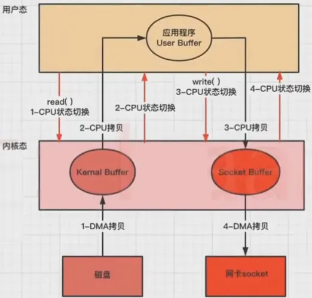

# 操作系统

### 操作系统是什么？

**管理软硬件资源，中间层**

- 操作系统本质也是一个**软件程序**，它的功能是**管理软硬件资源**，软件资源是应用程序，硬件资源是cpu,内存,设备等
- 那为什么要管理？因为让各应用程序直接共享硬件资源会因为资源竞争发生冲突，那遇到这种情况怎么办呢？
- 没有什么是加一层中间层解决不了的，如果有就再加一层，所以操作系统就是这样一个承担管理作用的**中间层**，它为上层的应用程序有序、高效地提供其所需的底层硬件资源
- 在这样的层级结构中，每一层都专注于做自己的事情，层与层之间协同交互，共同完成某个任务，不管是OSI网络模型还是MVC软件开发模式都是**层次化结构**，道理都是相通的

### 进程、线程、协程区别是什么？

- 进程是运行中的程序，也就是上层的应用程序开始工作了操作系统是为它服务的，所以要给它分配一系列的资源支撑它的运行，所以它是资源分配的最小单位
- 而正是给一个进程分配的资源太多了，导致操作系统要为其他进程服务的时候，需要**费很大劲**保存它的状态，开销很大
- 所以把进程进一步划分多个可独立运行的线程，所有线程共享该进程的所有资源，只保留少部分自己独有的数据(寄存器，栈)，所以又说线程是轻量级的进程
- 线程之间的切换开销就比进程切换开销小的多，多线程还可以通过并发或者并行的方式加速程序的执行过程
- 协程，是一种比线程更加轻量级的存在，正如一个进程可以拥有多个线程一样，一个线程也可以拥有多个协程。 最重要的是，协程不是被操作系统内核所管理，而完全是由用户程序控制的（也就是在用户态中执行）。这样带来的好处就是性能得到了很大的提升，不会像线程切换那样消耗资源。
- 协程拥有自己的寄存器上下文和栈。协程调度切换时，将寄存器上下文和栈保存到其它地方，在切回来的时候，恢复先前保存的寄存器上下文和栈，直接操作栈则基本没有内核切换的开销，可以不加锁的访问全局变量，所以上下文的切换非常快。

### 协程和线程
这里讨论的协程和线程说的都是用户空间的概念

操作系统把虚拟内存划分为用户空间和内核空间。内核空间对于外部线程调用是无感的，一般所说的用户线程和内核线程之间的关系是1:1的。但是协程是一种更加轻量级的线程，协程和内核线程之间是M:N的关系。与传统的线程相比，协程的创建和销毁成本非常低，可以方便地启动大量的协程来执行并行操作。

在Java和cpp语言中，如果想要实现并发，需要自己维护一个线程池，进行任务包装，然后进行任务提交。

但是在Golang中，goroutine是一个语言层面的并发调度机制，开发人员只需要定义任务，goroutine可以合理的分配CPU片。当你需要让某个任务并发执行的时候，你只需要把这个任务包装成一个函数，开启一个goroutine去执行这个函数就可以了。

协程与线程类似，也是独享栈空间，共享堆内存。一个线程大概几M，一个goroutine大概几kb。

#### 线程在内核态进行切换时，涉及以下主要步骤和操作:

- **保存当前线程的上下文**: 内核首先需要保存当前线程的上下文信息，包括寄存器状态、程序计数器(PC)、栈指针(SP)、标志寄存器等。这些信息被保存到内存中的线程控制块(Thread Control Block，TCB)中，以便在切换回该线程时能够恢复到原来的执行状态。
- **加载下一个线程的上下文**: 接着，内核会从调度队列中选择下一个要运行的线程，并加载其上下文信息。这包括将下一个线程的寄存器状态、程序计数器、栈指针等信息加载到 CPU 中，以便执行下一个线程的代码。
- **更新内存映射和页表**: 在进行线程切换时，可能需要切换线程的地址空间或更新页表信息。这通常涉及将内核地只址空间切换到新线程的地址空间，并更新相关的页表、段表等数据结构，以确保新线程能够正确访问内存中的数据。
- **刷新 CPU 缓存**: 在进行线程切换时，可能需要刷新 CPU的缓存，以避免由于缓存中的脏数据导致数据一致性问题。这通常涉及将 CPU 缓存中的数据写回内存或清除缓存中的数据。
- **调度器的调度决策**: 线程切换时，调度器可能会根据线程的优先级、调度策略等因素进行调度决策，选择适当的线程来运行。这可能涉及到线程的挂起、恢复和唤醒等操作。
- **切换到用户态**: 最后，内核将控制权交给新线程的用户态代码，新线程开始执行用户态的程序代码

#### goroutine切换时需要做的事情要少得多

这是因为协程是由编程语言的运行时环境管理的，而不是由操作系统内核管理:

- 保存当前协程的上下文: 当前协程的执行状态(包括寄存器状态、栈信息等)可能需要保存，以便稍后切换回来时能够恢复执行
- 选择下一个协程: 运行时环境可能需要选择下一个要执行的协程。这通常涉及从就绪队列中选择一个协程，并准备将其执行
- 切换到下一个协程的上下文: 将上下文切换到下一个协程，这可能包括恢复下一个协程的寄存器状态、栈信息等
- 调度决策: 运行时环境可能会根据调度策略和优先级等因素做出调度决策，以选择合适的协程来执行
- 切换到用户态: 最后，控制权被交还给被选择的协程，它开始执行用户态的程序代码

可以看到在线程切换的时候，内核层面要:
1. 切换上下文:保存和恢复大量的寄存器状态、内存映射等信息,
2. 特权级别切换:从用户态切换到内核态时，需要进行特权级别的切换，这通常涉及到修改 CPU 控制寄存器的状态、切换页表、权限检查等操作，开销较大。
3. 硬件:操作系统进行调度时可能涉及到硬件相关的操作，例如更新页表、修改中断向量表等，这些操作需要与硬件进行交互，开销较大，
4. 复杂的调度算法: 操作系统通常会使用复杂的调度算法来实现多任务调度，例如优先级调度、时间片轮转调度等，这些算法需要消耗大量的计算资源和时间来进行调度决策。

Go语言对协程的使用，使得优化并发的逻辑集中在了调度器的优化上。

### **什么是线程安全？如何保证线程安全？**

- 多线程对于共享数据的更改会引起程序结果错误，称为线程不安全
- 线程安全的解决策略就是：保护共享数据在多线程的情况下，保持正确的取值结果
- 线程安全就是多线程访问时，采用了加锁机制，同一时刻有且只有一个线程在操作共享数据，其他线程必须等到该线程处理完数据后再对共享数据进行操作，确保不会出现数据不一致或者数据污染

### 内核态和用户态的区别？

### **为什么要区分用户态和内核态**

操作系统区分用户态和内核态的原因有以下几点：

1. **安全性**：将操作系统和用户程序的运行环境分开有助于防止用户程序对系统造成不可修复的破坏。用户程序在用户态下运行，受到严格的限制，不能直接操作关键系统资源。
2. **稳定性**：如果一个用户程序崩溃或出现错误，它不会影响整个系统的稳定性。内核态下运行的操作系统可以继续正常工作，而不受用户程序的干扰。
3. **性能**：内核态具有更高的权限，可以执行一些需要较高特权级别的操作，如直接访问硬件。将这些操作限制在内核态有助于提高系统的性能，因为不需要为每个用户程序都提供相同的权限。

综上所述，通过区分用户态和内核态，操作系统可以实现更好的安全性、稳定性和性能。

- 我们知道操作系统的功能是为上层应用程序提供它所需要的底层硬件资源，所以当该用户程序需要硬件资源相关操作时，只需要使唤一下操作系统为它去完成，它就可以撒手不管了，坐等结果就可以
- 而操作系统自己本身也是软件程序，它这时候就按照用户程序需求对硬件资源执行命令操作，执行完毕再告诉用户结果
- 这个过程当中用户程序所在的空间就称为用户态，操作系统的程序所在空间就叫内核态，用户态和内核态之间通过中断切换，通过两次这样用户态和内核态的切换，操作系统就完成了用户程序对硬件资源的请求了

# 进程管理

### 怎么管理进程?进程的状态？

- **进程控制块PCB(Process Control Block)**：操作系统为了记录它需要服务的所有上层应用程序(也就是进程)的状态信息，会通过一个数据结构来管理和跟踪进程，也就是**进程控制块**，其中包括唯一的进程id，进程调度情况，进程对资源的需求情况等
- **进程状态**：创建状态，**就绪状态，运行状态，阻塞状态**，结束状态
- **进程上下文切换**：时机主要是在调度算法影响下，发生进程状态改变时（就绪到运行，运行到阻塞或者结束），CPU资源重新分配的时候，保存上下文信息到原进程中的PCB中，然后读取新进程PCB的上下文信息；上下文信息包括（保存当前进程的状态信息，包括CPU状态的程序计数器（PC）、寄存器，虚拟内存管理的页表），所以上下文切换的代价相对较高，因为它涉及到保存和加载大量的进程状态信息

### 进程在内存中长什么样?

- **代码段text，数据段data，BSS段**(未初始化的全局、静态变量)，**栈区**(函数调用上下文)，**堆区**(一堆空闲空间)
- [.data段和.bss段的区分是为了节省内存空间。.data段保存已经初始化的数据，需要分配实际空间，而.bss段保存未初始化的数据，只记录所需空间大小，不分配实际内存空间](https://blog.csdn.net/Ivan804638781/article/details/110209548)
- 区分堆和栈可以让编译器或运行时环境更好地管理内存，针对不同的数据存储需求进行合理的分配和释放，提高内存的使用效率和管理灵活性。 栈采用后进先出（LIFO）的方式管理数据，对于方法的调用和返回非常高效；而堆的动态分配能够满足复杂的数据结构和动态内存需求。
- https://blog.csdn.net/Ivan804638781/article/details/110010286

### **进程调度算法有哪些？**

- **进程调度==CPU管理**：为了确定 先执行哪个进程 以及 最后执行哪个进程 以实现最大 CPU 利用率，同时减少进程等待时间
- **进程调度算法：**
    - **先到先服务：**每次从就绪队列选择最先进入队列的进程，然后一直运行，直到进程退出或被阻塞，才会继续从队列中选择第一个进程接着运行，这似乎很公平，但是当一个长作业先运行了，那么后面的短作业等待的时间就会很长，**不利于短作业**
    - **最短作业优先：优先选择运行时间最短的进程来运行**，这有助于提高系统的吞吐量，但这显然对长作业不利，很容易造成一种极端现象。比如，一个长作业在就绪队列等待运行，而这个就绪队列有非常多的短作业，那么就会使得长作业不断的往后推，周转时间变长，致使长作业长期不会被运行
    - **最高响应比优先**：为了权衡短作业和长作业，每次进行进程调度时，先计算「响应比优先级」，然后把「响应比优先级」最高的进程投入运行，**响应比优先级=**（等待时间+服务时间）/ 服务时间
    - **时间片轮转：**这个是最古老、最简单、最公平且使用最广的算法，每个进程被分配一个时间段，称为时间片（*Quantum*），即允许该进程在该时间段中运行，这个方法中**时间片的长度**就是一个很关键的点，太短会导致过多的进程上下文切换，降低了 CPU 效率；太长可能引起对短作业进程的响应时间变长；所以需要设一个比较合理的折中值
    - **优先级调度：**「时间片轮转算法」做了个假设，即让所有的进程同等重要，也不偏袒谁，大家的运行时间都一样。但是，对于多用户计算机系统就有不同的看法了，它们**希望调度是有优先级的**，即希望调度程序能**从就绪队列中选择最高优先级的进程进行运行；**进程的优先级可以分为，静态优先级（进程创建时确定）或动态优先级(运行时动态变化)，也有两种处理优先级高的方法，非抢占式和抢占式，但是依然有缺点，可能会导致低优先级的进程永远不会运行
    - **多级反馈队列：**该算法是「时间片轮转算法」和「最高优先级算法」的综合和发展
        - 顾名思义：
        - 「多级」表示有多个队列，每个队列优先级从高到低，同时优先级越高时间片越短。
        - 「反馈」表示如果有新的进程加入优先级高的队列时，立刻停止当前正在运行的进程，转而去运行优先级高的队列；
        - 流程：
        - 新的进程会被放入到第一级队列的末尾，按先来先服务的原则排队等待被调度，如果在第一级队列规定的时间片没运行完成，则将其转入到第二级队列的末尾，以此类推，直至完成；
        - 当较高优先级的队列为空，才调度较低优先级的队列中的进程运行。如果进程运行时，有新进程进入较高优先级的队列，则停止当前运行的进程并将其移入到原队列末尾，接着让较高优先级的进程运行
        - 可以发现，对于短作业可能可以在第一级队列很快被处理完。对于长作业，如果在第一级队列处理不完，可以移入下次队列等待被执行，虽然等待的时间变长了，但是运行时间也会更长了，所以该算法很好的**兼顾了长短作业，同时有较好的响应时间**

### **进程通信方式有哪些？**

- **为什么需要进程间通信呢**？因为有些复杂程序或者是系统需要多个进程或者线程共同完成某个具体的任务，那么也就需要进程之间通信和数据访问。整个系统以进程粒度运行可以进一步提高系统整体并行性能和内存访问安全，每个进程可以有各自的分工。所以多个进程共同完成一个大的系统是比单个进程多线程要有很大的优势。
- 通信方式：
    - **本地**：
        - **管道：管道实际上是一个固定大小的缓冲区**，通信的数据是**无格式的流并且大小受限，**并且缓冲区只允许一边写入，另一边读出，管道传输数据是单向的，如果想相互通信，我们需要创建两个管道才行
            - **匿名管道**：用于具有继承关系的父子进程间，父子进程通过fork后，子进程继承了父进程的文件描述符。所以他们指向同一个数据结构。父子进程通常只需要单向通信，父子进程各关闭自己的一端。当父子进程对管道进程读写的时候，操作系统会控制这一切，包括数据的读取和写入，进程的挂起和唤醒
            - **命名管道**：**命名管道**突破了匿名管道只能在亲缘关系进程间的通信限制。管道有名字，进程们就可以通过名字去找到这个管道来通信，就可以在不相关的进程间也能相互通信，命名管道会提前创建了一个类型为管道的设备文件，在进程里只要使用这个设备文件，就可以相互通信
        - **消息队列**(升级版管道)：为了克服了**管道通信的数据是无格式的字节流的问题**，就有了消息队列方式，**消息队列是保存在内核中的消息链表，**消息的发送方和接收方要约定好消息体的数据类型，所以每个消息体都是固定大小的存储块，不像管道是无格式的字节流数据；**但是消息队列通信过程中，存在用户态与内核态之间的数据拷贝开销**，因为进程写入数据到内核中的消息队列时，会发生从用户态拷贝数据到内核态的过程，同理另一进程读取内核中的消息数据时，会发生从内核态拷贝数据到用户态的过程。
        - **共享内存：很好解决了消息队列中的数据拷贝开销问题，它是通过拿出一块虚拟地址空间来，映射到相同的物理内存中，**这样某个进程写入的东西，另外一个进程马上就能看到了，都不需要拷贝来拷贝去，传来传去，大大提高了进程间通信的速度
        
        - **信号量**(计数器，同步)：多进程都共享内存，如果同时都往里面写内容，难免会出现**冲突**的现象，为了防止对共享空间的读写冲突，我们得有个约束或者说一种保护机制。使得同一份共享的资源同一时刻只能由一个进程使用，这里就出现了信号量机制
            - 信号量实际上是一个计数器，主要是实现进程之间的同步和互斥，而不存储通信内容。
            - 信号量定义了两种操作，p操作和v操作，p操作为申请资源，会将数值减去M，表示这部分被他使用了，其他进程暂时不能用。v操作是归还资源操作，告知归还了资源可以用这部分
            
        - **信号：**与信号量名字很相似的叫**信号**，它俩名字虽然相似，但功能一点儿都不一样。信号是**异步通信机制**，信号可以在应用进程和内核之间直接交互，内核也可以利用信号来通知用户空间的进程发生了哪些系统事件，信号事件的来源主要有硬件来源（如键盘 Cltr+C ）和软件来源（如 kill 命令），一旦有信号发生，**进程有三种方式响应信号 1. 执行默认操作、2. 捕捉信号、3. 忽略信号**。有两个信号是应用进程无法捕捉和忽略的，即 `SIGKILL` 和 `SIGSTOP`，这是为了方便我们能在任何时候结束或停止某个进程
    - **网络**：管道、消息队列、共享内存、信号量和信号都是在同一台主机上进行进程间通信，那要想**跨网络与不同主机上的进程之间通信，就需要 Socket 通信了**
        - **Socket套接字**(网络通信)：**套接字（socket）是一个抽象层，**应用程序可以通过它发送或接收数据，可对其进行像对**文件**一样的打开、读写和关闭等操作。套接字允许应用程序将I/O插入到网络中，并与网络中的其他应用程序进行通信。网络套接字是**IP地址与端口的组合**

### 守护进程

- 守护进程（Daemon）是一类在后台运行的系统服务进程，而不是在交互式用户界面下运行的进程。它们通常在系统启动时启动，并持续运行以提供某种服务或执行特定任务。守护进程独立于任何终端会话，通常不接受用户输入，而是通过系统的事件驱动或定时器来执行任务

### 僵尸进程和孤儿进程？

- **特殊的进程**：Unix/Linux 系统中，子进程通常是通过 fork()系统调用创建的，该调用会创建一个新的进程，该进程是原有进程的一个副本。子进程和父进程的运行是相互独立的，它们各自拥有自己的 PCB，即使父进程结束了，子进程仍然可以继续运行
    - **僵尸进程：**父进程忘记回收的子进程，子进程占用的资源没有被释放，Top 命令可以查看，`zombie` 值表示僵尸进程的数量，为 0 则代表没有僵尸进程
    - **孤儿进程**：父进程结束了(意外终止)，但是子进程还在运行，为了避免孤儿进程占用系统资源，操作系统会将孤儿进程的父进程设置为 init 进程（进程号为 1），由 init 进程来回收孤儿进程的资源

### 同步和异步的区别?

- 同步就是我需要等待当前事件完成后才执行下一个事件
- 异步则不需要等待，就可以继续执行后面的事件

### 死锁怎么产生的？

- 死锁：两个进程同时被阻塞，互相等待对方释放资源，都无法继续执行，陷入了死锁
    - **死锁的四个必要条件**：
        - 互斥：多个线程不能同时使用同一个资源
        - 持有并等待：线程 A 在等待资源 2 的同时并不会释放自己已经持有的资源 1
        - 不可剥夺：当线程已经持有了资源 ，**在它使用完之前不能被其他线程获取**，线程 B 如果也想使用此资源，则只能在线程 A 使用完并释放后才能获取
        - 环路：在死锁发生的时候，两个线程获取资源的顺序构成了**环形链**
    - **解决**：避免死锁问题就只需要破环其中一个条件就可以，最常见的并且可行的就是**使用资源有序分配法，来破环环路等待条件，也就是说不同的进程以相同顺序的申请想要的资源**

### 锁

多线程访问共享资源的时候，避免不了资源竞争而导致数据错乱的问题，所以我们通常为了解决这一问题，都会在**访问共享资源之前加锁**

最常用的就是互斥锁，当然还有很多种不同的锁，比如自旋锁、读写锁、乐观锁等，不同种类的锁自然适用于不同的场景。

### 自旋锁和互斥锁？

加锁的目的就是保证共享资源在任意时间里，只有一个线程访问，这样就可以避免多线程导致共享数据错乱的问题。

**区别**：当已经有一个线程加锁后，其他线程加锁则就会失败，互斥锁和自旋锁**对于加锁失败后的处理方式是不一样**的：

- **互斥锁**加锁失败后，线程会**释放 CPU** ，给其他线程；该线程**加锁失败而阻塞，CPU 切换给其他线程运行，会有2次线程上下文切换的开销**
- **自旋锁**加锁失败后，线程会**忙等待**，直到它拿到锁；
    - **本质：while循环(自旋) + CAS原子操作获取锁**
    - **自旋锁**是通过 CPU 提供的 `CAS` 函数（*Compare And Swap*），加了while 或者睡眠 CPU 的操作而产生自旋的效果，加锁失败会忙等待直到拿到锁，在「用户态」完成加锁和解锁操作，不会主动产生线程上下文切换，所以相比互斥锁来说，会快一些，开销也小一些
    - 一般加锁的过程，包含两个步骤：
        - 第一步，查看锁的状态，如果锁是空闲的，则执行第二步；
        - 第二步，将锁设置为当前线程持有；
        
        CAS 函数就把这两个步骤合并成一条硬件级指令，形成**原子指令**，这样就保证了这两个步骤是不可分割的，要么一次性执行完两个步骤，要么两个步骤都不执行
        
    - 使用自旋锁的时候，当发生多线程竞争锁的情况，加锁失败的线程会「忙等待」，直到它拿到锁。这里的「忙等待」可以用 `while` 循环等待实现，不过最好是使用 CPU 提供的 `PAUSE` 指令来实现「忙等待」，因为可以减少循环等待时的耗电量。
- **总结**：**当加锁失败时，互斥锁用「线程切换」来应对，自旋锁则用「忙等待」来应对**。
- 自旋锁开销少，在多核系统下一般不会主动产生线程切换，适合异步、协程等在用户态切换请求的编程方式，但如果被锁住的代码执行时间过长，自旋的线程会**长时间占用 CPU 资源**，所以自旋的时间和被锁住的代码执行的时间是成「正比」的关系，我们需要清楚的知道这一点
- 自旋锁和互斥锁是锁的最基本处理方式，更高级的锁都会选择其中一个来实现，比如读写锁既可以选择互斥锁实现，也可以基于自旋锁实现
的

### 读写锁

读写锁从字面意思我们也可以知道，它由「读锁」和「写锁」两部分构成，如果只读取共享资源用「读锁」加锁，如果要修改共享资源则用「写锁」加锁。

所以，**读写锁适用于能明确区分读操作和写操作的场景**

读写锁的工作原理是：

- 当「写锁」没有被线程持有时，多个线程能够并发地持有读锁，这大大提高了共享资源的访问效率，因为「读锁」是用于读取共享资源的场景，所以多个线程同时持有读锁也不会破坏共享资源的数据。
- 但是，一旦「写锁」被线程持有后，读线程的获取读锁的操作会被阻塞，而且其他写线程的获取写锁的操作也会被阻塞

**从工作原理可以看出，读写锁在读多写少的场景，能发挥出优势**

读写锁既可以选择互斥锁实现，也可以基于自旋锁实现

### 乐观锁和悲观锁？

**悲观锁：**做事比较悲观，它认为多线程同时修改共享资源的概率比较高，于是很容易出现冲突，所以**访问共享资源前，都要先上锁，**互斥锁、自旋锁、读写锁，都是属于悲观锁

那相反的，如果多线程同时修改共享资源的概率比较低，就可以采用乐观锁

**乐观锁：**做事比较乐观，它假定冲突的概率很低，核心是**不上锁直接修改同步资源，再验证有没有发生冲突**。它的工作方式是：先修改完共享资源，再验证这段时间内有没有发生冲突，如果没有其他线程在修改资源，那么操作完成，如果发现有其他线程已经修改过这个资源，就放弃本次操作（或者通过CAS机制重试）；**可以看到乐观锁全程并没有加锁，所以它也叫无锁编程，其实是一种思想**

- **实现方式**：**版本号 + CAS**
    - 使用**数据版本（Version）记录机制**实现，这是乐观锁最常用的一种实现方式。何谓数据版本？即为数据增加一个版本标识，一般是通过为[数据库](https://cloud.tencent.com/solution/database?from_column=20065&from=20065)表增加一个数字类型的 “version” 字段来实现。当读取数据时，将version字段的值一同读出，数据每更新一次，对此version值加一。当我们提交更新的时候，判断数据库表对应记录的当前版本信息与第一次取出来的version值进行比对，如果数据库表当前版本号与第一次取出来的version值相等，则予以更新，否则认为是过期数据，结合CAS机制compare and swap（比较与交换），不断自旋循环重试，获取最新版本数据，再进行修改
    - 版本号的加入限制了数据的更新，必须数据和版本号绑定一起更新，从而保证数据更新的正确性
- 乐观锁虽然去除了加锁解锁的操作，但是一旦发生冲突，重试的成本非常高，所以**只有在冲突概率非常低，且加锁成本非常高的场景时，才考虑使用乐观锁**

总结：

- **思想层面**：悲观锁=要加锁，乐观锁=不加锁
- **实现层面**：互斥锁=失败会阻塞，自旋锁=不阻塞(忙等)，
    - 但是都是为了加锁
- CAS机制：[Compare](https://so.csdn.net/so/search?q=Compare&spm=1001.2101.3001.7020) and swap，比较和交换，内存值，预期值，更新值，2步数据交换操作合并为一个原子操作，不会被打断，保证并发安全
- CAS机制是原子操作，所以无需加锁，是无锁算法，也就是乐观锁的思想！
- 如**自旋锁**就借助CAS将2步加锁操作形成原子操作，然后通过`while`实现自旋的效果，但它本质是想加锁，所以自旋锁是悲观锁的思想
- 乐观锁的一个实现方式就可以通过**版本号+CAS**实现，这里CAS比较和交换的值就是数据的版本号，CAS一般会循环重试(自旋)直到操作成功

# 内存管理

### 虚拟内存管理技术？

- 进程的数据需要放在内存中，才能被CPU处理
- 内存也是一种硬件资源，内存管理主要指的是内存的分配与回收
- **虚拟内存管理**：当然需要深一点考虑比如内存不够了怎么办？于是就有了**虚拟内存技术**来**扩充内存**，扩充指的是在物理内存之上设置虚拟内存空间(本质也是加了一层**中间层**！)，进程都有一个唯一且私有的虚拟地址空间，互不影响，每个进程都认为自己拥有了整个物理内存，程序员不用和真正的物理内存打交道，而是借助虚拟地址空间访问物理内存，从而简化了内存管理。操作系统也只需要将进程当前正在使用的部分数据或指令加载入物理内存(**局部性原理**)，来提高物理内存利用率
- **局部性原理**：时间局部性(当前访问的数据大概率之后也会访问)，空间局部性(当前访问数据附近的那些数据大概率也会被访问)，所以基于局部性原理，无论一个进程占用多大的虚拟内存空间，在任一时刻，它实际使用的物理内存却是很少的
- **地址映射**：这时候又涉及虚拟内存地址和物理内存地址之间的地址映射了，操作系统一般通过 CPU 芯片中的一个重要组件 **MMU(Memory Management Unit，内存管理单元)** 将虚拟地址转换为物理地址，这个过程被称为 **地址转换，**通过 MMU 将虚拟地址转换为物理地址后，然后完成相应的物理内存读写，具体的地址转换方式和相应的内存管理方式相关(段式，页式，段页式)，就比如最常用的页式就是通过页表查找页号+页内偏移量得到物理内存地址的
- **页式管理**：
    - 广泛使用，把主存（物理内存）和应用程序的虚拟地址空间4GB都划分为连续等长的虚拟页，4kB，可有效避免分段机制中外部内存碎片的问题，但仍然可能会出现内部内存碎片
    - 分页管理通过 **页表（Page Table）** 映射虚拟地址和物理地址，在分页机制下，每个应用程序都会有一个对应的页表，存储虚拟页号和物理页号的映射关系，物理页号再加上虚拟地址中的页内偏移量得到最终的物理地址
    - 页表项包括：虚拟页号，物理页号
        - *状态位*：用于表示该页是否有效，也就是说是否在物理内存中，供程序访问时参考。
        - *访问字段*：用于记录该页在一段时间被访问的次数，供页面置换算法选择出页面时参考。
        - *修改位*：表示该页在调入内存后是否有被修改过，由于内存中的每一页都在磁盘上保留一份副本，因此，如果没有修改，在置换该页时就不需要将该页写回到磁盘上，以减少系统的开销；如果已经被修改，则将该页重写到磁盘上，以保证磁盘中所保留的始终是最新的副本
        - *硬盘地址*：用于指出该页在硬盘上的地址，通常是物理块号，供调入该页时使用。
    - **多级页表**：属于时间换空间的典型场景，利用增加页表查询的次数减少页表占用的空间，无需存储所有页表项(4G/4K个，邻接矩阵)，只需存储用到的页表项(邻接表，减少空间)
    - **快表**(**转址旁路缓存,TLB**)：本质上就是一块高速缓存（Cache），缓存了虚拟页号到物理页号的映射关系，你可以将其简单看作是存储着键（虚拟页号）值（物理页号）对的哈希表，设计思想非常简单，但命中率往往非常高，效果很好。这就是因为被频繁访问的页就是其中的很小一部分。其实和缓存（比如 Redis）很像
- **页面置换算法**：注意这里没找到就会发生**缺页中断**~需要从外存中将缺失的物理页加入，若此时物理内存没有空闲空间了，就需要如下**页面置换算法**来选择淘汰哪一个物理页，LRU 算法在实际使用中应用的最多：
    - **FIFO先进先出：**选择在内存驻留时间很长的页面进行中置换
    - **LRU最近最久未使用：选择最长时间没有被访问的页面进行置换**，也就是说，该算法假设已经很久没有使用的页面很有可能在未来较长的一段时间内仍然不会被使用
    - **LFU最少使用次数：**选择「访问次数」最少的那个页面，并将其淘汰。它的实现方式是，对每个页面设置一个「访问计数器」，每当一个页面被访问时，该页面的访问计数器就累加 1。在发生缺页中断时，淘汰计数器值最小的那个页面
- 如果被换出的物理页有被修改过（脏页），则把它换出到磁盘，然后把该被置换出去的页表项的状态改成「无效的」，最后把正在访问的页面装入到这个物理页中
- 综合来说，虚拟内存技术是一种时间换空间的策略，你用 CPU 的计算时间，页的调入调出花费的时间，换来了一个虚拟的更大的物理内存空间来支持程序的运行
- 此外在一次次内存的申请和释放过程中，不可避免地产生**内存碎片**，外部内存碎片(无法再次分配)和内部内存碎片(分配了没有用)，因此管理还有一部分内容就在于通过调整内存分配策略和回收算法来**提高内存使用率**
- 管理方式：
    - 段式：
        - 应用程序的虚拟地址空间被分为**大小不等的段**，段是有实际意义的，每个段定义了一组逻辑信息，例如有主程序段 MAIN、子程序段 X、数据段 D 及栈段 S 等；
        - 分段管理通过 **段表（Segment Table）** 映射虚拟地址和物理地址，计算段号+段内偏移得到物理内存地址；
        - 分段机制容易出现**外部内存碎片**，即在段与段之间留下碎片空间(不足以映射给虚拟地址空间中的段)。从而造成物理内存资源利用率的降低
        - 分段机制需要程序员将程序分为多个段，并且显式地使用段寄存器来访问不同的段
    - **页式**：
        - 广泛使用，把主存（物理内存）和应用程序的虚拟地址空间4GB都划分为连续等长的虚拟页，4kB，可有效避免分段机制中外部内存碎片的问题，但仍然可能会出现内部内存碎片
        - 分页管理通过 **页表（Page Table）** 映射虚拟地址和物理地址，在分页机制下，每个应用程序都会有一个对应的页表，存储虚拟页号和物理页号的映射关系，物理页号再加上虚拟地址中的页内偏移量得到最终的物理地址
        - **多级页表**：属于时间换空间的典型场景，利用增加页表查询的次数减少页表占用的空间，无需存储所有页表项(4G/4K个，邻接矩阵)，只需存储用到的页表项(邻接表，减少空间)
        - **快表**(**转址旁路缓存,TLB**)：本质上就是一块高速缓存（Cache），缓存了虚拟页号到物理页号的映射关系，你可以将其简单看作是存储着键（虚拟页号）值（物理页号）对的哈希表，设计思想非常简单，但命中率往往非常高，效果很好。这就是因为被频繁访问的页就是其中的很小一部分。其实和缓存（比如 Redis）很像
    - 段页式：结合了段式管理和页式管理的一种内存管理机制，把物理内存先分成若干段，每个段又继续分成若干大小相等的页。
        
        在段页式机制下，地址翻译的过程分为两个步骤：
        
        1. 段式地址映射
        2. 页式地址映射

# 文件管理

### **inode** 到是什么?有什么作用呢?

- 文件系统主要负责管理和组织计算机存储设备上的文件和目录，包括存储管理，文件与目录管理，文件的访问控制
- “一切皆文件”，将所有资源都抽象为文件的方式来进行管理和访问
- **每个文件都有一个唯一的 inode，存储文件的元信息。**如某个文件被分成几块、每一块在的地址、文件拥有者，创建时间，权限，大小等
    - inode 的数量是有限的，每个文件系统只能包含固定数量的 inode。这意味着当文件系统中的 inode 用完时，无法再创建新的文件或目录，即使磁盘上还有可用空间
    - 可以使用 `stat` 命令可以查看文件的 inode 信息，包括文件的 inode 号、文件类型、权限、所有者、文件大小、修改时间
    - 使用 inode 区分不同的文件。这样做的好处是，即使文件名被修改或删除，文件的 inode 号码不会改变，从而可以避免一些因文件重命名、移动或删除导致的错误。同时，inode 也可以提供更高的文件系统性能，因为 inode 的访问速度非常快，可以直接通过 inode 号码定位到文件的元数据信息，无需遍历整个文件系统

### **硬链接和软链接**？

- 在 Linux/类 Unix 文件系统中，每个文件和目录都有一个唯一的索引节点（inode）号，用来标识该文件或目录。硬链接通过 inode 节点号建立连接，硬链接和源文件的 inode 节点号相同，两者对文件系统来说是完全平等的（可以看作是互为硬链接，源头是同一份文件），删除其中任何一个对另外一个没有影响，可以通过给文件设置硬链接文件来防止重要文件被误删。
- 只有删除了源文件和所有对应的硬链接文件，该文件才会被真正删除。
- 硬链接具有一些限制，不能对目录以及不存在的文件创建硬链接，并且，硬链接也不能跨越文件系统(会导致 inode 节点号冲突)。
- `ln` 命令用于创建硬链接

---

- 软链接和源文件的 inode 节点号不同，而是指向一个文件路径。
- 源文件删除后，软链接依然存在，但是指向的是一个无效的文件路径。
- 软连接类似于 Windows 系统中的快捷方式。
- 不同于硬链接，可以对目录或者不存在的文件创建软链接，并且，软链接可以跨越文件系统。
- `ln -s` 命令用于创建软链接。

# IO

### DMA技术

- DMA（Direct Memory Access）：直接内存访问技术，DMA之前，要把外设的数据读入内存或把内存的数据传送到外设，一般都要通过`CPU控制完成，利用中断技术` ，而DMA允许某些硬件系统能够独立于CPU直接读写操作系统的内存，不需要CPU介入处理
- 主要负责将磁盘数据写入内核缓冲区

### Read读文件流程：

- **读内核缓冲区**：操作系统检查内核缓冲区读取，如果存在则直接把内核空间的数据copy到用户空间（`CPU处理`），应用程序即可使用
- **读磁盘**：如果内核缓冲区没数据，则从磁盘中读取文件数据到内核缓冲区（`DMA处理`），再把内核空间的数据copy到用户空间（`CPU处理`），应用程序即可使用
- 硬盘 ->内核缓冲区 ->用户缓冲区，两次上下文切换，

### Write 写文件时的流程：

- **写入内存缓冲区**：数据首先从应用写入到了C标准库的IO Buffer（用户态），这个Buffer在应用内存中，应用挂了，数据就没了；
- **写入内核缓存区**：关闭流之前调用flush，通过flush将数据主动写入到内核的Page Cache中（内核态），应用挂了，数据也安全，但是系统挂了数据就没了
- **写入磁盘**：调用fsync将内核中的Page Cache中的数据写入到磁盘（持久化介质）中，系统挂了，数据也不丢失

### Direct IO && Buffer IO两种写方式

- **Direct IO(直接IO)：**
    - 应用程序把数据**直接从用户态地址空间写入到磁盘中**，**直接跳过内核空间缓冲区**，减少操作系统缓冲区和用户地址空间的拷贝次数，降低了CPU和内存开销
- **Buffer IO(标准IO)：**
    - 应用程序把数据从用户空间copy到内核空间的缓冲区（`CPU处理`），再把内核缓冲区的数据写到磁盘（`DMA处理`）

### cache 和 buffer

- cache：Cache 标准可以翻译为缓存或者快取，主要用于解决系统两端性能不匹配的问题，利用空间局部性原理和时间局部性原理加快访问速度，提高性能。比如我们常见的CPU多级缓存；
    - cache就是把最常用的工具放在手边
- buffer：Buffer 翻译为缓冲区，更偏向解决生产者和消费者速率不匹配的问题，平滑整个传输过程减少延迟，提高性能。比如我们常见的磁盘缓冲区；
    - buffer就是垃圾桶，垃圾先扔在垃圾桶里，垃圾满了再一起扔

### 磁盘缓冲区：

- 磁盘缓冲区是硬盘与PCI总线之间的容量固定的硬件。同样是一种优化磁盘 I/O 性能的重要技术，通过减少磁盘访问次数和优化数据写入方式，提高了计算机系统的整体效率和响应速度

### PageCache(内核缓冲区)

https://cloud.tencent.com/developer/article/2416904

- 当CPU需要读写磁盘的数据时，需要等待DMA把数据从磁盘传输到内存(内核态的内存空间)。但是从磁盘读取数据实在太慢了。因此我们希望直接可以从内存读取到数据，而不是先让DMA把磁盘的数据传输到内存中
- 因此我们可以根据局部性原理把磁盘的数据缓存到内存中，缓存磁盘数据的这部分内存，我们称其为PageChche
- PageCache的两个功能为（1）缓存使用过的数据(时间局部性)（2）预读数据(空间局部性)
- **PageCache在传输大文件时不会起作用：**因为如果PageCache要把大文件全部缓存到PageCache中，那么可能会把PageCache中的所有其他数据全部淘汰掉，而这个大文件很可能缓存之后不会再使用。这样反而得不偿失，可以采用O_DIRECT选项绕过内核缓冲区，直接将数据写入磁盘
- PageCache 和 BufferCahe 实际上是 Linux 文件系统发展中不同时期的产物，现在合并为pagecache

### 网络IO：等待就绪+

- **读网络数据**：网卡Socket（类似磁盘）中读取客户端发送的数据到内核空间（`DMA处理`），再把内核空间的数据copy到用户空间（`CPU处理`），然后应用程序使用
- **写网络数据**：用户缓冲区中的数据copy到内核缓冲区的Socket Buffer中（`CPU处理`），再将内核空间中的Socket BUffer拷贝到Socket协议栈（网卡设备）进行传输（`DMA处理`）

### 应用程序从磁盘读取文件到发送到网络的流程

- 程序先read磁盘，然后write网络，其中包含4次内核态和用户态的切换、4次缓冲区的拷贝

    

### 零拷贝技术？

- 零拷贝旨在**减少不必要的内核缓冲区跟用户缓冲区之间的拷贝工作**，从而减少CPU的开销和减少了内核态和用户态的上下文切换，提升性能
- ZeroCopy技术实现有两种（内核态和用户态切换次数不一样）：
    
    方式一：mmap + write；
    
    - 思想：如果`把内核空间和用户空间的虚拟地址映射到同一个物理地址`，就不需要来回复制数据了
    - mmap系统调用函数会直接把内核缓冲区里的数据映射到用户空间，这样`内核空间和用户空间就不需要进行数据拷贝操作`，节省了CPU开销
    - CPU用户态和内核态上下文切换仍然是4次，和3次数据拷贝（2次DMA拷贝，1次CPU拷贝），**只是减少了1次CPU拷贝**（只有内核之间有一次拷贝）
    - 总结：
        - mmap调用可以在应用程序中直接修改Page Cache中的数据，使用的是mmap+write两步；
        - 调用比sendfile成本高，但优于传统I/O的零拷贝实现方式，虽然比sendfile多了上下文切换；
        - 用户空间与内核空间并不需要数据拷贝，在正确使用情况下并不比sendfile效率差；
        - 适用于多个线程以只读的方式同时访问同一个文件，mmap机制下多线程共享同一物理内存，节约内存；
        - 文件大小：适合小数据量读写；
        - 切换和拷贝：4次上下文切换,3次数据拷贝。
    
    方式二：sendfile
    
    - `系统调用函数sendfile()`替代read()和write()两个系统调用，**减少一次系统调用**，即减少2次CPU上下文切换的开销
    - 只把**内存地址、偏移量的缓冲区fd描述符** 拷贝到Socket Buffer中去，变成了真正的零拷贝（没有用户态和内核态的CPU拷贝，只有两次DMA拷贝）
    
    总结：
    
    - **sendfile无法在调用过程中修改数据**，只适用于`应用程序不需要对所访问数据进行处理修改`情况；
    - 比如`静态文件传输、MQ的Broker发送消息给消费者`；
    - 想要在传输过程中修改数据，可以使用mmap系统调用；
    - 文件大小：适合大文件传输；
    - 切换和拷贝：2次上下文切换，最少2次数据拷贝
    
    在文件较小的时候mmap用时更短，文件较大时sendfile方式最优