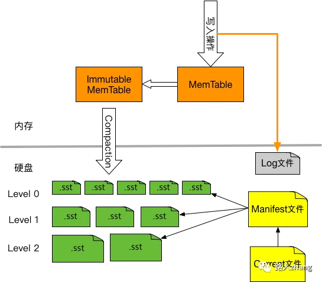

# 数据结构

## 排序


## 比较排序

- 时间复杂度在O(nlogn) ~ O(n^2)之间

### 简单排序O(n^2)

- **冒泡排序**
    - **基本思想**：遍历这个序列中的数，和其相邻的数比较，如果前面的大于后面的就将它们交换，这样使得**大的数往后面走**，每次冒泡就会将一个大的数往后面冒，从而达到排序的目的
    - 优化改进：
        - **记录上一次最后交换的那个位置**，下一轮交换只需要进行到这个位置即可
        - **同时冒泡两边**，从低到高，然后从高到低，相当于顺便把最小的数也冒泡到最前面这个方法比冒泡更加高效一点
- **选择排序**
    - 从未排序的元素中**选择**最小/最大的元素，放在已排序的序列末尾(交换)
    - 为什么不稳定？
- **插入排序**
    - **基本思想**：每一趟将一个待排序的记录，按其关键字的大小插入到已经排好序的一组记录的适当位置上(查找，可优化为二分查找)，直到全部待排序记录全部插入为止

### 树型排序O(nlogn)

- **希尔排序**
- **快速排序：**
    - 基本思想：
    - 一般情况下性能最好的排序算法
    - 
- **归并排序**
    - 基本思想：
    - 稳定性最高的排序算法
- **堆排序**
    - 内存占用最少的排序算法

## 非比较排序

- 时间复杂度可以达到O(n)
- 计数排序
- 基数排序
- 桶排序

## 稳定性问题

- **稳定**：稳定算法是指：如果待排序的序列中存在值相等的元素，经过排序之后，相等元素之间原有的先后顺序不变
- 指的是如果arr[i] = arr[j]，排序前arr[i]在arr[j]之前，排序后arr[i]还在arr[j]之前**，**通俗地讲就是**保证排序前后两个相等的数的相对顺序不变**
- **稳定排序只有：冒泡、插入、归并**
- 可以通过自定义比较函数来去除稳定性问题
    - 如：对于冒泡排序，原本是稳定的排序算法，如果将记录交换的条件改成arr[i] >= arr[i + 1]，则两个相等的记录就会交换位置，从而变成不稳定的排序算法

# 红黑树

- 前身：**平衡搜索二叉树**
    - 关键词：**平衡**（严格要求左右子树高度相差1，极致的平衡导致复杂的维护操作），**搜索**（有序，左<根<右），**二叉**（二分查找O(logN)），**树**（本质也是链表结构）
    - 问题：平衡搜索二叉树插入时维护平衡性（多次旋转操作）的成本和复杂度高，几乎没有工程落地的应用，需要进行改造
- 关键词：**红黑（通过颜色要求+少量旋转(最多3次)维持大致的平衡，左右子树高度最多相差一倍，最多旋转3次就能实现平衡，在平衡性和复杂度两者之间折中）**
- 颜色：根节点和 nil 叶节点都是黑色，所有从根节点到叶节点的路径上，包含相同个数的黑色节点，且不允许出现两个连续的红色节点

# B树

- **为什么会有B树？**
    - 大多数的平衡查找树（Self-balancing search trees)，比如 AVL 树 和红黑树，都假设所有的数据放在**内存**当中，当**数据量达到亿级别**，内存当中根本存储不下，我们只能以块的形式从磁盘读取数据，与内存的访问时间相比，**磁盘的 I/O 操作相当耗时**
    - 提出 B树的主要目的就是**减少磁盘的 I/O 操作**
    - 通过**调整 B树中结点所包含的键的数目m**，使得 B树的高度保持一个较小的值
    - 大多数平衡树的操作（查找、插入、删除，最大值、最小值等等）需要 𝑂 ( ℎ ) 次磁盘访问操作，其中 ℎ 是树的高度logmN，不再是 𝑙 𝑜 𝑔 N (其中 N 是树中的结点个数）
    - 由于**B树的高度 h 可控**（一般远小于 𝑙 𝑜 𝑔 𝑛 ），所以与 AVL 树和红黑树相比，B树的磁盘访问时间将极大地降低
- **B树结构**：
    - **阶数**：阶数表示了一个结点最多有多少个孩子结点，一般用字母m表示阶数。当m取2时，就是我们常见的二叉搜索树
    - 所有结点均存储了键值数据和指向子节点的指针，这就会导致可以存储在 B树中的结点数目极大地减少了，从而增加 B树的层数，进而增加了记录的搜索时间
- **B+树：B树上+优化**
    - B+树的内部节点只存储键和指向子节点的指针。它们不存储与键关联的数据值
    - 仅在树的叶子结点中存储数据，叶子结点之间通过指针有序相连（有序链表结构），方便范围查询
    - 非叶节点存储冗余的关键字索引，不存储真正的数据，这样可以存储更多的索引，从而存储更多的数据
    - 对于同样多的记录，B+树的高度会更矮，磁盘 I / O 会更少，查询效率更高
- **缺点**
    - B 树一族是数据可变的代表结构，B 树的理论增删查改性能都是 logN，但 B 树的实际写入效率并不是特别高
    - B 树需要分裂合并等操作保证整棵树的平衡性，这里面涉及很多磁盘随机读写的操作，性能会比较差
    - 另一方面考虑到并发场景，修改 B 树结构时需要比较复杂的锁机制保证并发安全，也会一定程度影响效率
    - 综上：B 树的难点在于平衡性维护和并发控制，一般用在**读多写少**的场景（**而lsm是写多读少**）

# 跳表

- **有序**数据结构
    - 平衡搜索二叉树AVL、红黑树等
    - 此类数据结构需要满足增删改查均在O(logN)的时间复杂度
    - **那为什么不用红黑树，选用跳表呢？**
        - 两者在性能方面不分伯仲，红黑树的树结构对于范围查询不能很好支持，跳表的有序单向链表天然支持范围查询
        - 但在并发读写情况下，红黑树由于着色旋转操作需要对整棵树加**全局锁**，而跳表只需要对所操作的单个数据加上**更细粒度的锁**即可
- **关键词：跳（随机概率决定层数、多层级索引（方便查）），表（有序链表，方便增删改）**
- **跳：在高层检索时，每跳过一个节点，实际上都过滤跳过了底层的大量数据，从而实现检索加速**
- 结构：
    - 在底层单向有序链表（全量数据）上加多层索引（冗余节点）辅助查找
    - 每一层节点数是下一层节点数的一半（概率控制，大数据情况下满足数学期望）
    - 为保证连贯性，跳表额外补充了本身不存储数据的头节点和尾节点，作为起点和终点 头节点和尾节点的高度是动态扩缩的，其高度取决于当前跳表内数据节点的最大高度
    - 总层数为logN，时间复杂度O(logN)，空间复杂度O(2*N）=O(n)
- 关键检索过程（查），在此基础上进行简单的增删改：
    - 每次检索时，都从最高层出发，依次在向右或者向下的路径中二择其一，直到找到符合 target 值的节点，或者是来到第1层后确认 target 值不存在
- 插入，删除都是从高层往下进行，结束后维护高度和虚拟头尾节点
- 典型应用：redis 的有序集合 zset
- 设计跳表：
    - **leetcode原题：[https://leetcode.cn/problems/design-skiplist/](https://leetcode.cn/problems/design-skiplist/description/)**
    - skipList包含了一个头指针和一个int层数值，链表节点node包含一个next数组，存放的是每一层的下一个节点指针，以及需要保存的num;
        
        ```go
        type node struct {
            next []*node
            val int
        }
        type Skiplist struct {
            head *node
            level int
        }
        func Constructor() Skiplist {
            level := 16
            return Skiplist{
                head:&node{
                    val: math.MinInt,
                    next:make([]*node,level),
                },
                level:level,
            }
        }
        ```
        
    - search则是从最高层开始，遍历next数组（相当于竖着遍历），然后横向遍历每一层的所有节点；
    
        ```go
        func (this *Skiplist) find(key int) *node {
            // 每次检索从头部出发
            move := this.head
            // 每次检索从最大高度出发，直到来到首层
            for level := len(this.head.next) - 1; level >= 0; level-- {
                // 在每一层中持续向右遍历，直到下一个节点不存在或者 key 值大于等于 key
                for move.next[level] != nil && move.next[level].val < key {
                    move = move.next[level]
                }
                // 如果 key 值相等，则找到了目标直接返回
                if move.next[level] != nil && move.next[level].val == key {
                    return move.next[level]
                }
        
                // 当前层没找到目标，则层数减 1，继续向下
            }
        
            // 遍历完所有层数，都没有找到目标，返回 nil
            return nil
        }
        func (this *Skiplist) Search(target int) bool {
            cur := this.find(target)
            return cur != nil
        }
        ```
        
    - Add则是先roll level := rand.Intn(this.level)决定从哪一层开始，然后构造节点，找到每一层的插入位置，修改指针插入；
        
        ```jsx
        func (this *Skiplist) roll() int {
            level := 0
            // rand.Float64() 来生成一个 0 到 1 之间的随机浮点数，并与概率 0.5 比较来决定是否增加层数
            for rand.Float64() < 0.5 && level < 31 {
                level++
            }
            return level
        }
        func (this *Skiplist) Add(num int)  {
            // 可以保留重复值
            // roll rand 决定第几层
            // level := rand.Intn(this.level)
            level := this.roll()
        
            // 构造节点
            tmp := node{val:num}
            tmp.next = make([]*node, level+1)
        
            // 从最高层往下add, 每一层找到插入的位置
            cur := this.head 
            for i := level; i >= 0; i -- {
                // 找插入位置
                for cur.next[i] != nil && cur.next[i].val < num {
                    cur = cur.next[i]
                }
                // 插入
                tmp.next[i] = cur.next[i]
                cur.next[i] = &tmp
            } 
        }
        
        ```
        
    - Del删除则是先search判断是否存在，然后从search返回的节点所在层开始向下修改指针
        
        ```go
        func (this *Skiplist) Erase(num int) bool {
            res := this.find(num) // 不存在就返回
            if res == nil {
                return false
            }
            // 从找到的那层开始删
            cur := this.head
            for i := len(res.next)-1; i >= 0; i -- {// 找到的节点开始，不用从头开始
                for cur.next[i] != nil && cur.next[i].val < num {
                    cur = cur.next[i]
                }
                // 删除
                if cur.next[i] != nil && cur.next[i].val == num {
                    cur.next[i] = cur.next[i].next[i]
                }
            }
            return true
        }
        ```
        

# 前缀树Trie

- 又称字典树、单词查找树，广泛应用于本文词频统计场景的树状存储结构.
- 关键词：
    - **前缀**：路径是key，而非节点值是key，每一个节点存放的是字符，拥有相同前缀的字符串可以复用同一条路径上的节点
    - 公共前缀的设计可以节省空间提高节点利用率，也赋以了 trie 能够支持前缀频率统计以及前缀模糊匹配的功能.
- 很常用的应用场景就是搜索提示，当没有完全匹配的搜索结果时，也可以基于前缀返回最相似的可能
- 实现前缀树：
    - [leetcode208](https://leetcode.cn/problems/implement-trie-prefix-tree/description/)：每一个节点都包含一个26字母作为下标的Next节点数组（多叉树），以及一个bool标识是否存在单词以当前节点为结尾
    
    ```go
    type Trie struct {
        end bool
        next [26]*Trie
    }
    func (this *Trie) Insert(word string)  {
        **cur := this
        for i := 0; i < len(word); i ++ {
            if cur.next[word[i]-'a'] != nil {
                cur = cur.next[word[i]-'a']
            }else {**
                node := &Trie{}
                cur.next[word[i]-'a'] = node
                cur = node
            }
            if i == len(word)-1{
                cur.end = true
            }
        }
    }
    ```
    
- 优化：压缩前缀树radix tree
    - 压缩：倘若某个父节点有且仅有一个子节点，并且不存在单词以这个父节点作为结尾，则此时 radix tree 会将这个父节点与子节点进行合并，并把父、子节点的相对路径组装在一起生成一段复合的相对路径，以此作为这个“新生节点”的相对路径
    - 进一步节省空间
    - 应用：gin中的路由模块设计实现，使用 radix tree 作为路由树的数据结构，建立了请求路径 pattern 和路径处理函数链 handlers 之间的映射关系
        - 不用hashmap?因为在路由匹配时，除了需要根据请求路径进行精确匹配之外，还有着模糊匹配的诉求.此外在路由这样一个场景来说，路由长度相比于数量而言更加有限，使用 radix tree 实现的话可以有更好的性能表现

# 布隆过滤器

- **关键词**：一个bitmap（减少空间）+多个哈希（查询高效（哈希函数O(1）），提高精度）,标识数据是否存在
- **判重**
    - set集合：需要爬取10亿个url（去重：防止程序陷入重复的死循环当中），一个url16byte的话，10亿个就需要16GB的存储空间，这对于单机来说很重了
    - bitmap位图+哈希：通过一个 bit 位对 状态进行标识，由 16 byte 降低到了 1 bit，所花费的空间仅为原方案的 1/128
- 改进：降低误判率(可接受)
    - 多个哈希函数，多个位同时命中才标识存在
    - 理解误判：
        - 从结果来理解，布隆过滤器判断不存在，那么一定不存在；但是布隆过滤器判断存在，其实不一定存在；所以一般使用布隆过滤器是判断不存在！
        - 一个url存在，布隆过滤器不会误判成不存在
        - 一个url不存在，布隆过滤器**可能**会误判成存在
            - **可能**：k 个 bit 位都因为哈希碰撞而被置为 1，才会误判，相比于 1 个 bit 位，发生误判的概率大大降低
- **缺点：数据删除困难**
    - 由于哈希碰撞问题的存在，一个 bit 位可能被多个输入数据使用，因此无法删除. 最终 bitmap 使用越久，被置为 1 的 bit 位越多，发生误判的概率就越高
    - 解决：数据归档：当数据库中存有全量数据的明细记录，使用布隆过滤器仅仅作为缓存层起到保护关系型数据库的用途，交替新老数据，更新bitmap
- 实现布隆过滤器：(简单)

    ```go
    package main

    import "fmt"

    type bloomfilter struct {
        mp uint8
    }

    func (b *bloomfilter) insert(index uint8) {
        k := 1
        for i := 0; i < int(index); i++ {
            k = k << 1
        }
        b.mp |= uint8(k)
        // fmt.Printf("%b", b.mp)
        // fmt.Println()
    }

    func (b *bloomfilter) query(index uint8) bool {
        k := b.mp
        for i := 0; i < int(index); i++ {
            k = k >> 1
        }
        // fmt.Printf("%b", k)
        // fmt.Println()
        if k&1 == 1 {
            return true
        }
        return false

    }

    func hash(s string) uint8 {
        v := 0
        for i := 0; i < len(s); i++ {
            // v += int(s[i]) 加法hash
            v += v*33 + int(s[i]) // 乘法hash
        }
        v %= 8
        return uint8(v)
    }

    func main() {
        s := "c"
        t := "d"
        b := new(bloomfilter)
        v := hash(s)
        vt := hash(t)
        b.insert(v)
        // b.insert(vt)
        fmt.Println(b.query(v))
        fmt.Println(b.query(vt))
    }

    ```

# LSM tree

**推荐阅读《数据密集型应用系统设计》**

写多读少、随机写换顺序写、额外考虑读优化

SSTable、分层、排序合并 → 保证有序 → 二分+布隆过滤器优化查询速度


- （Log Structure Merge Tree，**日志结构合并树**）：数据不可变，即已经插入的数据就不能再修改了，只能在尾部追加新数据，不能修改之前已经插入的数据
- 存储组件根据读写频次的不同，可以被分为适用于读多写少场景的读密集型和写多读少场景的写密集型两大类.
- 存储结构的有序程度直接决定了该类结构的读写性能上限。有序度越高，读性能越强，但相应的，维护有序性的成本也越高，写入性能也就会越差
- API：
    - get(key)：查询
    - set(key)：增、删、改；如果set的key不存在就是新增键值对，如果已经存在，就是更新键值对；如果把val设置为一个特殊值（比如 null）就可以代表key被删掉了（墓碑机制）
- 从磁盘的角度来说，在尾部追加的写入效率非常高，因为不需要像 B 树那样维护复杂的树形结构嘛，但代价就是，查找效率肯定比较低，因为只能通过线性遍历去查找操作记录
- 写多读少：
    - 写：通过磁盘顺序写取代随机写的方式，保证了写操作的性能和稳定性
    - 读：通过文件分层以及各层次间的排序归并操作，保证了内容的有序性，进一步能够兼顾保证不俗的读性能
    - TiDB、RocksDB、LevelDB 均是由 lsm tree 完成存储结构的组织，因此都能很好地胜任写密集型的应用场景
- 优点：追加写（写入速度很快
- 缺点：
    
    1. 存在空间放大问题，在 B 树中一个键值对就占用一个节点，我更新这个键 100 次，它还是只占用一个节点。但在 LSM 树中，如果我更新一个键 100 次，就相当于写入了 100 条数据，会消耗更多空间
    
    - compact压实操作优化：把操作序列中失效的历史操作消除掉，只保留最近的操作记录
    
    2. 读放大：读取数据时实际读取的数据量大于真正的数据量。例如在LSM树中需要先在MemTable查看当前key是否存在，不存在继续从SSTable中寻找
    
- **B树系列（读多写少，写性能很差）写多读少场景下，lsm采用追加写速度快，但是读就不太行了，那怎么保证读也行呢？关键在于底层存储文件的组织结构了，lsm采用层级存储和合并操作，保证层内有序和sstable文件内有序，通过二分查找和布隆过滤器提升读效率，有舍比必有得，读写性能的取舍都是根据需求进行的权衡LSM 树的难点在于 compact 操作和读取数据时的效率优化，一般用在写多读少的场景**
- **数据结构**
    - **memtable(sorted，内存中)：**
        - memtable是红黑树或者跳表这样的有序内存数据结构，起到缓存和排序的作用，把新写入的数据按照键的大小进行排序。
        - 当memtable到达一定大小之后，会被转化成SSTable格式刷入磁盘持久化存储
    - **SSTable(Sorted String Table，持久化)**
        - SSTable（Sorted String Table）说白了就是一个特殊格式的文件，其中的数据按照键的大小排列，你可以把它类比成一个有序数组。而 LSM 树，说白了就是若干SSTable的集合
    - **wal：write-ahead log**
        - log文件记录操作日志，在数据写入memtable的同时也会刷盘写入到log文件，作用是数据恢复。比如在memtable中的数据还没转化成SSTable持久化到磁盘时，如果突然断电，那么memtable里面的数据都会丢失，但有log文件在，就可以恢复这些数据。当然，等memtable中的数据成功转化成SSTable落盘之后，log文件中对应的操作日志就没必要存在了，可以被删除（**minor compaction**）
- **写流程：set写入过程并不复杂，写入log和memtable，最后转化成一个SSTable持久化到磁盘就行了**
- **读和 compact 的过程（关键）：**
    - **SSTable要如何组织，才能快速get到一个key对应的val呢？如何定期对所有 SSTable 做 compact 瘦身呢**
    - SSTable是按照层级组织的新刷入的SSTable在第 0 层，如果某一层的SSTable个数超过上限，则会触发 compact 操作（**major compaction**），按照SSTable的键区间从该层和下一层选出若干SSTable（有交集的部分）合并成一个更大的SSTable，放在下一层每个SSTable就好比一个有序数组/链表，多个SSTable的合并就是双指针合并多个有序链表的逻辑越靠上层的数据越新，越靠下层的数据越旧，且保证同一层的若干SSTable的key整体有序，不存在重叠
        - 读：先读memtable，不在再读SSTable从上到下遍历层，并在每一层中使用 二分查找算法 找到键区间包含key的SSTable，然后用布隆过滤器快速判断一下key27是否存在这个SSTable中。如果存在，由于SSTable中的键也是有序的，可以再次运用 二分查找算法 找到键对应的值
        - 综上：LSM 树的层级结构和SSTable的有序性，就能利用二分搜索提升查找效率，避免线性查找键值对
- **LSM Tree虽然数据写入速度非常快，但是存在空间放大和读放大的现象，这些现象如果不进行抑制，可能导致读性能的极端恶化和空间占用过于膨胀，最终导致LSM Tree在实际生产环境中不可用。SSTable合并就是用来缓解这种现象的。LSM Tree支持将多个SSTable合并为一个新的SSTable，合并过程中，会删除旧的重叠数据，并真正物理删除被删除的数据，也减少了SSTable的数量，这样消除了空间放大，同时也提升了数据查找的性能。但是，合并需要将合并涉及的SSTable读入内存，并把合并后产生的新的SSTable写入磁盘，会增加磁盘IO和CPU的消耗，这种写入磁盘的数据量大于实际数据量现象成为写放大（write amplification），当然合并也意味着读放大（读取一个数据需要读更多的数据）。由此可见，SSTable合并是一把双刃剑，有利也有弊，需要合理利用**
- 磁盘+内存：在存储上主要依赖于磁盘文件 sstable（sorted string table） 进行数据持久存储；使用内存中有序表（memtable）作为数据的写入口，保证写性能及数据的局部有序
- memtable：内存有序表，分为读写表 active memtable，和只读表 read-only memtable. active memtable 是唯一的写入口，当其容量达到阈值，会切换为 read only 模式，进入溢写磁盘流程，同时会创建出一个新的 active memtable 作为新的写入口
- wal：write-ahead log，落于磁盘的预写日志. 为了避免易失性存储的 memtable 数据出现丢失，数据在写入前需要事先在 wal 中留痕. 当 memtable 成功溢写到磁盘成为 sstable 文件时，对应的 wal 文件即可清除
- level: 磁盘文件分为0~k层，表层为更晚的热数据，底层为更早的冷数据；层数越深，磁盘文件容量越大；每层由多个存储数据的磁盘文件构成；
- level0：level0层是特殊的，其中的磁盘文件由 read-only memtable 溢写生成. 由于 memtable 本身是有序表，能保证每个磁盘文件内局部有序. 但不同文件间的数据是重叠无序的；
- level1~levelk：当一层磁盘文件容量达到阈值，会对本层和下层涉及到的文件进行排序归并，最终生成新的文件插入下层. 因此 level1~levelk 的文件是全局有序且无重复的
- sstable：sorted string table. 每个存储数据的磁盘文件称为 sstable. 其中以 block 为单位进行数据分组拆分并建立索引辅助提升检索效率. 针对每个 block 建立布隆过滤器，辅助进行数据存在性校验
- 写流程：很简单，写入 active memtable 即可
- 读流程：需要花费常数次磁盘 IO. 遵循数据新旧流向，依次读 active memtable、read-only memtable、自尾向首遍历 level0 层每个 sstable 文件（文件间有重复且越晚写入越新）、自上而下遍历 level1~levelk 每层至多一个 sstable 文件（越上层数据越新、每层文件全局有序且无重复）. 在这个流程中，严格遵循先后顺序，但凡某一步取得结果则结束流程返回结果.
- 参考：
    - **https://www.zhihu.com/people/labuladong/posts**
    - **https://blog.csdn.net/qq_43684922/article/details/139716295**
- 

### **key-Value存储引擎**

请设计一个Key-Value存储引擎(Design a key-value store)。

这是一道频繁出现的题目，个人认为也是一道很好的题目，这题纵深非常深，内行的人可以讲的非常深。

首先讲两个术语，**数据库**和**存储引擎**。数据库往往是一个比较丰富完整的系统, 提供了SQL查询语言，事务和水平扩展等支持。然而存储引擎则是小而精, 纯粹专注于单机的读/写/存储。一般来说, 数据库底层往往会使用某种存储引擎。

目前开源的KV存储引擎中，RocksDB是流行的一个，MongoDB和MySQL底层可以切换成RocksDB， TiDB底层直接使用了RocksDB。大多数分布式数据库的底层不约而同的都选择了RocksDB。

RocksDB最初是从LevelDB进化而来的，我们先从简单一点的LevelDB入手，借鉴它的设计思路。

### **LevelDB整体结构**

有一个反直觉的事情是，**内存随机写甚至比硬盘的顺序读还要慢**，磁盘随机写就更慢了，说明我们要避免随机写，最好设计成顺序写。因此好的KV存储引擎，都在尽量避免更新操作，把更新和删除操作转化为顺序写操作。LevelDB采用了一种SSTable的数据结构来达到这个目的。

SSTable(Sorted String Table)就是一组按照key排序好的 key-value对, key和value都是字节数组。SSTable既可以在内存中，也可以在硬盘中。SSTable底层使用LSM Tree(Log-Structured Merge Tree)来存放有序的key-value对。

LevelDB整体由如下几个组成部分，

1. MemTable。即内存中的SSTable，新数据会写入到这里，然后批量写入磁盘，以此提高写的吞吐量。
2. Log文件。写MemTable前会写Log文件，即用WAL(Write Ahead Log)方式记录日志，如果机器突然掉电，内存中的MemTable丢失了，还可以通过日志恢复数据。WAL日志是很多传统数据库例如MySQL采用的技术，详细解释可以参考数据库如何用 WAL 保证事务一致性？- 知乎专栏。
3. Immutable MemTable。内存中的MemTable达到指定的大小后，将不再接收新数据，同时会有新的MemTable产生，新数据写入到这个新的MemTable里，Immutable MemTable随后会写入硬盘，变成一个SST文件。
4. `SSTable`
    
    文件。即硬盘上的SSTable，文件尾部追加了一块索引，记录key->offset，提高随机读的效率。SST文件为Level 0到Level N多层，每一层包含多个SST文件；单个SST文件容量随层次增加成倍增长；Level0的SST文件由Immutable MemTable直接Dump产生，其他Level的SST文件由其上一层的文件和本层文件归并产生。
    
5. Manifest文件。Manifest文件中记录SST文件在不同Level的分布，单个SST文件的最大最小key，以及其他一些LevelDB需要的元信息。
6. Current文件。从上面的介绍可以看出，LevelDB启动时的首要任务就是找到当前的Manifest，而Manifest可能有多个。Current文件简单的记录了当前Manifest的文件名。

LevelDB的一些核心逻辑如下，

1. 首先SST文件尾部的索引要放在内存中，这样读索引就不需要一次磁盘IO了
2. 所有读要先查看`MemTable`，如果没有再查看内存中的索引
3. 所有写操作只能写到`MemTable`, 因为SST文件不可修改
4. 定期把`Immutable MemTable`写入硬盘，成为`SSTable`文件，同时新建一个`MemTable`会继续接收新来的写操作
5. 定期对`SSTable`文件进行合并
6. 由于硬盘上的`SSTable`文件是不可修改的，那怎么更新和删除数据呢？对于更新操作，追加一个新的key-value对到文件尾部，由于读`SSTable`文件是从前向后读的，所以新数据会最先被读到；对于删除操作，追加“墓碑”值(tombstone)，表示删除该key，在定期合并`SSTable`文件时丢弃这些key, 即可删除这些key。

### **添加、更新和删除数据**

LevelDB写入新数据时，具体分为两个步骤：

1. 将这个操作顺序追加到log文件末尾。尽管这是一个磁盘操作，但是文件的顺序写入效率还是很高的，所以不会降低写入的速度
2. 如果log文件写入成功，那么将这条key-value记录插入到内存中MemTable。

LevelDB更新一条记录时，并不会本地修改SST文件，而是会作为一条新数据写入MemTable，随后会写入SST文件，在SST文件合并过程中，新数据会处于文件尾部，而读取操作是从文件尾部倒着开始读的，所以新值一定会最先被读到。

LevelDB删除一条记录时，也不会修改SST文件，而是用一个特殊值(墓碑值，tombstone)作为value，将这个key-value对追加到SST文件尾部，在SST文件合并过程中，这种值的key都会被忽略掉。

核心思想就是把写操作转换为顺序追加，从而提高了写的效率。

### **读取数据**

读操作使用了如下几个手段进行优化：

- MemTable + SkipList
- Binary Search(通过 manifest 文件)
- 页缓存
- bloom filter
- 周期性分层合并