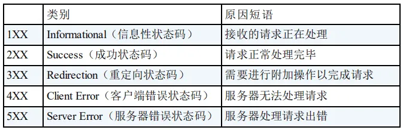
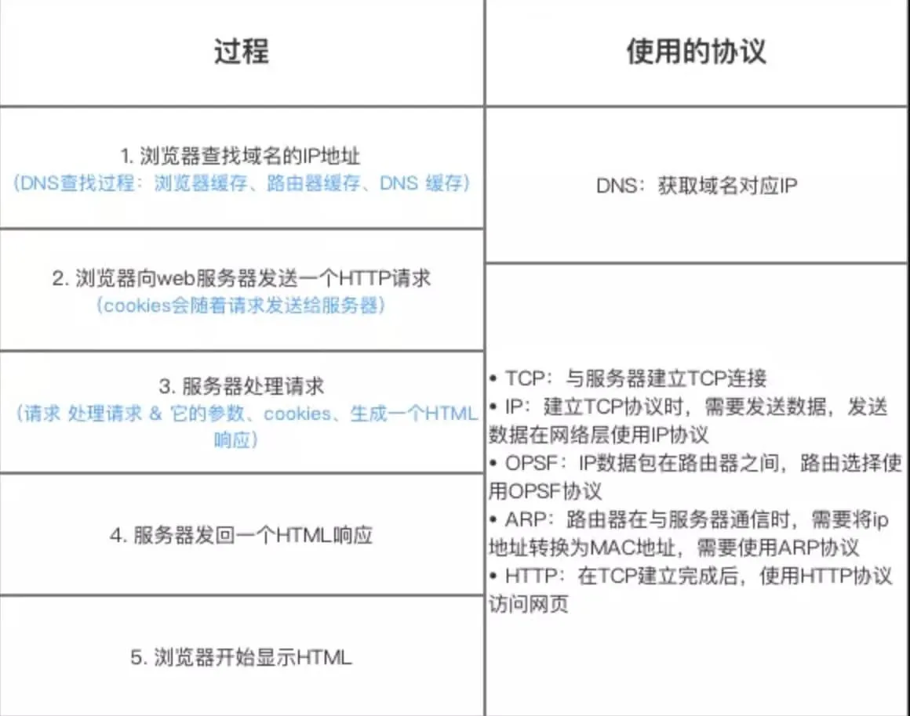
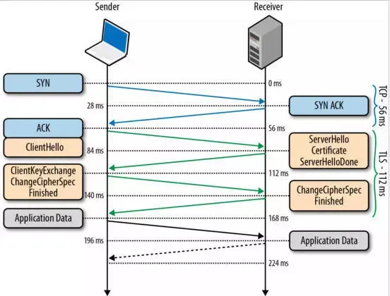
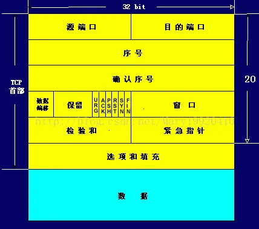
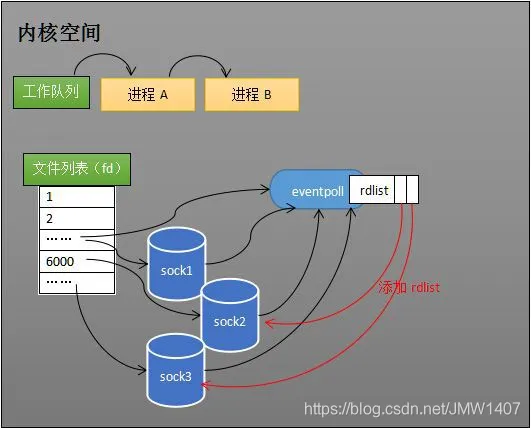

# 计算机网络

### 网络状态码？

**200 status OK**：请求成功

**404 Not Found**：客户端请求资源不存在

**400 Bad Request**：客户端的非法请求

**502 Bad Gateway**：服务器响应错误(比如服务挂了)

**504 Gateway Timeout**：服务器超时无响应




### 网络分层模型是什么？

物理、数据链路、网络（IP），传输（TCP、UDP），会话（RPC），表示（SSL，TLS），应用（HTTP,FTP,SMTP,TELNET）

- **OSI 七层模型**： (应用层、表示层、会话层)、**传输层、网络层**、(数据链路层、物理层)
    
    OSI 的七层体系结构概念清楚，理论也很完整，但是它比较复杂而且不实用，而且有些功能在多个层中重复出现
    
- **TCP/IP 四层模型** 是目前被广泛采用的一种模型，我们可以将 TCP / IP 模型看作是 OSI 七层模型的精简版本，由以下 4 层组成：**应用层、传输层、网络层、网络接口层**
- 为什么要分层？
    
    业务开发分层→model（数据库操作）+Service（业务操作）+Controller（前后端数据交互）→复杂的系统需要分层，通过层次化结构分工明确，每一层都专注于某一类事情，层与层之间独立，也就对应上了高内聚，低耦合的原则→任何问题都可以通过增加一个中间层来解决，不能就再加一层
    

### 输入 URL 到页面展示发生了什么？

- **url→DNS域名解析(浏览器缓存、操作系统缓存、本地服务器缓存)→IP地址→创建套接字(ip+端口80)→TCP连接→发送HTTP请求报文—>服务端处理请求并响应→浏览器收到响应并显示**


### HTTP协议

> HTTP：
> 
> 1. HTTP 协议，全称**超文本传输协议**（Hypertext Transfer Protocol）。顾名思义，HTTP 协议就是**用来规范超文本的传输**，超文本，也就是网络上的包括文本在内的各式各样的消息，具体来说，主要是来规范浏览器和服务器端的行为的。
> 2. 并且，HTTP 是一个**无状态**（stateless）协议，也就是说服务器不维护任何有关客户端过去所发请求的消息。这其实是一种懒政，有状态协议会更加复杂，需要维护状态（历史信息），而且如果客户或服务器失效，会产生状态的不一致，解决这种不一致的代价更高。
> 3. HTTP 是应用层协议，它以 TCP（传输层）作为底层协议，默认端口为 80.  优点是扩展性强，速度快，跨平台；通信过程主要如下：
>     1. 服务器在 80 端口等待客户的请求。
>     2. 浏览器发起到服务器的 TCP 连接（创建套接字 Socket）。
>     3. 服务器接收来自浏览器的 TCP 连接。
>     4. 浏览器（HTTP 客户端）与 Web 服务器（HTTP 服务器）交换 HTTP 消息。
>     5. 关闭 TCP 连接
> 


### HTTPS协议

> 
> 1. HTTPS 协议（Hyper Text Transfer Protocol `Secure`），是 HTTP 的加强安全版本。HTTPS 是基于 HTTP 的，也是用 TCP 作为底层协议，并`额外使用 SSL/TLS 协议用作加密和安全认证`。默认端口号是 443. 优点是保密性高，信任度高
> 2. 核心：**SSL/TLS协议**
>     1. SSL 指安全套接字协议（Secure Sockets Layer），首次发布与 1996 年。SSL 的首次发布其实已经是他的 3.0 版本，SSL 1.0 从未面世，SSL 2.0 则具有较大的缺陷（DROWN 缺陷——Decrypting RSA with Obsolete and Weakened eNcryption）。很快，在 1999 年，SSL 3.0 进一步升级，**新版本被命名为 TLS 1.0**。因此，TLS 是基于 SSL 之上的，但由于习惯叫法，通常把 HTTPS 中的核心加密协议混称为 SSL/TLS
>     2. 工作原理：SSL/TLS 的核心要素是**非对称加密**。非对称加密采用两个密钥——一个公钥，一个私钥，在通信时，私钥仅由解密者保存，公钥由任何一个想与解密者通信的发送者（加密者）所知（单向陷门函数，f(x,h) = y，f相当于公钥，陷门h相当于私钥，公钥 f 是公开的，任何人对已有输入，都可以用 f 加密，而要想根据加密信息还原出原信息，必须要有私钥才行）
>     3. 使用 SSL/TLS 进行通信的双方需要使用非对称加密方案来通信，但是非对称加密设计了较为复杂的数学算法，在实际通信过程中，计算的代价较高（加密任何数据），效率太低，因此，**SSL/TLS 实际对消息的加密使用的是对称加密（即非对称加密《`加密`》对称加密密钥）**
>     4. 对称加密的`密钥`生成代价比公私钥对的生成代价低得多，那么有的人会问了，为什么 SSL/TLS 还需要使用非对称加密呢？因为对称加密的保密性完全依赖于密钥的保密性。在双方通信之前，需要商量一个用于对称加密的密钥。我们知道网络通信的信道是不安全的，传输报文对任何人是可见的，密钥的交换肯定不能直接在网络信道中传输。因此，**`使用非对称加密，对对称加密的密钥进行加密，保护该密钥不在网络信道中被窃听`**。这样，**通信双方只需要一次非对称加密，获取公钥，然后使用其交换非对称加密的密钥，在之后的信息通信中，使用绝对安全的密钥，对信息进行对称加密，即可保证传输消息的保密性**
>     5. 公钥传输的信赖性：
>         1. 假设 S 公钥不做加密，在信道中传输，那么很有可能存在一个攻击者 A，发送给 C 一个诈包，假装是 S 公钥，其实是诱饵服务器 AS 的公钥。当 C 收获了 AS 的公钥（却以为是 S 的公钥），C 后续就会使用 AS 公钥对数据进行加密，并在公开信道传输，那么 A 将捕获这些加密包，用 AS 的私钥解密，就截获了 C 本要给 S 发送的内容，而 C 和 S 二人全然不知。同样的，S 公钥即使做加密，也难以避免这种信任性问题，C 被 AS 拐跑了！
>         2. 为了公钥传输的信赖性问题，第三方机构应运而生——**证书颁发机构**（CA，Certificate Authority）。CA 默认是受信任的第三方。CA 会给各个服务器颁发证书，证书存储在服务器上，并附有 CA 的**电子签名**（见下节）。
>         3. 当客户端（浏览器）向服务器发送 HTTPS 请求时，一定要先获取目标服务器的证书，并根据证书上的信息，检验证书的合法性。一旦客户端检测到证书非法，就会发生错误。客户端获取了服务器的证书后，由于证书的信任性是由第三方信赖机构认证的，而证书上又包含着服务器的公钥信息，客户端就可以放心的信任证书上的公钥就是目标服务器的公钥
>     

### HTTPS 流程

https://cloud.tencent.com/developer/article/1425339


（1）首先建立tcp链接。所以https的加密层也是在tcp之上的。

（2）客户端首先发起clientHello消息。包含一个客户端随机生成的random1 数字，客户端支持的加密算法，以及SSL信息。

（3）服务器收到客户端的clientHello消息以后，取出客户端法发来的random1数字，并且取出客户端发来的支持的加密算法，

然后选出一个加密算法，并生成一个随机数random2，发送给客户端serverhello让客户端对服务器进行身份校验,服务端通过将自己的公钥通过数字证书的方式发送给客户端。

（4）客户端收到服务端传来的证书后，先从 CA 验证该证书的合法性，验证通过后取出证书中的服务端公钥，再生成一个随机数 Random3，再用服务端公钥非对称加密 Random3 生成 PreMaster Key。并将PreMaster Key发送到服务端。

（5）服务端通过私钥将PreMaster Key解密获取到Random3,此时客户端和服务器都持有三个随机数Random1 Random2 Random3,双方在通过这三个随即书生成一个对称加密的密钥.双方根据这三个随即数经过相同的算法生成一个密钥,而以后应用层传输的数据都使用这套密钥进行加密。

Change Cipher Spec Finished: 告诉客户端以后的通讯都使用这一套密钥来进行。

（6）最后ApplicationData 全部使用对称加密的原因就是非对称加密太卡，对称加密不影响性能。所以实际上也看的出来，HTTPS的真正目的就是保证对称加密的 密钥不被破解，不被替换，不被中间人攻击，如果发生了上述情况，那么HTTPS的加密层也能获知，避免发生事故

### HTTP/1.0 和HTTP /1.1有什么区别？

- **连接方式** : HTTP/1.0 为短连接，HTTP/1.1 支持长连接。HTTP 协议的长连接和短连接，实质上是 TCP 协议的长连接和短连接。
- **状态响应码** : HTTP/1.1 中新加入了大量的状态码，光是错误响应状态码就新增了 24 种。比如说，`100 (Continue)`——在请求大资源前的预热请求，`206 (Partial Content)`——范围请求的标识码，`409 (Conflict)`——请求与当前资源的规定冲突，`410 (Gone)`——资源已被永久转移，而且没有任何已知的转发地址。
- **缓存机制** : 在 HTTP/1.0 中主要使用 Header 里的 If-Modified-Since,Expires 来做为缓存判断的标准，HTTP/1.1 则引入了更多的缓存控制策略例如 Entity tag，If-Unmodified-Since, If-Match, If-None-Match 等更多可供选择的缓存头来控制缓存策略。
- **带宽**：HTTP/1.0 中，存在一些浪费带宽的现象，例如客户端只是需要某个对象的一部分，而服务器却将整个对象送过来了，并且不支持断点续传功能，HTTP/1.1 则在请求头引入了 range 头域，它允许只请求资源的某个部分，即返回码是 206（Partial Content），这样就方便了开发者自由的选择以便于充分利用带宽和连接。
- **Host 头（Host Header）处理** :HTTP/1.1 引入了 Host 头字段，允许在同一 IP 地址上托管多个域名，从而支持虚拟主机的功能。而 HTTP/1.0 没有 Host 头字段，无法实现虚拟主机。

### HTTP/1.1 和HTTP /2.0 有什么区别？

- **多路复用（Multiplexing）**：HTTP/2.0 在同一连接上可以同时传输多个请求和响应（可以看作是 HTTP/1.1 中长链接的升级版本），互不干扰。HTTP/1.1 则使用串行方式，每个请求和响应都需要独立的连接，而浏览器为了控制资源会有 6-8 个 TCP 连接的限制。。这使得 HTTP/2.0 在处理多个请求时更加高效，减少了网络延迟和提高了性能。
- **二进制帧（Binary Frames）**：HTTP/2.0 使用二进制帧进行数据传输，而 HTTP/1.1 则使用文本格式的报文。二进制帧更加紧凑和高效，减少了传输的数据量和带宽消耗。
- **头部压缩（Header Compression）**：HTTP/1.1 支持`Body`压缩，`Header`不支持压缩。HTTP/2.0 支持对`Header`压缩，使用了专门为`Header`压缩而设计的 HPACK 算法，减少了网络开销。
- **服务器推送（Server Push）**：HTTP/2.0 支持服务器推送，可以在客户端请求一个资源时，将其他相关资源一并推送给客户端，从而减少了客户端的请求次数和延迟。而 HTTP/1.1 需要客户端自己发送请求来获取相关资源。

### **WebSocket和HTTP区别？**

- 问题：不管是RPC还是HTTP，它们都有个特点，那就是消息都是客户端请求，服务端响应。**客户端没问，服务端肯定就不答**，这就有点僵了，但现实中肯定有需要**下游主动发送消息给上游**的场景，比如打个网页游戏，站在那啥也不操作，怪也会主动攻击我，这种情况该怎么办呢？
- **服务端主动推送：使用HTTP不断轮询**
    - 轮询是指由浏览器每隔一段时间向服务器发出 HTTP 请求，然后服务器返回最新的数据给客户端
    - **短轮询**：以很短的时间间隔去不断发出请求
    - **长轮询**：将一次HTTP请求的超时设置的很大，即发起一个请求，在较长时间内等待服务器响应，减少了HTTP请求的个数
    - **伪推送：本质还是请求-响应**
- **全双工**：
    - 好好的全双工TCP，被HTTP用成了半双工，因为HTTP协议起初就是为了网页文本设计的，根本就没考虑网页游戏这种需要双方都主动发送数据的场景
- **websocket：基于TCP的新协议**
    - 和socket一点关系没有
    - **建立连接**：
        - 经历了三次TCP握手之后，利用HTTP协议升级为websocket协议
        - 具体的，在HTTP请求基础上带上一些**特殊的header头，将HTTP协议升级为websocket协议，**返回101状态码表示协议切换
        - websocket只有在建立连接时才用到了HTTP，**升级完成之后就跟HTTP没有任何关系了**
        
        ```jsx
        客户端发送：
        Connection: Upgrade
        Upgrade: websocket
        **Sec-WebSocket-Key**: T2a6wZlAwhgQNqruZ2YUyg==\r\n  // 校验码
        服务器发送：
        HTTP/1.1 101 Switching Protocols\r\n
        **Sec-WebSocket-Accept**: iBJKv/ALIW2DobfoA4dmr3JHBCY=\r\n
        Upgrade: websocket\r\n
        Connection: Upgrade\r\n
        浏览器接收后，将T2a6wZlAwhgQNqruZ2YUyg==\r\n转成另一段字符串，如果这段字符串跟服务器传回来的字符串一致，那验证通过
        即通过一来一回两次HTTP握手，websocket成功建立连接
        ```
        

### Session和cookie有什么区别？

- 我们知道HTTP 是一种不保存状态，即**无状态**（stateless）协议。也就是说 HTTP 协议自身不对请求和响应之间的通信状态进行保存。那么我们如何保存用户状态呢？cookie和Session 机制的存在就是为了解决这个问题
- **`Cookie` 在客户端保存用户信息**，比如我们在 `Cookie` 中保存已经登录过的用户信息，下次访问网站的时候页面可以自动帮你登录的一些基本信息给填了；也可以使用 Cookie 保存 SessionId 或者 Token ，向后端发送请求的时候带上 Cookie，这样后端就能取到 Session 或者 Token 了。这样就能记录用户当前的状态了，因为 HTTP 协议是无状态的
- **`Session` 是在服务端记录用户的状态**。典型的场景是购物车，当你要添加商品到购物车的时候，系统不知道是哪个用户操作的，因为 HTTP 协议是无状态的。服务端给特定的用户创建特定的 Session 之后就可以标识这个用户并且跟踪这个用户了（一般情况下，服务器会在一定时间内保存这个 Session，过了时间限制，就会销毁这个 Session）
- **没有cookie，session还能用么？**当然可以！cookie只是一个信息载体！换一个不就得了，比如将 SessionID 放在请求的 url 里面https://javaguide.cn/?Session_id=xxx 这种方案也是可行的，但是安全性和用户体验感降低。当然，为了安全你也可以对 SessionID 进行一次加密之后再传入后端

### JWT身份验证？

**header头部，payload负载，signature签名(密钥)  aaaa.bbbb.cccc**

- JWT （JSON Web Token） 是目前最流行的跨域认证解决方案，是一种基于 Token 的认证授权机制。 从 JWT 的全称可以看出，JWT 本身也是 Token，一种规范化之后的 JSON 结构的 Token。
- JWT 自身包含了身份验证所需要的所有信息，因此，我们的服务器`不需要存储 Session 信息`。这显然增加了系统的可用性和伸缩性，大大减轻了服务端的压力
- JWT 本质上就是一组字串，通过（`.`）切分成三个为 Base64 编码的部分：
    - **Header** : 描述 JWT 的json数据，定义了生成签名的算法以及 `Token` 的类型(也就是JWT)，转换成Base64编码(xxxxxxx)
    - **Payload** : 用来存放实际需要传递的数据claims(用户id，过期时间等)，Payload默认是不加密的，所以**一定不要将隐私信息存放在 Payload 当中（比如用户密码），**转换成Base64编码(yyyyyyy)
    - **Signature（签名）**：服务器通过 Payload、Header 和一个密钥(Secret！不能泄露！**JWT 安全的核心在于签名，签名安全的核心在密钥**)，使用 Header 里面指定的签名算法（默认是 HMAC SHA256）生成(zzzzzzz)
    - JWT 通常是这样的：`xxxxx.yyyyy.zzzzz`
    - 基于 JWT 进行身份验证：服务器通过 Payload、Header 和 Secret(密钥)创建 JWT 并将 JWT 发送给客户端。客户端接收到 JWT 之后，会将其保存在 Cookie 或者 localStorage 里面，以后客户端发出的所有请求都会携带这个令牌。
        - 用户向服务器发送用户名、密码以及验证码用于登陆系统
        - 如果用户用户名、密码以及验证码校验正确的话，服务端会返回已经签名的 Token，也就是 JWT
        - 用户以后每次向后端发请求都在 Header 中带上这个 JWT ，请求服务端并携带 JWT 的常见做法是将其放在 HTTP Header 的 `Authorization` 字段中（`Authorization: Bearer Token`）
        - 服务端检查 JWT 并从中获取用户相关信息
- RBAC模型补充：RBAC 即基于角色的权限访问控制（Role-Based Access Control）。这是一种通过角色关联权限，角色同时又关联用户的授权的方式，系统权限控制最常采用的访问控制模型就是 **RBAC 模型**


### UDP如何实现可靠性（QUIC）

https://www.51cto.com/article/704384.html

### TCP和UDP的区别？

**设计理念，可靠性首部，连接通信，应用场景**

TCP 和 UDP 都是传输层的协议，但由于它们的设计理念不同，导致它们之间存在诸多差异

TCP，即**传输控制协议**，顾名思义，它希望对传输进行一系列的控制，来解决网络中如数据丢失、重复、乱序和拥塞等问题，因此，TCP 更偏向于提供端到端的可靠传输；而 UDP，即用户数据报协议，它并不提供可靠性保证，它只是尽最大努力向用户交付数据，所以UDP 可能会出现丢包、乱序等情况

嗯具体来说呢他们的区别主要体现在以下几点：

首先第一点呢，TCP为了解决这样一些传输过程中发生的问题来确保可靠传输所以他在他的头部呢设计了一系列的字段，来辅助其实现包括连接管理重传机制流量控制等这样一些复杂的一个功能；而UDP则不同，它的头部就非常的简单，只包含了一些必要的端口信息和数据长度这样一个信息，没有维护额外的状态信息，所以UDP的首部只有八个字节，而t cp首部是一般是20到60个字节之间

其次呢就是TCP在解决这些问题的同时呢需要去建立这样一个可靠的连接通道来维护通信双方的状态信息，所以TCP他只能用于一对一的这样一个通信，同时涉及到了连接的建立释放这样一些工作，相比之下 UDP是不需要连接就可以直接发送数据的，所以它不仅支持一对一的东西也支持一对多多对多的这样一个通信方式，非常的灵活

最后的也只是因为上面的两点区别导致他们的应用场景也有所不同，对于应用在那些对于可靠性传输要求比较高的场景当中比如文件传输，http服务等；而u d p的应用有那些侧重于对于传输的实时性和传输效率要求比较高的这样一个场景当中。比如音视频流的传输或者说是实时通信这样一个场景

嗯总的来说呢TCP向上层提供了这样一个面向连接的，基于字节流的，可靠的传输服务，而UDP呢则提供了无连接不可靠但是简单高效的这样一个数据传输服务

tcp头部没有长度字段，20个字节，udp头部有长度字段



### 如何理解是 TCP 面向字节流协议？

**面向字节流指的是TCP不承诺是按照用户报文来传输的，而是通过自动切片分包解决了因为MTU上限无法发送大数据包的问题，这样TCP就可以根据情况自由分片，无需考虑用户数据是怎么组织的，只要按顺序传就行了，所以它自动计算MTU，智能地以最合适的大小传输（太大分片，太小聚合），确保数据安全高效传输**

因为TCP要实现可靠传输，所以通过滑动窗口算法模拟流的实现是最直观和最简单的，如果像udp那样即要保证报文传输，又要保证顺序到达和传输可靠性，那么实现起来就会非常复杂，所以**TCP保证可靠传输的代价就是不保证报文传输**

比如前面提过，UDP报文最大允许65535字节;但以太网限制了MTU不得超过1492/1480字节。为了让这样的报文能够通过以太网传输，协议栈就必须能够自动把这个大包分片，分成一堆不超过MTU的报文传输;然后对端再把这一系列的、分片的小包组合起来，拼装出原始的65535字节的大包。

那么问题来了:如果其中一个小的分片在传输过程中丢失了，怎么办?

- 不妨参考下滑窗算法。
你看，这事能做到;但投入产出比太低;而且，对UDP的使用者来说，现在这个协议的状态会太复杂、太难懂--他只是发了几个包,，结果.…什么报文什么分片什么片段丢失的一大堆，这得看多少书才能搞明白啊?
因此，UDP就仅仅承诺“按用户指定的报文传输”，也就是在发送端发送的报文，在接收端自动给你还原;然后发送端发一个报文，接收端报告一次收到。除此之外，它不承诺任何东西--这些报文会丢失，顺序会乱;但UDP不管，你自己检查、自己处理就是
- 这正是接口设计的难点所在: 明智的在基础协议层保留某些缺陷、不把它设计的面面俱到，反而会提升它的性能、易用性和泛用性。而要做到这个，你就必须有极其丰富的工程经验、并且有能力高屋建瓴只的一眼看到本质。
- 换句话说: 有些功能，就应该放在不同层次去做，不要眉毛胡子一把抓

- **面向报文**：当用户消息通过 UDP 协议传输时，**操作系统不会对消息进行拆分**，在组装好 UDP 头部后就交给网络层来处理，所以发出去的 UDP 报文中的数据部分就是完整的用户消息，也就是**每个 UDP 报文就是一个用户消息的边界**，这样接收方在接收到 UDP 报文后，读一个 UDP 报文就能读取到完整的用户消息。
- **面向字节流**：当用户消息通过 TCP 协议传输时，**消息可能会被操作系统分组成多个的 TCP 报文**，也就是一个完整的用户消息被拆分成多个 TCP 报文进行传输。这时，接收方的程序如果不知道发送方发送的消息的长度，也就是**不知道消息的边界**时，是无法读出一个有效的用户消息的，因为用户消息被拆分成多个 TCP 报文后，并不能像 UDP 那样，一个 UDP 报文就能代表一个完整的用户消息

### **TCP粘包**

- TCP 是面向连接的传输协议,TCP 传输的数据是以**字节流**的形式,而流数据是没有明确的开始结尾边界,所以 TCP 也没办法判断哪一段流属于一个消息;
- 当两个消息的某个部分内容被分到同一个 TCP 报文时，就是我们常说的 TCP 粘包问题，这时接收方不知道消息的边界的话，是无法读出有效的消息。要解决这个问题，要交给**应用程序**
- TCP协议是流式协议;所谓流式协议,即协议的内容是像流水一样的字节流,内容与内容之间没有明确的分界标志,需要**手动地去给这些协议划分边界**
- 解决：**明确用户消息的边界在哪**
    - **特殊字符作为边界：**HTTP 是一个非常好的例子，它通过通过设置回车符、换行符作为 HTTP 报文协议的边界，但是有一点要注意，这个作为边界点的特殊字符，如果刚好消息内容里有这个特殊字符，我们要对这个字符**转义**，避免被接收方当作消息的边界点而解析到无效的数据
    - **自定义消息结构**：这个消息结构由包头和数据组成，其中包头包是固定大小的，而且包头里有一个字段来说明紧随其后的数据有多大，于是就可以知道数据的长度和边界了
- **UDP不会发生粘包问题**：UDP具有保护消息边界,在每个UDP包中就有了消息头(UDP长度、源端口、目的端口、校验和)

### TCP三次握手？

为什么要建立连接？连接过程？为什么是三次？

1. **为什么建立连接？**因为 TCP 想要解决诸如数据包丢失、乱序、重复、拥塞等网络问题，所以它需要通信双方共同协商和维护一些信息，因此建立连接是必要的
2. **连接过程**：三报文握手
    - TCP 建立连接的过程叫做**握手**，握手需要在客户和服务器之间交换三个TCP 报文段，所以称之为**三报文握手**
    - 首先客户端向服务端发送 SYN 报文(seq=x)，这被称为第一次握手；服务端接收到 SYN 报文后，向客户端发送 SYN + ACK(seq=y,ack=x+1) 报文作为响应，这被称为第二次握手；最后，客户端回复 ACK (ack=y+1)报文给服务端，这被称为第三次握手。
    - 通过这个三次握手的过程，双方通过协商初始的序列号等信息来保证后续的可靠传输。客户端和服务端也相互确认了彼此的发送和接收能力，从而建立了可靠的TCP连接，双方就可以开始进行数据的传输了

3. **为什么是三次？不能两次握手？四次握手？**

**两次不够，四次冗余**

- 两次握手和三次握手的区别就在于**TCP客户端最后还发送了一个TCP确认报文给服务器，那如果不发的话会出现这么几个问题**
    1. 首先**旧的历史连接可能被连接初始化**：我们知道网络都是不可靠的，所以如果发生这样一种情况，客户端发送的连接请求报文段由于网络阻塞，经过一段时间后突然又传送到了，服务端响应，连接建立，给客户端发送应答报文，但是客户端此时并没有发起新的TCP连接请求，并且处于关闭状态，因此不会理会该报文段，但TCP服务器已进入了连接已建立状态，所以这将白白浪费TCP服务器进程所在主机的很多资源
    2. **无法保证双方都同步了对方的状态信息**(序列号，序列号能够保证数据包不重复、不丢弃和按序传输)，因为当客户端发送的序列号得到了服务端的响应，但是服务端发送的序列号并没有得到客户端的应答响应，只有通过客户端再回复一个ACK报文，这样一来一回，才能确保双方的初始序列号能被可靠的同步
    3. **服务端资源浪费**：这个问题主要是如果客户端发送的 `SYN` 报文在网络中阻塞了，重复发送多次 `SYN` 报文，那么服务端在收到请求后就会**建立多个冗余的无效链接，**造成不必要的资源浪费
    4. 所以三次握手来通过额外加了一次握手，通过再次确认客户端的状态来避免了上述这些问题，从而**能防止历史连接的建立，减少双方不必要的资源开销，帮助双方同步初始化序列号，建立起可靠的连接**
- 既然三次已经可以实现可靠连接了，不需要使用更多的通信次数，所以四次显得有点冗余
1. **第三个ACK报文丢失了怎么办？第三次握手的 ACK 是对服务端第二次握手的 SYN 的确认报文**
    1. 客户端：
        1. 正常发送数据：客户端收到服务端的 SYN-ACK 报文后，就会给服务端回一个 ACK 报文，也就是第三次握手，此时客户端状态进入到 `ESTABLISH` 状态，可以正常发送数据
        2. 响应服务端重传的第二次握手SYN 确认报文
    2. 服务端：
        1. 重传第二次握手SYN 确认报文：当第三次握手丢失了，服务端那一方迟迟收不到这个ACK确认报文，就会触发超时重传机制，重传 SYN-ACK 报文，直到收到第三次握手，或者达到最大重传次数
        2. 这个期间收到了：连接建立，进入到 `ESTABLISH` 状态，正常收发数据
        3. 没收到：断开连接

### TCP四次挥手？

为什么要释放连接？释放连接过程？为什么四次？

1. **为什么要释放连接**：为了避免端口资源耗尽、内存资源浪费或泄漏，以及网络拥塞，从而影响其他连接的性能，有序地释放连接是必要的
2. **释放连接过程**：
    - 我们把主动发起连接释放请求的一方称为客户端，被动释放连接的一方称为服务端
    - 首先，客户端向服务端发送 FIN (seq=x)报文，这是第一次挥手；服务端接收到 FIN 报文后，向客户端发送ACK (ack=x+1)报文作为响应，这是第二次挥手。随后，服务端也会发送 FIN(seq=y) 报文给客户端，这是第三次挥手；最后，当客户端收到服务端的 FIN 报文后，会回复 ACK (ack=y+1)报文，这是第四次挥手。此时客户端会等待一段时间，通常是 2MSL，确保服务端能够收到最后的确认报文，当服务端收到客户端的 ACK 报文后，或者客户端等待了两倍的最⻓报文段寿命（2MSL）的时间。整个连接成功关闭！
3. **为什么四次？为什么不能把服务端发送的 ACK 和 FIN 合并起来，变成三次挥手？**
    - 因为服务端收到客户端断开连接的请求时，可能还有一些数据没有发完，这时先回复 ACK，表示接收到了断开连接的请求。等到数据发完之后再发 FIN，断开服务端到客户端的数据传送
4. **为什么最后要time wait 2MSL等待两倍的最长报文段寿命？**
    1. 第四次挥手时，**客户端发送给服务端的 ACK 有可能丢失**，如果服务端因为某些原因而没有收到 ACK 的话，服务端就会重发 FIN，这样一来一去刚好两个msl，如果客户端在 2*MSL 的时间内收到了 FIN，就会重新发送 ACK 并再次等待 2MSL，防止 Server 没有收到 ACK 而不断重发 FIN，最终确保对方能够收到最后发送的确认报文，帮助其正常关闭
    2. **其次这个时间足以让旧连接上传输的旧数据都自然消失在网络中，不会影响后续的新连接**

### 什么是半连接队列和全连接队列？

在 TCP 三次握手过程中，Linux 内核会维护两个队列来管理连接请求：

1. **半连接队列**（也称 SYN Queue）：当服务端收到客户端的 SYN 请求时，此时双方还没有完全建立连接，它会把半连接状态的连接放在半连接队列
2. **全连接队列**（也称 Accept Queue）：当服务端收到客户端对 ACK 响应时，意味着三次握手成功完成，服务端会将该连接从半连接队列移动到全连接队列。如果未收到客户端的 ACK 响应，会进行重传，重传的等待时间通常是指数增长的。如果重传次数超过系统规定的最大重传次数，系统将从半连接队列中删除该连接信息。**accept 队列中的连接会等待进程调用 accept 函数时把连接取出来。**

### **SYN攻击是什么？如何避免？**

- SYN 攻击方式最直接的表现就会把 TCP 半连接队列打满，这样**当 TCP 半连接队列满了，后续再在收到 SYN 报文就会丢弃**，导致客户端无法和服务端建立连接
- **避免** SYN 攻击方式，可以有以下几种方法：
    - 增大 TCP 半连接队列；
    - 减少 SYN+ACK 重传次数：当服务端受到 SYN 攻击时，就会有大量处于 SYN_REVC 状态的 TCP 连接，处于这个状态的 TCP 会重传 SYN+ACK ，当重传超过次数达到上限后，就会断开连接，加快处于 SYN_REVC 状态的 TCP 连接断开，从而移除半连接队列

### TCP怎么保证可靠传输？

**序列号和确认机制，重传机制、流量控制、拥塞控制**

1. 通过**序列号和确认机制，重传机制来**保证数据分组无差错且有序地被接收
    
    #### 序列号和确认机制
    
    1. **序列号（Sequence Number）**：
        - 每个字节的数据在传输时都会被分配一个唯一的序列号。
        - 发送方在发送数据段时，会在TCP头部包含一个序列号字段，这个字段表示该数据段中的第一个字节的序列号。
        - 序列号用于接收方按正确顺序重新组装数据，以及检测丢失的数据段。
    2. **确认号（Acknowledgment Number）**：
        - 接收方在接收到数据段后，会发送一个带有确认号的TCP报文段给发送方。
        - 确认号表示接收方期望接收的下一个字节的序列号，意味着之前所有的数据都已经正确接收。
        - 例如，如果接收方收到序列号为1000的字节，并且数据段长度为100，那么确认号将是1100，表示期望下一个数据段从字节1100开始。
    3. **滑动窗口机制（Sliding Window）**：
        - 滑动窗口机制允许发送方在没有收到确认之前继续发送一定数量的数据，从而提高传输效率。
        - 窗口大小由接收方确定，并在TCP头部的窗口字段中告知发送方。
    
    #### 重传机制
    
    TCP重传机制用于确保数据在丢失或损坏时能够重新发送，以保证数据的完整性和可靠性。
    
    1. **超时重传**：
        - 发送方在发送数据段后，会启动一个计时器。
        - 如果在计时器超时前没有收到该数据段的确认，发送方会假定数据段丢失并重新发送。
        - 超时时间的设置非常关键，通常根据网络延迟的变化动态调整。
    2. **快速重传（Fast Retransmit）**：
        - 如果接收方接收到一个失序的数据段，会立即发送重复确认（Duplicate Acknowledgment）。
        - 当发送方收到三个或更多的重复确认时，会立即重传丢失的数据段，而不必等待计时器超时。
    
    #### TCP可靠性特性
    
    - **有序传输**：通过序列号和确认机制，TCP确保数据按正确顺序到达接收方。
    - **丢包重传**：通过超时重传和快速重传机制，TCP可以检测并重新发送丢失的数据段。
    - **数据完整性**：TCP头部包含校验和字段，用于检测数据在传输中的损坏。
    
    这些机制共同作用，确保了TCP能够提供可靠的数据传输服务。
    
2. 通过**流量控制**保证发送方能够根据接收方的实际接收能力来进行数据发送，防止分组丢失
- 什么是流量控制？目的是？如何实现？引发的死锁？如何避免死锁？
    - **什么是流量控制**：如果发送者发送数据过快，接收者来不及接收，那么就会有分组丢失。为了避免分组丢失，控制发送者的发送速度，使得接收者来得及接收，这就是流量控制。
    - **目的**：流量控制根本目的是防止分组丢失，它是构成TCP可靠性的一方面
    - **如何实现**：流量控制由滑动窗口协议实现。滑动窗口协议既保证了分组无差错、有序接收，也实现了流量控制。主要的方式就是接收方返回的 ACK 中会包含自己的接收窗口的大小，并且利用大小来控制发送方的数据发送。
    - **死锁**：当发送者收到了一个窗口为0的应答，发送者便停止发送，等待接收者的下一个应答。但是如果这个窗口不为0的应答在传输过程丢失，发送者一直等待下去，而接收者以为发送者已经收到该应答，等待接收新数据，这样双方就相互等待，从而产生死锁
    - **避免**：TCP使用了**持续计时器**。每当发送者收到一个零窗口的应答后就启动该计时器。时间一到便主动发送**窗口探测报文**询问接收者的窗口大小。若接收者仍然返回零窗口，则重置该计时器继续等待；若窗口不为0，则表示应答报文丢失了，此时重置发送窗口后开始发送，这样就避免了死锁的产生。
3. 通过拥塞控制防止过多的数据注入到网络中，引发网络阻塞
- **拥塞控制**: 与流量控制区别在于，它不是考虑接收端，而是考虑了网络，防止过多的数据注入网络中，造成网络负载过大，所以tcp牺牲自己，控制自己发送的数据量
**方法: 动态维持拥塞窗口的大小**
    - **慢启动**: 核心思想是不要一开始就发送大量数据，先探测一下网络的拥塞程度，也就是由小到大从1开始通过指数增长达到阈值
    - **拥塞避免**: 达到慢启动阈值时改用拥塞避免算法，按照线性规律缓慢增长
    - **拥塞发生**: 无论是在哪个阶段发生了超时重传，发送方就认为网络发生拥塞了，然后会将拥塞窗口阈值减小一半，然后拥塞窗口重新从1开始慢启动到达新阈值，然后继续拥塞避免算法
    - **快速恢复**: 当发生的不是超时重传，而是快重传的时候，发送方考虑到如果网络出现了拥塞应该不会收到好几个重复的确认，所以发送方认为网络拥塞不严重，没有必要重新慢启动来大幅降低自己的发送速率， 所以不会执行上述过程，而是先将阈值减半，然后将拥塞窗口大小设置为阈值大小，然后开始拥塞避免算法缓慢增长，减缓拥塞同时也快速恢复了传输速率

### IO多路复用？

问题：**如何使服务器服务更多的用户**？

为啥不直接使用**多进程/多线程技术**，而是要使用 IO 多路复用技术呢?这是因为，使用 IO 多路复用技术，系统不必创建和维护进程/线程，从而节约了系统的开销，进程的上下文切换开销大，虽说线程切换的上下文开销不大，但是如果频繁创建和销毁线程，系统开销也是不小的，尽管使用**线程池**的方式来避免线程的频繁创建和销毁，当面临一万个客户端并发请求时，意味着要维护 1 万个进程/线程，操作系统就算死扛也是扛不住的

所以既然为每个请求分配一个进程/线程的方式不合适，那有没有可能只使用一个进程来维护多个 Socket 呢？答案是有的，那就是 **I/O 多路复用**技术

IO多路复用是一种允许程序在单一线程中同时处理多个IO操作的方法，它广泛用于网络编程中，以提高应用程序的性能和效率。

IO多路复用的核心思想是通过一个或多个系统调用来监视多个文件描述符（如套接字、管道等）的状态变化，一旦某个文件描述符准备好进行IO操作（如可读、可写或有异常），程序就可以进行相应的处理。常见的IO多路复用机制包括`select`、`poll`和`epoll`

**select**：

- select 实现多路复用的方式是，将已连接的 Socket 都放到一个**文件描述符集合**，然后调用 select 函数将文件描述符集合**拷贝**到内核里，让内核来检查是否有网络事件产生，检查的方式很粗暴，就是通过**遍历**文件描述符集合的方式，当检查到有事件产生后，将此 Socket 标记为可读或可写， 接着再把整个文件描述符集合**拷贝**回用户态里，然后用户态还需要再通过**遍历**的方法找到可读或可写的 Socket，然后再对其处理。
- select 使用固定长度的 BitsMap，表示文件描述符集合，而且所支持的文件描述符的个数是有限制的，在 Linux 系统中，由内核中的 FD_SETSIZE 限制， 默认最大值为 `1024`，只能监听 0~1023 的文件描述符

**poll**: 

- poll和select本质没有区别，只是比Select可处理的文件数量变多了，因为poll不再用 BitsMap 来存储所关注的文件描述符，取而代之用动态数组，以链表形式来组织，突破了 select 的文件描述符个数限制，当然还会受到系统文件描述符限制
- poll 和 select 都是使用「**线性结构**」存储进程关注的 Socket 集合，因此**都需要遍历**文件描述符集合来找到可读或可写的 Socket，时间复杂度为 O(n)，而且也需要在用户态与内核态之间**拷贝**文件描述符集合，这种方式随着并发数上来，性能的损耗会呈指数级增长

**epoll**: 

- 那么，有没有减少遍历的方法？有没有保存就绪socket的方法？这两个问题便是epoll技术要解决的
- epoll 内部涉及一套复杂的数据结构，包括一棵**红黑树**和一个**就绪链表**（双向链表，存放就绪socket）（以及一个epollwait等待队列(存放阻塞进程)）。全部都工作在内核态。通过红黑树，高效地管理海量的连接。在数据到来的时候，不断地将数据 Ready 的socket 放到就绪链表中
- epoll 通过两个方面，很好解决了 select/poll 的问题：
- 一方面，epoll 使用「红黑树」来关注进程所有待检测的 Socket，红黑树是个高效的数据结构，增删改一般时间复杂度是 O(logn)，通过对这棵黑红树的管理，不需要像 select/poll 在每次操作时都传入整个 Socket 集合，减少了内核和用户空间大量的数据拷贝和内存分配；但是红黑树的作用是仅仅是在管理大量连接的情况下，添加和删除 socket 非常的高效。
    - 如果 epoll 管理的 socket 固定的话，在数据收发的事件管理过程中其实红黑树是没有起作用的。内核在socket上收到数据包以后，可以直接找到 epitem(epollpoll对象)，并把它插入到就绪队列里，然后等用户进程把事件取走。这个过程中，红黑树的作用并不会得到体现
    - 创建epoll对象后，可以用`epoll_ctl`添加或删除所要监听的socket，内核就会将eventpoll添加到这三个socket的等待队列中(**socket → eventpoll对象，建立联系**)
    - 当socket收到数据后，中断程序会给eventpoll的“就绪列表”(rdlist)添加socket引用(将socket引用加入其指向的eventpoll对象中的就绪队列中)
    - eventpoll对象相当于是socket和进程之间的中介，socket的数据接收并不直接影响进程，而是通过改变eventpoll的就绪列表来改变进程状
    
    
    
- 另一方面，epoll 使用事件驱动的机制，内核里维护了一个「**双向链表**」来记录就绪事件（插入、删除效率高），只将有事件发生的 Socket 集合传递给应用程序，不需要像 select/poll 那样轮询扫描整个集合（包含有和无事件的 Socket ），大大提高了检测的效率
- 所以我们最少只需要一个epoll进程就可以维护成千上万甚至是百万级别的连接。用户进程简单地去就绪队列中查看有没有 Ready，需要被处理的 socket。有就拿走处理。只要活儿足够的多，epoll_wait 根本都不会让进程阻塞。用户进程会一直干活，一直干活，直到 epoll_wait 里实在没活儿可干的时候才主动让出 CPU。大量地减少了进程切换次数，这就是 epoll 高效的地方所在！
- **Epoll 提供了两种工作模式，**分别是边缘触发（Edge Triggered，简称 ET）和水平触发（Level Triggered，简称 LT）。**水平触发**的意思是只要满足事件的条件，比如内核中有数据需要读，就一直不断地把这个事件通知给用户；而**边缘触发**的意思是只有第一次满足条件的时候才触发，之后就不会再通知同样的事件了。
- 程序首先通过`epoll_create`创建一个`epoll`实例，然后使用`epoll_ctl`添加、修改或删除监视的文件描述符，然后`epoll_wait`用于等待文件描述符的状态变化，它会阻塞直到一个或多个文件描述符变得可用，或者超时发生